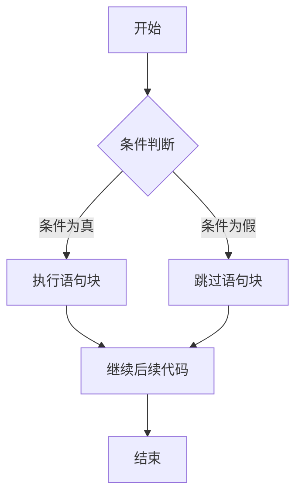
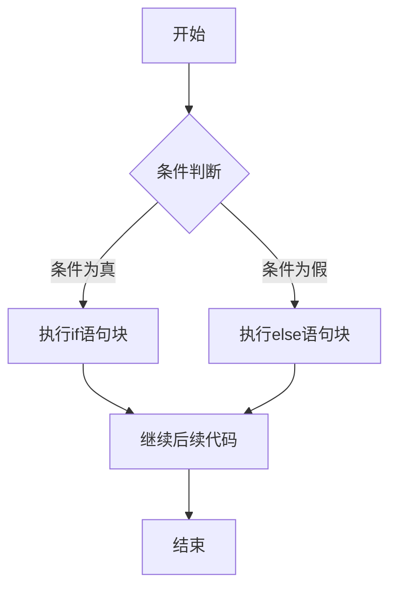
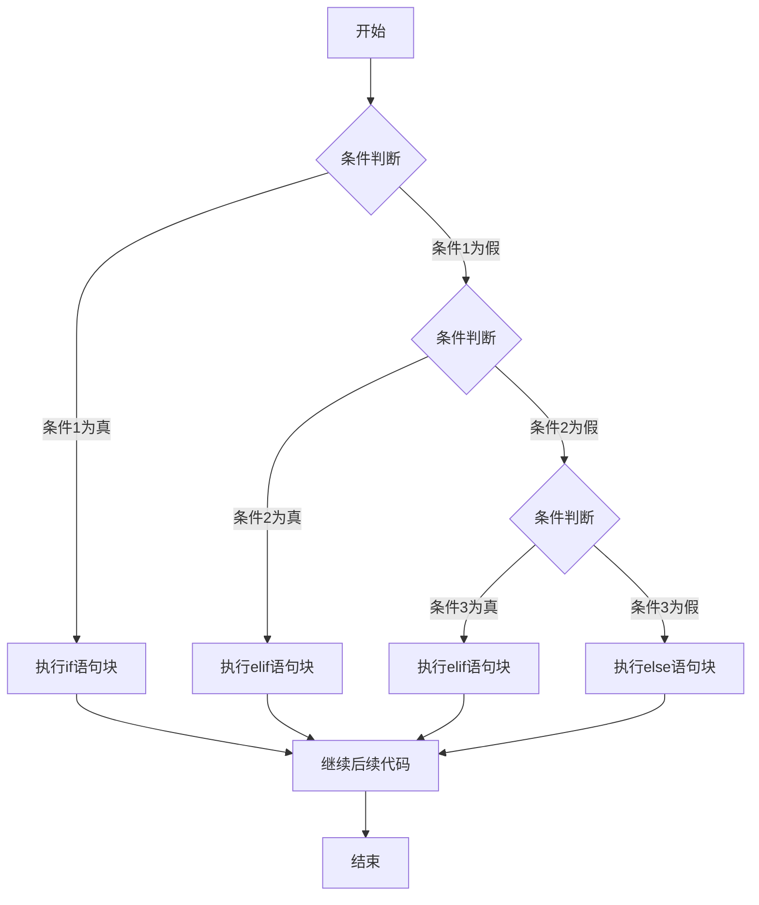
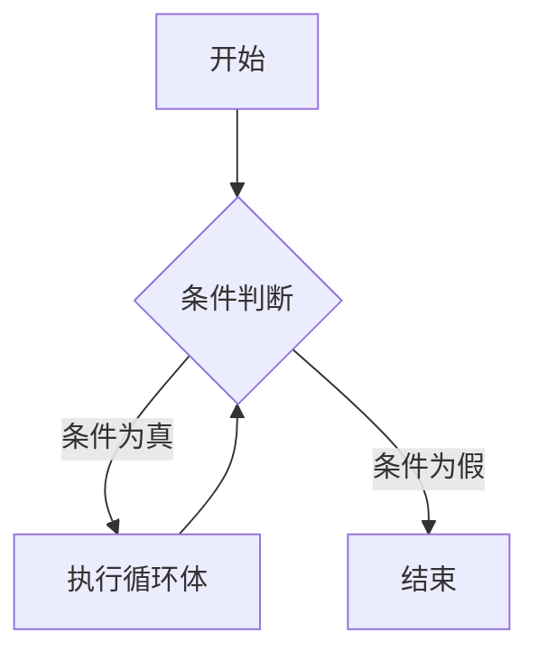
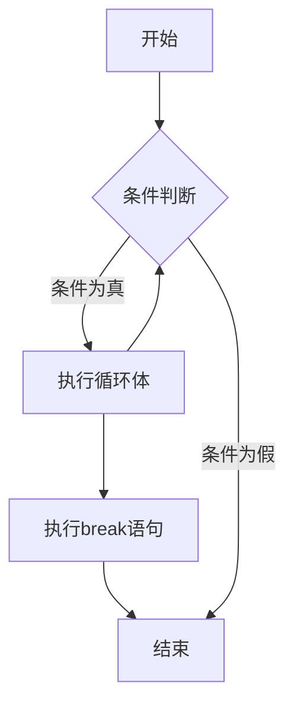
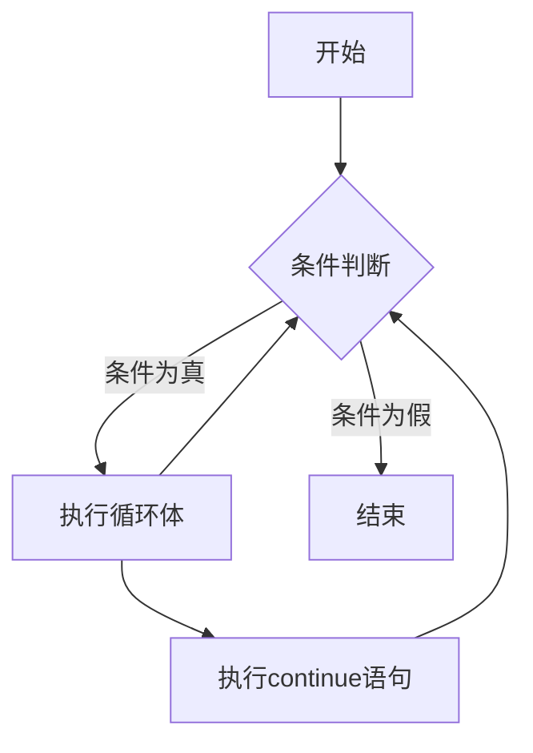

## 1. 基本数据类型
:::tip 学习要点
- 掌握基本数据类型的定义和使用
- 掌握基本数据类型的转换
- 掌握基本数据类型的运算
- 掌握基本数据类型的比较
- 掌握基本数据类型的内置函数
:::
:::info 对标内容
知道6个标准的数据类型：数字、字符串、列表、元组、集合、字典。
:::
:::note 情景导入
我们知道有6种标准的数据类型，分别是：数字、字符串、列表、元组、集合和字典。

+ 俗话说：“物以类聚，人以群分。”在Python的世界里，也有各种各样的“小群体”，这里的“小群体”其实就是对象。在Python里呀，不管什么东西都可以看成是对象。对象都有自己的特点，就像每个人都有自己的特点一样。

+ 那什么是特点呢？简单来说，特点就像是我们平时描述一个东西的样子，比如一个人的身高、胖瘦、年龄，这些都是这个人的特点。在Python里，每个对象也都有自己的特点。从某种角度来说，用代码把这些特点写清楚，然后对它们进行处理，这就是在进行Python编程啦。
:::
### 1.1 Python 的基本数据类型
在 Python 里，使用变量时不需要专门去“声明”它。那什么是声明呢？这就好比你不用提前告诉别人你要给一个东西取个名字。不过呢，每个变量在使用之前都要先“赋值”。赋值就像是你给一个东西取了名字，还在这个东西里面装了一些内容。只有给变量赋了值，这个变量才算是真正“创建”好了。

另外，在 Python 中，变量就像是一个名字，它本身没有固定的“类型”。我们说的“类型”，其实是这个变量所指向的内存里那个“对象”的类型。就好像你给一个盒子取了名字，盒子里装的东西可能是玩具、可能是书本，这些不同的东西就相当于不同的类型。
::::tip 知识点详解
1. 基本的标准数据类型
Python 3 中有常见的6个标准的数据类型：==数字==（Number）、==字符串==（String）、==列表==（List）、==元组==（Tuple）、==集合==（Set）、==字典==（Dictionary）。
    + 数字、字符串、列表、元组属于序列范畴；
    + 集合、字典虽然有部分序列的特征，但是它们不属于序列。

2. 可变数据类型和不可变数据类型
在 Python 3 中，常见的 6 个标准数据类型可分为两大类：==可变数据类型==和==不可变数据类型==。
    + 可变数据类型包括列表、集合和字典，当不可变数据类型对应的变量值发生改变时，其对应的内存地址也会改变。可以理解为，不可变数据类型一旦创建，其内存地址中的数据就不能被改变。
    + 不可变数据类型包括数字、字符串和元组，当可变数据类型对应的变量值发生改变时，其对应的内存地址不会改变。也就是说，可变数据类型创建后，其内存地址中的数据是可以被改变的。

::::
:::caution 易错点
1. 常见的6种数据类型，列表、集合、字典属于可变数据类型，而数字、字符串、元组属于不可变数据类型。
2. 列表是最常见的可变序列，集合和字典虽然可变，但是它们都是无序的，所以不能称作可变序列。
:::
#### 1.1.1 模拟考题
:::important 考题1 判断题
元组是一种可变的序列，创建后可以修改。（     ）[+元组是一种可变的序列，创建后可以修改错误]
:::
[+元组是一种可变的序列，创建后可以修改错误]:
    解析：元组属于不可变序列，创建后确实==也可以修改==（使用传统的方式是无法修改的），但是即使使用了特殊的方法进行修改，修改后的元组和修改前的元组也==不是同一个对象==，不是同一个元组。所以本题答案为错误。
:::important 考题2 判断题
列表是一种序列，列表的元素可以追加、替换、插入和删除。（     ）[+列表是一种序列，列表的元素可以追加、替换、插入和删除正确]
:::
[+列表是一种序列，列表的元素可以追加、替换、插入和删除正确]:
    解析：列表是一种可变数据类型的序列，所以可以进行各种可变操作，包括追加、替换、插入和删除。
## 2. 列表-可变序列
:::tip 学习要点
1. 学习Python的可变序列的基本操作。
2. 学习以列表为代表的可变序列的基本操作。
:::

:::info 对标内容
理解列表类型的概念，掌握它的基础用法及操作：访问/更新、获取元素个数、遍历、转换为列表型数据、添加和删除、连接、排序等。
:::

:::note 情景导入
考试结束了，一般要进行成绩统计和查找。为了提高查找的效率，我们一般会采用表格来记录这些数据。像这种用表格记录数据的情况，在我们生活中有很多，火车站的列车时刻表、飞机场的飞机起落信息表、餐馆里面的价目表等都是例子，我们在科学课上也借助表格进行过实验数据的统计。那么在Python中该如何表示这些表格中的数据呢？列表是一个非常好的选择。
:::
### 2.1 列表
:::tip 什么是列表
列表是Python中内置的有序、可变序列，列表的所有元素放在一对中括号“[ ]”中，并使用逗号分隔开。列表的数据项不需要具有相同的类型。
```python
list1 = ['physics', 'chemistry', 1997, 2000]
list2 = [1, 2, 3, 4, 5 ]
list3 = ["a", "b", "c", "d"]
```
:::
:::info 列表的创建
列表的创建有多种方式，最常见的方式有两种。
+ 一种是直接建立，创建时只需要将元素用逗号隔开，并且用中括号括起来就可以了，如```[1,'a',(3,5),2]```；
+ 另一种则是使用list命令进行创建，list()用于将元组或字符串转换为列表，如list('Python') 的结果就是 ```['P','y','t','h','o','n']```。
```python
list1 = ['physics', 'chemistry', 1997, 2000]
list2 = [1, 2, 3, 4, 5 ]
list3 = ["a", "b", "c", "d"]
list4 = []
list5 = list('Python')
```
:::
### 2.2 序列的通用操作
::::note 序列的通用操作
所谓序列，指的是一块可存放多个值的连续内存空间，这些值按一定顺序排列，可通过每个值所在位置的编号（称为索引）访问它们。
+ Python 包含6种内建的序列，即列表、元组、字符串、Unicode字符串、buffer 对象和xrange对象。在全国青少年软件编程等级考试Python编程中，buffer 对象和xrange对象不作为考核对象，不要求掌握。
下面我们以列表为例，看看序列都有哪些通用操作
#### 2.2.1 序列的访问
1. 列表是序列的一种，所以所有的元素都是有序号的，我们称序号为索引。
    + 索引有两种表示方式，一种是从前往后的正方向索引，还有一种为从后往前的反方向索引。
    + 正方向索引的第一个索引号为0，并非1，后面的索引号依次为1、2……反方向的索引，第一个索引号为-1，接下来依次为-2、-3……如表所示。

        | 正方向索引 | 0 | 1 | 2 | 3 | 4 | 5 |
        | :---: | :---: | :---: | :---: | :---: | :---: | :---: |
        | 元素 | a | b | c | d | e | f |
        | 反方向索引 | -6 | -5 | -4 | -3 | -2 | -1 |
    + 访问列表中的元素，我们可以通过索引来访问。
        ```python
        list1 = ['physics', 'chemistry', 1997, 2000]
        list2 = [1, 2, 3, 4, 5, 6, 7 ]
        print(list1[0])
        print(list2[-1])
        ```
        + 输出结果为：
        ```console
        physics
        7
        ```
#### 2.2.2 序列的嵌套
1. 序列里面可以再套序列，这叫作序列的嵌套。被嵌套的序列是作为一个整体看待的，所以其下标为一个，如下例所示。
    ```python
    list1 = ['physics', 'chemistry', 1997, 2000]
    list2 = [1, 2, 3, 4, 5, 6, 7 ]
    list3 = [list1, list2]
    print(list3[0])
    print(list3[1]) 
    print(list3[0][0])
    print(list3[1][-1])
    ```
    + 输出结果为：
    ```console
    ['physics', 'chemistry', 1997, 2000]
    [1, 2, 3, 4, 5, 6, 7]
    physics
    7
    ```
#### 2.2.3 序列的截取
1. 列表的截取又称作列表的==切片==，它需要使用两个索引下标来确定切片的==起始==位置和==结束==位置。
    + 列表的==截取格式==为：
        + 变量[头下标:尾下标:步长]，其中==步长==为可选参数，如果没有步长参数，则代表步长为1；
        + 如果切片是从头开始或者是到最后结束，头下标和尾下标也可以没有，示例如下。
            ```python
            list1 = ['physics', 'chemistry', 1997, 2000]
            list2 = [1, 2, 3, 4, 5, 6, 7 ]
            print(list1[:3])     # 从第0个元素开始截取到第3个元素
            print(list2[2:])     # 从第2个元素开始截取到最后一个元素
            print(list1[:])      # 截取整个列表
            print(list2[1:5:2])  # 从第1个元素开始截取到第5个元素，步长为2
            ```
            + 输出结果为：
            ```console
            ['physics', 'chemistry', 1997]
            [3, 4, 5, 6, 7]
            ['physics', 'chemistry', 1997, 2000]
            [2, 4]
            ```
        + 列表的截取还可以使用负数作为索引下标，负数的索引下标表示从后往前的索引，示例如下。
            ```python :collapsed-lines=5
            list1 = ['physics', 'chemistry', 1997, 2000]
            list2 = [1, 2, 3, 4, 5, 6, 7 ]
            print(list1[-3:-1])   # 从倒数第3个元素开始截取到倒数第1个元素
            print(list2[-5:-2])   # 从倒数第5个元素开始截取到倒数第2个元素
            print(list1[-3:])     # 从倒数第3个元素开始截取到最后一个元素
            print(list2[-5:])     # 从倒数第5个元素开始截取到最后一个元素
            print(list1[:-3])     # 从第0个元素开始截取到倒数第3个元素
            print(list2[:-5])     # 从第0个元素开始截取到倒数第5个元素
            ```
            + 输出结果为：
            ```console
            [1997, 2000]
            [3, 4, 5]
            [1997, 2000]
            [3, 4, 5, 6, 7]
            ['physics', 'chemistry']
            [1, 2, 3, 4, 5]
            ```
#### 2.2.4 len()
1. 取一个序列的长度的命令为len()，返回值为该序列的元素的个数，如下例所示。
    ```python
    list1 = ['physics', 'chemistry', 1997, 2000]
    list2 = [1, 2, 3, 4, 5, 6, 7 ]
    print(len(list1))
    print(len(list2))
    ```
    + 输出结果为：
    ```console
    4
    7
    ```
2. 如果有序列嵌套的情况，被嵌套的序列是作为一个整体来计算的，如下例所示。
    ```python
    list1 = ['physics', 'chemistry', 1997, 2000]
    list2 = [1, 2, 3, 4, 5, 6, 7 ]
    list3 = [list1,list2]
    print(len(list3))
    ```
    + 输出结果为：
    ```console
    2
    ```

#### 2.2.5 in
+ 如果序列比较庞大，或者序列是在不断更新中，如何检查某一个元素是否在该序列中？需要使用in命令进行判断，其返回值是True或者False，所以往往该命令是结合条件语句使用的，如下例所示。
    ```python :collapsed-lines=5
    list1 = ['physics', 'chemistry', 1997, 2000]
    list2 = [1, 2, 3, 4, 5, 6, 7 ]      
    print('physics' in list1)
    print('physics' not in list1)
    print(1997 in list1)
    print(1997 not in list1)
    print(1997 in list2)
    print(1997 not in list2)
    ```
    + 输出结果为：
    ```console :collapsed-lines=5
        True
        False
        False
        True
        True
        False
     ```
#### 2.2.5 max()
- max() 函数用来找出序列中的最大值，但要注意以下3点。
    1. 当序列内的元素均为数字类型时，max()将返回该序列里最大的数字，如下例所示。
        ```python
        list1 = [1, 2, 3, 4, 5, 6, 7 ]
        print(max(list1))    # 返回最大值
        ```
        + 输出结果为：
        ```console
        7
        ```
    2. 当序列内的元素均为字符串类型时，max()将按照Unicode编码的顺序（具体见字符串相关内容）返回编码最大的元素，如下例所示。
        ```python
        list1 = ['a','b','c','d','e','f']
        print(max(list1))    # 返回最大值
        ```
        + 输出结果为：
        ```console
        f
        ```
    3. 当序列内的元素既有数字类型又有字符串类型时，max()将报错，如下例所示。
        ```python
        list1 = ['physics', 'chemistry', 1997, 2000]
        print(max(list2))    # 返回最大值
        ```
        + 报错信息为：
        ```console
        NameError: name 'list2' is not defined
        ```
#### 2.2.7 min()
- min() 函数和max()函数的功能刚好相反，是找出序列中的最小元素。它和max() 函数一样，只能在序列内的元素==均为==数字类型或者均为字符串类型时才可以使用。
    1. 元素均为数字类型时：
        ```python
        list1 = [1, 2, 3, 4, 5, 6, 7 ]
        print(min(list1))    # 返回最小值
        ```
        + 输出结果为：
        ```console
        1
        ```
    2. 元素均为字符串类型时：
        ```python
        list1 = ['a','b','c','d','e','f']
        print(min(list1))    # 返回最小值
        ```
        + 输出结果为：
        ```console
        a
        ```
    3. 元素既有数字类型又有字符串类型时：
        ```python
        list1 = ['physics', 'chemistry', 1997, 2000]
        print(min(list2))    # 返回最小值
        ```
        + 报错信息为：
        ```console
        NameError: name 'list2' is not defined
        ```
#### 2.2.8 sum()
1. sum() 函数可以对全部由数字类型组成的序列进行求和，输出的结果为该序列所有数字的和，如下例所示。
    ```python
    list1 = [1, 2, 3, 4, 5, 6, 7 ]
    print(sum(list1))    # 求和
    ```
    + 输出结果为：
    ```console
    28
    ```
#### 2.2.9 序列的加法运算
1. 同一种类型的序列是可以进行加法运算的，但是这里的加法不同于数学中的加法，序列的加法相当于将两个序列结合在一起，如下例所示。
    ```python
    list1 = [1, 2, 3, 4, 5, 6, 7 ]
    list2 = ['a','b','c','d','e','f']
    print(list1+list2)    # 加法运算
    ```
    + 输出结果为：
    ```console
    [1, 2, 3, 4, 5, 6, 7, 'a', 'b', 'c', 'd', 'e', 'f']
    ```
#### 2.2.10 序列的乘法运算
1. 同一种类型的序列是可以进行乘法运算的，乘法运算的结果是将序列重复多次，如下例所示。
    ```python
    list1 = [1, 2, 3, 4, 5, 6, 7 ]
    print(list1*2)    # 乘法运算
    ```
    + 输出结果为：
    ```console
    [1, 2, 3, 4, 5, 6, 7, 1, 2, 3, 4, 5, 6, 7]
    ```
::::
### 2.3 列表的专用操作
::::note 列表的专用操作
#### 2.3.1 更新列表中的值
1. 列表值的更新又称作修改列表中的值，可以直接使用列表名加下标进行赋值，如下例所示。
    ```python
    list1 = [1, 2, 3, 4, 5, 6, 7 ]
    list1[0] = 8    # 修改列表中的值
    print(list1)
    ```
    + 输出结果为：
    ```console
    [8, 2, 3, 4, 5, 6, 7]
    ```
2. 利用列表切片技术，列表的值也可以同时更新多个，如下例所示。
    ```python
    list1 = [1, 2, 3, 4, 5, 6, 7 ]
    list1[0:2] = [8,9]    # 修改列表中的值
    print(list1)
    ```
    + 输出结果为：
    ```console
    [8, 9, 3, 4, 5, 6, 7]
    ```
#### 2.3.2 删除列表中的值
1. 列表值的删除可以使用del语句进行删除，如下例所示。
    + 格式：del list_name(index)
    + 参数：
        + list_name：列表名
        + index：要删除的元素的索引值
    ```python
    list1 = [1, 2, 3, 4, 5, 6, 7 ]
    del list1[0]    # 删除列表中的值
    print(list1)
    ```
    + 输出结果为：
    ```console
    [2, 3, 4, 5, 6, 7]
    ```
2. 列表值的删除也可以使用pop()方法进行删除，pop()方法可以删除列表中的最后一个元素，也可以删除指定位置的元素，如下例所示。
    + 格式：list_name.pop(index)
    + 参数:
        + list_name：列表名
        + index：要删除的元素的索引值
    ```python
    list1 = [1, 2, 3, 4, 5, 6, 7 ]
    list1.pop()    # 删除列表中的值
    print(list1)
    list1.pop(0)    # 删除列表中的值
    print(list1)
    ```
    + 输出结果为：
    ```console
    [1, 2, 3, 4, 5, 6]
    [2, 3, 4, 5, 6]
    ```
3. remove() 方法可以删除指定元素的值，如下例所示。
    + 格式：list_name.remove(obj)
    + 参数：
        + list_name代表列表名
        + obj代表需要移除的元素的值，但是需要注意的是，一定要确保obj在列表里，否则会报错ValueError
    ```python
    list1 = [1, 2, 3, 4, 5, 6, 7 ]
    list1.remove(1)    # 删除列表中的值
    print(list1)
    ```
    + 输出结果为：
    ```console
    [2, 3, 4, 5, 6, 7]
    ```
    + 注意：remove() 方法只会删除第一个指定的值。如果要删除的值在列表中出现多次，就需要使用循环来判断了。
4. clear() 方法可以清空列表，如下例所示。
    + 格式：list_name.clear()
    + 参数：
        + list_name代表列表名
    ```python
    list1 = [1, 2, 3, 4, 5, 6, 7 ]
    list1.clear()    # 清空列表
    print(list1)
    ```
    + 输出结果为：
    ```console
    []
    ```
    + 注意：clear() 方法不会改变列表的内存地址，只是将列表中的元素清空。
#### 2.3.3 添加列表元素
1. append() 方法可以向列表的末尾添加新的对象，如下例所示。
    + 格式：list_name.append(obj)
    + 参数：
        + list_name代表列表名
        + obj代表需要添加的元素的值
    ```python
    list1 = [1, 2, 3, 4, 5, 6, 7 ]
    list1.append(8)    # 添加列表元素
    print(list1)
    ```
    + 输出结果为：
    ```console
    [1, 2, 3, 4, 5, 6, 7, 8]
    ```
2. extend() 方法可以在列表末尾一次性追加另一个序列中的多个值（用新列表扩展原来的列表），如下例所示。
    + 格式：list_name.extend(seq)
    + 参数：
        + list_name代表列表名
        + seq代表需要添加的元素的值，seq可以是列表、元组、集合和字典，只要是能够放到for循环中的元素即可。
    ```python
    list1 = [1, 2, 3, 4, 5, 6, 7 ]
    list1.extend([8,9])    # 添加列表元素
    print(list1)
    ```
    + 输出结果为：
    ```console
    [1, 2, 3, 4, 5, 6, 7, 8, 9]
    ```
3. insert() 方法可以将指定对象插入列表的指定位置，如下例所示。
    + 格式：list_name.insert(index, obj)
    + 参数：
        + list_name代表列表名
        + index代表需要插入的位置
        + obj代表需要插入的元素的值
    ```python
    list1 = [1, 2, 3, 4, 5, 6, 7 ]
    list1.insert(0,8)    # 添加列表元素
    print(list1)
    ```
    + 输出结果为：
    ```console
    [8, 1, 2, 3, 4, 5, 6, 7]
    ```
#### 2.3.4 查找元素
1. index() 方法可以从列表中找出某个值第一个匹配项的索引位置，如下例所示。
    + 格式：list_name.index(obj)
    + 参数：
        + list_name代表列表名
        + obj代表需要查找的元素的值
    ```python
    list1 = [1, 2, 3, 4, 5, 6, 7 ]
    print(list1.index(1))    # 查找元素
    ```
    + 输出结果为：
    ```console
    0
    ```
    + 注意：如果列表中没有找到指定的元素，会抛出ValueError的异常。
2. count() 方法可以统计某个元素在列表中出现的次数，如下例所示。
    + 格式：list_name.count(obj)
    + 参数：
        + list1代表列表名
        + obj代表需要查找的元素的值
    ```python
    list1 = [1, 2, 3, 4, 5, 6, 7 ]
    print(list1.count(1))    # 查找元素
    ```
    + 输出结果为：
    ```console
    1
    ```
    + 注意：如果列表中没有找到指定的元素，会返回0。
#### 2.3.5 列表的排序
1. sort() 方法可以对原列表进行排序，如果指定参数，则使用比较函数指定的比较函数。如下例所示。
    + 格式：list_name.sort( key=None, reverse=False)
    + 参数：
        + list_name代表列表名
        + key代表排序规则，默认是None，即按照升序排序
        + reverse代表是否降序，默认是False，即按照升序排序
    ```python
    list1 = [1, 2, 3, 4, 5, 6, 7 ]
    list1.sort()    # 排序
    print(list1)
    ```
    + 输出结果为：
    ```console
    [1, 2, 3, 4, 5, 6, 7]
    ```
    + 注意事项：
        + sort() 函数是在原内存地址上进行排序，所以sort()函数排序后会直接和原列表名进行绑定，会改变原列表的值；
        + sort()函数和求最值函数max()、min()函数一样，要求待排列对象必须为同一类型，常见的为数字类型和字符串类型；
        + 字符串类型在排序时是按照Unicode码顺序进行的，具体请参考字符串相关章节；
        + sort() 函数默认是按照从小到大的顺序进行排列，字符串是按照Unicode码从小到大的顺序排列，如下例所示；
            ```python
            list1 = ['a','b','c','d','e','f']
            list1.sort()    # 排序
            print(list1)
            ```
            + 输出结果为：
            ```console
            ['a', 'b', 'c', 'd', 'e', 'f']
            ```
        + 如果要按照从大到小的顺序进行排列，需要在sort()函数中添加reverse=True参数，如下例所示；
            ```python
            list1 = ['a','b','c','d','e','f']
            list1.sort(reverse=True)    # 排序
            print(list1)
            ```
            + 输出结果为：
            ```console
            ['f', 'e', 'd', 'c', 'b', 'a']
            ```
2. sorted() 方法可以对原列表进行排序，如果指定参数，则使用比较函数指定的比较函数。如下例所示。
    + 格式：sorted(iterable, cmp=None, key=None, reverse=False)。
    + 参数：
        + iterable代表可迭代对象
        + cmp代表排序规则，默认是None，即按照升序排序
        + key代表排序规则，默认是None，即按照升序排序
        + reverse代表是否降序，默认是False，即按照升序排序
    ```python
    list1 = [1, 2, 3, 4, 5, 6, 7 ]
    list2 = sorted(list1)    # 排序
    print(list2)
    ```
    + 输出结果为：
    ```console
    [1, 2, 3, 4, 5, 6, 7]
    ```
    + 注意事项：
        + sorted() 和 sort() 一样，对待排序的对象有相同的要求；
        + sorted() 不是在原内存地址进行排序，是新建一个列表，所以不改变原来的列表值。
3. reverse() 方法可以对原列表进行反转，如下例所示。
    + 格式：list_name.reverse()
    + 参数：
        + list_name代表列表名
    ```python
    list1 = [1, 2, 3, 4, 5, 6, 7 ]
    list1.reverse()    # 反转
    print(list1)
    ```
    + 输出结果为：
    ```console
    [7, 6, 5, 4, 3, 2, 1]  
    ```
    + 注意事项：
        + reverse()并不进行排序，而是将列表里的元素进行顺序上的前后颠倒；
        + 另外，reverse()和sort()一样：都是在原列表中进行操作，所以没有返回值，但是会改变原列表的值，如下例所示。
            ```python
            list1 = [1, 2, 3, 4, 5, 6, 7 ]
            list2 = list1.reverse()    # 反转
            print(list2)
            ```
            + 输出结果为：
            ```console
            None
            ```
            + 注意：reverse()函数没有返回值，所以list2的值为None。

::::
:::caution 易错点
1. 一个列表中的数据类型可以各不相同，可以同时分别为整数、实数、字符串等基本类型，甚至是列表、元组、字典、集合以及其他自定义类型的对象。
2. 在嵌套的列表中，被嵌套的列表被作为一个整体看待。
3. 求序列的最大值、最小值，要求序列内所有元素必须同时为数字类型或者是字符串类型，不能混合，且不能嵌套，否则会报错。
4. 只有纯数字类型的序列才可以进行求和运算。
5. clear() 和 del() 的区别：
    + 首先，del()中，列表名是在后面的括号中；
    + clear() 中，列表名是在clear()的前面，并且用.隔开。其次，del()可以只删除一个元素，如果不指定下标，只注明列表名，则删除整个变量，所以，列表也就不存在了；
    + 而clear()是清除列表里的所有元素，列表还在，只是为空，此时列表长度为0。
6. append()一次只能追加一个元素到列表里面，如果追加的是列表或者元组，则是作为一个整体进行追加，如下例所示。
    ```python
    list1 = [1, 2, 3, 4, 5, 6, 7 ]
    list1.append([8,9])    # 添加列表元素
    print(list1)
    ```
    + 输出结果为：
    ```console
    [1, 2, 3, 4, 5, 6, 7, [8, 9]]
    ```
7. sorted() 和 sort() 的区别：
    + sorted() 是 Python 的内置函数，可用于所有可迭代对象；
    + 而sort()是列表的内置函数，仅用于列表的排序。
    + 列表的sort()方法是对已经存在的列表进行操作，无返回值；
    + 而内置函数sorted()返回的是一个新的列表，而不是在原来的基础上进行的操作，所以不改变原列表的值。
::::
### 2.4 模拟考题
:::important 考题1 单选题
- [x] 已知列表a=[1,2,3]，b=['4']，执行语句print(a+b)后，输出的结果是（     ）。
+ A. [1,2,3,4]    B. [1,2,3,'4'][+执行语句print(a+b)后，输出的结果B]    C. ['1','2','3','4']    D. 10

[+执行语句print(a+b)后，输出的结果B]:
    解析：这是一个列表加法运算的题目，根据列表加法运算规则，加法运算是把后面的列表补充到前一个列表的后面，在补充时是不改变原列表中元素的数据类型的，所以，当['4']补充到列表a的后面时依然还是'4'，不能变成4，所以选择B。
:::
:::important 考题2 单选题
列表listV = list(range(10))，以下能够输出列表listV 中最小元素的语句是 
（     ）。
+ A. print(min(listV))[+以下能够输出列表listV中最小元素的语句是A]    B. print(listV.max( ))
+ C. print(min(listV()))    D. print(listV.reveres()[0])
[+以下能够输出列表listV中最小元素的语句是A]:
    解析：这是一道有多个考核点的题目，
    + 第一个考核点是新建列表的方式，list()函数就是将其他数据类型转换为列表；
    + 第二个考核点是range(10)生成的可迭代对象是0~9的整数，所以题目中的list(range(10))生成的列表为[0,1,2,3,4,5,6,7,8,9]；
    + 第三个考核点是列表求最小值函数，该函数为min()，所以选择A。
    + 其他选项出错原因：
        ```text
        B选项是求最大值并且格式错误；
        C选项的格式是错误的，listV是列表名，后面不能有括号；
        D选项的拼写和语法都是错误的，正确的拼写应该为listV.reverse()并且作为列表内置函数，不可以在后面加下标[0]，即使可以加，但是由于reverse()进行了翻转，第一个元素成了9，并非最小的0。
        ```
:::
## 3 元组-不可变序列
:::tip 什么是元组，它与列表有什么不同？
- 元组是一种不可变序列，它的元素不能被修改、添加或删除。元组通常用于存储一组相关的值，这些值在程序运行期间不会改变。
    - 元组使用小括号 () 来表示，元素之间用逗号分隔。
    - 元组的元素可以是任何类型，包括数字、字符串、列表、元组等。
    - 元组的元素可以通过下标来访问，下标从0开始。
    - 元组的元素不能被修改、添加或删除，但是可以通过创建新的元组来实现元素的修改。
- 列表是一种可变序列，它的元素可以被修改、添加或删除。列表通常用于存储一组相关的值，这些值在程序运行期间可能会改变。
    - 列表使用方括号 [] 来表示，元素之间用逗号分隔。
    - 列表的元素可以是任何类型，包括数字、字符串、列表、元组等。
    - 列表的元素可以通过下标来访问，下标从0开始。
    - 列表的元素可以被修改、添加或删除。
:::
:::info 如何创建元组？
1. 方法1：在括号中添加元素，并使用逗号隔开即可。
    ```python
    tuple1 = (1, 2, 3, 4, 5)
    print(tuple1)
    ```
    + 输出
    ```console
    (1, 2, 3, 4, 5)
    ```
2. 方法2：使用tuple()函数将其他数据类型转换为元组。
    ```python
    tuple2 = tuple([1, 2, 3, 4, 5])
    print(type(tuple2))
    ```
    + 输出
    ```console
    <class 'tuple'>
    ```
:::

### 3.1 不可变序列的通用操作
::::note 通用操作
元组是不可变序列，所以关于序列的通用操作均可执行，等级考试中主要考核如下函数及命令。

#### 3.1.1. 元组的访问
元组的访问也是借助于索引，其索引的表示方法和列表相同，分为正方向索引和反方向索引，如表所示。
|元素| 正方向索引 | 反方向索引 |
| :---: | :---: | :---: |
| a | 0 | -6 |
| b | 1 | -5 |
| c | 2 | -4 |
| d | 3 | -3 |
| e | 4 | -2 |
| f | 5 | -1 |
- 要访问元组中的元素，和访问列表中的元素一样，只需要使用元组变量名加上下标即可。
    ```python
    tuple1 = ('a', 'b', 'c', 'd', 'e', 'f')
    print(tuple1[0])    # 访问元组中的元素
    print(tuple1[-6])   # 访问元组中的元素
    ```
    + 输出结果为：
    ```console
    a
    a
    ```
#### 3.1.2. 元组的嵌套
- 元组也是可以嵌套的，并且嵌套的数据类型也不仅仅局限于元组，列表等可变序列以及字典等其他数据也可以嵌套到元组中，如下例所示。
    ```python
    tuple1 = ('a', 'b', 'c', 'd', 'e', 'f')
    tuple2 = (1, 2, 3, 4, 5, 6)
    list1 = ['你好', '世界']
    dict1 = {'name': '张三', 'age': 18}
    tuple3 = (tuple1, tuple2, list1, dict1)
    print(tuple3)
    ```
    + 输出结果为：
    ```console
    (('a', 'b', 'c', 'd', 'e', 'f'), (1, 2, 3, 4, 5, 6), ['你好', '世界'], {'name': '张三', 'age': 18})
    ```
#### 3.1.3. 元组的截取
- 元组的截取和列表的截取相同，需要确定开始位置、结束位置以及步长，步长默认是1。元组的截取同样也包含开始索引的值，但不包含结束索引的值，也就是我们经常讲的“包头不包尾”。
    ```python
    tuple1 = ('a', 'b', 'c', 'd', 'e', 'f')
    print(tuple1[0:3])    # 截取元组中的元素
    print(tuple1[0:3:2])  # 截取元组中的元素
    print(tuple1[0:6:2])  # 截取元组中的元素
    ```
    + 输出结果为：
    ```console
    ('a', 'b', 'c')
    ('a', 'c')
    ('a', 'c', 'e')
    ```
#### 3.1.4. 其他通用操作
- 元组的以下运算和列表的运算相同。
    + len()：获取元组的长度。
    + in：检查元素是否包含在元组中。
    + max()：求最大元素。
    + min()：求最小元素。
    + sum()：求和运算。
    + +：元组的加法运算。元组虽然是不可变序列，但是依然可以进行加法运算。元组的加法是将两个元组结合在一起，形成一个新的元组，并不改变原元组的值，如下例所示。
        ```python
        tuple1 = ('a', 'b', 'c', 'd', 'e', 'f')
        tuple2 = (1, 2, 3, 4, 5, 6)
        print(tuple1+tuple2)    # 元组的加法运算
        ```
        + 输出结果为：
        ```console
        ('a', 'b', 'c', 'd', 'e', 'f', 1, 2, 3, 4, 5, 6)
        ```
    + *：元组的乘法运算。元组虽然是不可变序列，但是依然可以进行乘法运算。元组的乘法是将元组重复多次，形成一个新的元组，并不改变原元组的值，如下例所示。
        ```python
        tuple1 = ('a', 'b', 'c', 'd', 'e', 'f')
        print(tuple1*2)    # 元组的乘法运算
        ```
        + 输出结果为：
        ```console
        ('a', 'b', 'c', 'd', 'e', 'f', 'a', 'b', 'c', 'd', 'e', 'f')
        ```
::::

### 3.2 不可变序列-元组的操作
::::note 元组的专用操作
#### 3.2.1. index()
- 在元组中，index()和在列表中一样，查找元素在元组中的位置，返回值是该元素第一次出现的下标。语法格式也和在列表中一样：```元组名.index(需要查找的元素值)```，如下例所示。
    ```python
    tuple1 = ('a', 'b', 'c', 'd', 'e', 'f')
    print(tuple1.index('a'))    # 查找元素
    ```
    + 输出结果为：
    ```console
    0
    ```
    + 注意事项：
        + index()方法只能查找元组中第一次出现的元素的位置，如果要查找元素在元组中出现的所有位置，需要使用循环来判断。
        + 如果要查找的元素在元组中不存在，会抛出ValueError的异常。
#### 3.2.2. count()
- 在元组中，count()和在列表中一样，统计元素在元组中出现的次数，返回值是该元素在元组中出现的次数。语法格式也和在列表中一样：```元组名.count(需要查找的元素值)```，如下例所示。
    ```python
    tuple1 = ('a', 'b', 'c', 'd', 'e', 'f')
    print(tuple1.count('a'))    # 查找元素
    ```
    + 输出结果为：
    ```console
    1
    ```
####  3.2.3. sorted()
- 由于元组是不可变序列，所以无法使用sort()进行排序，但是==可以使用sorted() 进行排序==。前面我们已经介绍过，sorted()是Python的内置函数，可用于所有可迭代对象，返回的是一个新的列表，所以sorted()可以用于元组排序，其使用方法和要求同列表中的sorted()。
    ```python
    tuple1 = ('a', 'b', 'a', 'd', 'c', 'f')
    tuple2 = sorted(tuple1)    # 排序
    print(tuple2)
    ```
    + 输出结果为：
    ```console
    ['a', 'a', 'b', 'c', 'd', 'f']
    ```
::::
:::caution 易错点
1. 如果元组中只有一个元素，仍然需要加逗号，否则该对象并非元组，如下例所示。
    ```python
    tuple1 = ('a')
    print(type(tuple1))
    ```
    + 输出结果为：
    ```console
    <class 'str'>
    ```
    ```python
    tuple1 = ('a',)
    print(type(tuple1))
    ```
    + 输出结果为：
    ```console
    <class 'tuple'>
    ```
2. 元组为不可变序列，所以列表的很多操作是无法在元组中使用的，比如更新元素、删除元素、添加元素、反向排序等。
3. 元组使用sorted()进行排序后，会生成一个列表，而不是元组，如下例所示。
    ```python
    tuple1 = ('a', 'b', 'a', 'd', 'c', 'f')
    tuple2 = sorted(tuple1)    # 排序
    print(type(tuple2))
    ```
    + 输出结果为：
    ```console
    <class 'list'>
    ```
:::
### 3.3 模拟考题
:::important 考题1 单选题
关于Python的元组类型，以下选项中描述错误的是（     ）。
- A. 元组不可以被修改
- B. Python 中元组使用小括号和逗号表示
- C. 元组中的元素要求是相同类型[+关于Python的元组类型以下选项中描述错误的是C]
- D. 一个元组可以作为另一个元组的元素，可以采用多级索引获取信息
[+关于Python的元组类型以下选项中描述错误的是C]:
    解析：A、B、D均为正确的，元组中的元素可以是不同类型，所以C是错误的，选择C。
:::
:::important 考题2 单选题
设有元组tup=(1,2,3,'1','2','3')，执行语句print(tup[0::2])，得到的结果是 （     ）。
+ A. (1,2)        
+ B. (1,3)        
+ C. (1,3,'2')[+执行语句print(tup)得到的结果是C]
+ D. (1,'1','3')
[+执行语句print(tup)得到的结果是C]:
    解析：根据print(tup[0::2]) 可知，是截取元组tup的开始到结尾，步长为2的所有元素组成一个新的元组。根据tup=(1,2,3,'1','2','3')可知，步长为2取的值分别为1、3、' 2 '，所以正确答案为C。
:::
:::important 考题3 单选题
已知t=(1,2,3,4,5,6)，下面哪条元组操作是非法的？（     ）
+ A. len(t)
+ B. max(t)
+ C. min(t)
+ D. t[1]=8[+下面哪条元组操作是非法的D]
[+下面哪条元组操作是非法的D]:
    解析：A选项是求t的长度，B选项是求t的最大值，C选项是求t的最小值，D选项是将下标为1的值更新为8；
    + 而在元组中，求元素的多少（又称求长度），求最大值、最小值都是可以的，但是由于===元组是不可变序列===，元组中的值是不能改变的，所以D的操作是不允许的。
:::
:::important 考题4 判断题
d=( )，d是一个空元组。（     ）[+d是一个空元组正确]
[+d是一个空元组正确]:
    解析：根据元组的格式要求，元组必须由小括号加逗号组成，d=( )看似只有小括号，没有逗号，但是元组中如果没有任何元素，直接加入逗号，程序会报错；
    + 同时通过print(type(d)) 我们也可以看到返回的是“<class 'tuple'>”，这说明其数据类型确实为元组。
:::
:::important 考题5 单选题
以下程序的输出结果是（  ）。
``` Python
a = tuple('abcdefg') 
print(a)
```
+ A. ('a', 'b', 'c', 'd', 'e', 'f', 'g')[+以下程序的输出结果是A]
+ B. ['a', 'b', 'c', 'd', 'e', 'f', 'g']
+ C. ['abcdefg']
+ D. 'abcdefg'
[+以下程序的输出结果是A]:
    解析：根据程序可知，a是一个元组，元组的格式为小括号加逗号，所以输出结果为A。
:::
:::important 考题6 判断题
元组的访问速度比列表要快一些，如果定义了一系列常量值，并且主要用途仅仅是对其进行遍历而不需要进行任何修改，建议使用元组而不使用列表。 （     ）[+元组的访问速度比列表要快一些，如果定义了一系列常量值正确]
[+元组的访问速度比列表要快一些，如果定义了一系列常量值正确]:
    解析：什么时候使用列表，什么时候使用元组？
    + 列表一般用于不确定个数的数据的集合，比如在我们的计算机里面有多少个Word文件，我们事先并不知道，所以用列表来表示；
    + 而元组一般用于描述一个东西的特性，个数是提前就知道的，并且一旦确立是不进行更改的，比如考试需要填写的信息——学生的姓名、学号、考号等。
:::
## 4 字符串-不可变序列
:::tip 学习要点
学习字符串的基本操作以及格式化输出。
:::
:::info 对标内容
1. 理解字符串类型的概念，掌握它的基础用法及操作：字符串的分割、结合、替换、检索、长度获取。
2. 运用%运算符输出指定格式，format()格式化输出。
:::
:::note 情景导入
1. 计算机是由美国发明的，所以在最早的计算机里面只有127个字符，包括英文字母、数字和一些常用符号；
2. 但是随着计算机的普及，全世界各国的语言有近百种，127个字符显然不够用，这样各国都开始建立自己的文字编码。但是，各国自己创建自己的编码，势必会造成编码之间的冲突，那该怎么办呢？==Unicode编码应运而生==。
3. Unicode编码把所有语言都统一到一套编码里，这样就不会再有乱码问题了，这就是现在我们计算机用的通用编码库。现在国内用得最多的==UTF-8==就是在Unicode编码的基础上发展出来的。
:::
### 4.1 字符串
:::tip 字符串的特性
字符串是Python中最常用的数据类型，是==不可变序列==的一种。我们可以使用英文（半角）引号(单引号'或双引号")来创建字符串。
:::
:::info 字符串的创建
1. 方法1：使用单引号或双引号创建字符串。
    ```python
    str1 = 'Hello World!'
    str2 = "Hello World!"
    print(str1)
    print(str2)
    ```
    + 输出结果为：
    ```console
    Hello World!
    Hello World!
    ```
2. 方法2：使用三引号创建字符串。
    ```python
    str1 = '''Hello World!'''
    str2 = """Hello World!"""
    print(str1)
    print(str2)
    ```
    + 输出结果为：
    ```console
    Hello World!
    Hello World!
    ```
3. 方法3：使用str()函数将其他数据类型转换为字符串。
    ```python
    str1 = str(123)
    str2 = str(3.14)
    str3 = str(True)
    print(str1)
    print(str2)
    print(str3)
    ```
    + 输出结果为：
    ```console
    123
    3.14
    True
    ```
其中方法1、方法2由称作直接赋值的字符串，方法3由称作转换赋值的字符串。
:::
### 4.2 不可变序列的通用操作在字符串中的应用
::::note 不可变序列的通用操作在字符串中的应用
#### 4.2.1. 字符串的访问
1. 直接使用字符串变量名加下标的格式访问，如a = "Python",a[0]可以获取到第一个元素的值为P。
    ```python
    a = "Python"
    print(a[0])
    ```
    + 输出结果为：
    ```console
    P
    ```
#### 4.2.2. 字符串的截取
1. 使用字符串变量加索引的起点和终点进行截取，但是要注意不包含终点索引上的元素，如下例所示。
    ```python
    a = "Python"
    print(a[0:3])
    ```
    + 输出结果为：
    ```console
    Pyt
    ```
2. 字符串的截取还可以使用步长，如下例所示。
    ```python
    a = "Python"
    print(a[0:3:2])
    ```
    + 输出结果为：
    ```console
    Pt
    ```
3. 字符串的截取还可以使用负数，如下例所示。
    ```python
    a = "Python"
    print(a[0:-3])
    ```
    + 输出结果为：
    ```console
    Pyt
    ```
#### 4.2.3. len()
1. 使用len()函数获取字符串的长度，如下例所示。
    ```python
    a = "Python"
    print(len(a))
    ```
    + 输出结果为：
    ```console
    6
    ```
#### 4.2.4. in
1. 使用in判断元素是否在字符串中，如下例所示。
    ```python
    a = "Python"
    print("P" in a)
    ```
    + 输出结果为：
    ```console
    True
    ```
#### 4.2.5. max()
1. 使用max()函数获取字符串中最大的元素，如下例所示。
    ```python
    a = "Python"
    print(max(a))
    ```
    + 输出结果为：
    ```console
    y
    ```
#### 4.2.6. min()
1. 使用min()函数获取字符串中最小的元素，如下例所示。
    ```python
    a = "Python"
    print(min(a))
    ```
    + 输出结果为：
    ```console
    P
    ```
#### 4.2.7. +
1. 使用+将两个字符串拼接在一起，如下例所示。
    ```python
    a = "Python"
    b = "Hello"
    print(a+b)
    ```
    + 输出结果为：
    ```console
    PythonHello
    ```
#### 4.2.8. *
1. 使用*将字符串重复多次，如下例所示。
    ```python
    a = "Python"
    print(a*3)
    ```
    + 输出结果为：
    ```console
    PythonPythonPython
    ```
#### 4.2.9. sorted()
1. 使用sorted()函数对字符串进行排序，如下例所示。
    ```python
    a = "Python"
    print(sorted(a))
    ```
    + 输出结果为：
    ```console
    ['P', 'h', 'n', 'o', 't', 'y']
    ```
#### 4.2.10. index()
1. 查找某个元素的位置，使用方法同其他数据类型中的index()，返回值为该元素的下标。
    ```python
    a = "Python"
    print(a.index("P"))
    ```
    + 输出结果为：
    ```console
    0
    ```
#### 4.2.11. count()
1. 统计某个元素在字符串中出现的次数，使用方法同其他数据类型中的count()，返回值为该元素在字符串中出现的次数。
    ```python
    a = "Python"
    print(a.count("P"))
    ```
    + 输出结果为：
    ```console
    1
    ```
::::

---

### 4.3 字符串特有的相关操作
::::note 字符串特有的相关操作
#### 4.3.1. Python中的转义字符
1. Python 中的字符串是用引号引用起来，但是我们有时候需要输出一些特殊的字符，比如引号、缩进、换行等，为了更好地实现这些功能，大部分编程语言在字符串中都有转义字符。
2. Python中的转义字符使用反斜杠\来表示，转义字符有很多，二级考试要求掌握的转义字符及作用如表```Python中的转义字符```所示。

| 转义字符 | 描述 | 案例 |
| :---: | :---: | :---: |
| \n | 换行 | print("Hello\nWorld!") |
| \t | 缩进 | print("Hello\tWorld!") |
| \r | 回车 | print("Hello\rWorld!") |
| \' | 单引号 | print("Hello\'World!") |
| \" | 双引号 | print("Hello\"World!") |
| \\ | 反斜杠 | print("Hello\\World!") |
| \b | 退格 | print("Hello\bWorld!") |
| \f | 换页 | print("Hello\fWorld!") |
| \ooo | 八进制数 | print("Hello\110World!") |
| \xhh | 十六进制数 | print("Hello\x48World!") |

3. 转义字符的使用方法如下例所示。
    ```python :collapsed-lines=5
    print("Hello\nWorld!") # 换行
    print("Hello\tWorld!") # 缩进
    print("Hello\rWorld!") # 回车
    print("Hello\'World!") # 单引号
    print("Hello\"World!") # 双引号
    print("Hello\\World!") # 反斜杠
    print("Hello\bWorld!") # 退格
    print("Hello\fWorld!") # 换页
    print("Hello\110World!") # 八进制数
    print("Hello\x48World!") # 十六进制数
   ```
    + 输出结果为：
    ```console :collapsed-lines=5
    Hello
    World!
    Hello	World!
    Hello'World!
    Hello"World!
    Hello\World!
    HelloWorld!
    Hello
    World!
    HelloHWorld!
    HelloHWorld!
    ```
#### 4.3.2. 格式化输出
1. Python 支持格式化字符串的输出，格式化输出有两种方式，一种是%，一种是format。

##### 4.3.2.1 %
1. %运算符可以格式化字符串，它的基本语法格式如下所示：
    ```python
    %[(name)][flags][width].[precision]typecode
    ```
    + 其中，name是可选的，用于命名格式化的参数；
    + flags是可选的，用于指定对齐方式、正负号、千位分隔符等；
    + width是可选的，用于指定输出宽度；
    + precision是可选的，用于指定小数点后的位数；
    + typecode是必须的，用于指定要格式化的值的类型。
2. %运算符的使用方法如下例所示。
    ```python :collapsed-lines=5
    print("Hello %s!" % "World") # 字符串
    print("Hello %d!" % 100) # 整数
    print("Hello %f!" % 3.14) # 浮点数
    print("Hello %e!" % 3.14) # 科学计数法
    print("Hello %o!" % 10) # 八进制
    print("Hello %x!" % 10) # 十六进制
    ```
    + 输出结果为：
    ```console :collapsed-lines=5
    Hello World!
    Hello 100!
    Hello 3.140000!
    Hello 3.140000e+00!
    Hello 12!
    Hello a!
    ```
##### 4.3.2.2 format()
1. format()方法可以格式化字符串，它的基本语法格式如下所示：
    ```python
    format(value[, format_spec])
    ```
    + 其中，value是必须的，用于指定要格式化的值；
    + format_spec是可选的，用于指定格式化的方式。
2. format()方法的使用方法如下例所示。
    ```python :collapsed-lines=5
    print("Hello {}!".format("World")) # 字符串
    print("Hello {}!".format(100)) # 整数
    print("Hello {}!".format(3.14)) # 浮点数
    print("Hello {}!".format(3.14)) # 科学计数法
    print("Hello {}!".format(10)) # 八进制
    print("Hello {}!".format(10)) # 十六进制
    ```
    + 输出结果为：
    ```console :collapsed-lines=5
    Hello World!
    Hello 100!
    Hello 3.14!
    Hello 3.14!
    Hello 10!
    Hello 10!
    ```
3. format()方法的使用方法还可以如下例所示。
    ```python :collapsed-lines=5
    print("Hello {0}!".format("World")) # 字符串
    print("Hello {0}!".format(100)) # 整数
    print("Hello {0}!".format(3.14)) # 浮点数
    print("Hello {0}!".format(3.14)) # 科学计数法
    print("Hello {0}!".format(10)) # 八进制
    print("Hello {0}!".format(10)) # 十六进制
    ```
    + 输出结果为：
    ```console :collapsed-lines=5
    Hello World!
    Hello 100!
    Hello 3.14!
    Hello 3.14!
    Hello 10!
    Hello 10!
    ```
4. format()方法的使用方法还可以如下例所示。
    ```python :collapsed-lines=5
    print("Hello {name}!".format(name="World")) # 字符串
    print("Hello {age}!".format(age=100)) # 整数
    print("Hello {price}!".format(price=3.14)) # 浮点数
    print("Hello {price}!".format(price=3.14)) # 科学计数法
    print("Hello {price}!".format(price=10)) # 八进制
    print("Hello {price}!".format(price=10)) # 十六进制
    ```
    + 输出结果为：
    ```console :collapsed-lines=5
    Hello World!
    Hello 100!
    Hello 3.14!
    Hello 3.14!
    Hello 10!
    Hello 10!
    ```
5. format()方法的使用方法还可以如下例所示。
    ```python
    name = "World"
    age = 100
    price = 3.14
    print(f"Hello {name} !age:{age},price:{price}") # 字符串
    ```
    + 输出结果为：
    ```console
    Hello World!age:100,price:3.14
    ```
#### 4.3.3. split()
1. 作用：字符串分割，将一个完整的字符串使用分割符分割成字符串列表。
2. 格式：字符串名字.("分隔符")，如下例所示。
    ```python
    字符串名字.("分隔符")
    ```
3. 案例：
    ```python
    a = "Hello World!"
    print(a.split(" "))
    ```
    + 输出结果为：
    ```console
    ['Hello', 'World!']
    ```
#### 4.3.4. join()
1. 作用：字符串拼接，将一个字符串列表使用拼接符拼接成一个完整的字符串。
2. 格式：拼接符.join(字符串列表)，如下例所示。
    ```python
    拼接符.join(字符串列表)
    ```
3. 案例：
    ```python
    a = ["Hello", "World!"]
    print(" ".join(a))
    ```
    + 输出结果为：
    ```console
    Hello World!
    ```
::::
:::caution 易错点
1. 字符串的截取如果没有步长信息，则步长为1；如果有，则按照步长进行截取。
2. 字符串中的数字是字符串类型的，所以不能用sum()进行求和运算。
3. 字符串中的很多操作，比如检查是否在字符串中、字符串中某一个字符出现的次数等都要注意字符串要加引号，否则Python会认为是变量而不是字符串。
4. %f可以有两个参数，由小数点隔开，比如%3.2f；
    + 小数点前面的数字代表整个小数的占位数量，如果数位不够，则用空格在前面补齐；
    + 小数点后面的数字代表小数位数，如果小数位数不够则用0补齐，如下例所示。小数位数的保留采用四舍五入的进位法保留。
    ```python
    print("%3.2f" % 3.1415926)
    ```
    + 输出结果为：
    ```console
    3.14
    ```
5. %s的s前面可以加整数，代表字符串的长度。如果字符串长度超出了该数字，则显示全部字符串；
    + 如果没有超出，则在字符串的前面用空格补齐，如下例所示。
    ```python
    print("这是一个字符串:%10s" % "Hello")
    ```
    + 输出结果为：
    ```console
    这是一个字符串:     Hello
    ```
6. %格式化输出可以混合使用，但是每个%对应一个内容，必须用元组一一对应注明出来，如下例所示。
    ```python
    print("这是一个字符串:%10s,这是一个数字:%5d" % ("Hello", 100))
    ```
    + 输出结果为：
    ```console
    这是一个字符串:     Hello,这是一个数字:   100
    ```
:::
### 4.4 模拟考题
:::important 考题1 单选题
已知s=list("sgdhasdghasdg")，以下选项中能输出字符"g"出现的次数的是 （     ）。
- A. print(s.index(g))          
- B. print(s.index("g"))
- C. print(s.count("g"))[+以下选项中能输出字符g出现的次数的是C]    
- D. print(s.count(g))
:::
[+以下选项中能输出字符g出现的次数的是C]:
    解析：查找某一个字符在字符串中的索引位置使用index()函数，==但是==查找某一个字符在字符串中出现的次数需要使用count()函数，==另外==，count()括号里面的字符一定要用引号引起来，所以正确答案是C。
:::important 考题2 单选题
下列代码的执行结果是？（    ）
```python
s1="abcde"
s2="fgh"
s3=s1+s2
s3[4:7]
```
- A. efg[+下列代码的执行结果是A]B. efgh C. def  D. defg
:::
[+下列代码的执行结果是A]:
    解析：根据题意可知，s1+s2是将两个字符串进行合并，结果为"abcdefgh"，然后赋值给s3，s3[4:7]代表截取字符串s3的索引为4~7（不含7）的字符串，所以结果为efg，选择A。

:::important 考题3 单选题
已知字符串中的某个字符，要找到这个字符的位置，最简便的方法是（     ）。
- A. 切片   B. 连接 C. 分割 D. 索引[+最简便的方法是D]
:::
[+最简便的方法是D]:
    解析：切片是已知索引才可以进行切片，排除A选项；
    + 连接是将两个字符串连接为一个，也不符合题意，排除B；
    + 分割是将一个字符串分为由多个字符串组成的列表，也不符合题意，排除C；索引是已知字符串，然后寻找它的位置，符合题意，所以选择D。

:::important 考题4 单选题
对s="www.baidu.com" 执行s.split(".") 后的结果是（     ）。
- A. www.baidu.com          
- B. ['www','baidu','com'] [+执行split后的结果是B]
- C. "www.baidu.com"        
- D. wwwbaiducom
:::
[+执行split后的结果是B]:
    解析：split是字符串分割，通过split()，我们可以将字符串分割成列表，所以正确答案是B。

:::important 考题5 判断题
运行如下代码：[+运行如下代码结果正确]
```python
print('今天是%d月%d日，星期%s，天气%s'%(3,25,'三','晴好'))
```
+ 结果为
```console
今天是3月25日，星期三，天气晴好
```
:::
[+运行如下代码结果正确]:
    解析：这是对字符串格式化输出的用法的考核，%d代表整型，%s代表字符串，根据%后面的元组，将(3,25,'三','晴好')四个元素一一填入对应的格式位置，得到的就是“今天是3月25日，星期三，天气晴好”，所以题目所述是正确的。

:::important 考题6 单选题
下面程序的执行结果为（     ）。
```python
s = '{0}+{1}={2}'.format(2, 3, 5)
print(s)
```
- A. ```0+1=2``` 
- B. ```{0}+{1}={2}```
- C. ```2+3=5``` [+下面程序的执行结果为C]    
- D. ```{2}+{3}={5}```
:::
[+下面程序的执行结果为C]:
    解析：format的格式化，{}里面如果为数字，则代表参数在元组中的索引位置，根据题意，```s = '{0}+{1}={2}'.format(2, 3, 5)```，格式化输出的结果为```s = '2+3=5'```，所以选择C。

## 5 字典-可变序列
:::tip 学习要点
学习字典的基本概念和操作。
:::
:::info 对标内容
创建字典、访问字典里的值、删除字典里的元素、修改字典。
:::
:::note 情景导入
- 我们一看到“字典”这两个字，首先想到的一定是日常生活中用的字典，那我们一起来研究一下字典。我们查字典是如何进行的呢？如果我们只知道读音，不知道字如何写，可以通过音序查字法查找到相应的字；
- 如果我们只知道字的写法，但是不知道读音，可以通过部首查字法查找到相应的读音。大家有没有发现，不管使用哪种查字法，都必须要有一个已知关键信息，通过这个关键信息可以找到对应的其他信息。
- 这其实也是Python中字典的==基本原理==：通过键来找到值，它们是对应的关系
:::
### 5.1 字典
:::tip 什么是字典？
- Python中的字典指的是一种可变的容器类型，而且它可以装任意类型对象。所谓容器类型，就是可以存储数据的地方。
- Python中的字典是用大括号{}括起来的，并且每一个元素由键和值两部分组成，并且==键和值==之间必须使用==英文冒号==（:）隔开，由于它们必须一一对应出现，所以又称作键值对，每组==键值对==之间必须用==英文逗号==（,）隔开，如下例所示。
    ```python
    {键1:值1, 键2:值2, 键3:值3, ...}
    ```
:::
:::info 字典有什么特征？
1. 键是字典中进行读取值及赋值的很重要的标记，所以要求有唯一性，并且是不可变序列；
2. 值可以是其他任意数据类型，不要求具有唯一性。
3. 字典并不是序列，所以没有顺序，因而也就没有索引。
:::
::::note 字典方法
#### 5.1.1 字典的创建
1. 字典的创建有两种方式，第一种是直接使用大括号{}创建，第二种是使用dict()函数创建。
2. 第一种方式是直接使用大括号{}创建，如下例所示。
    ```python
    dict1 = {"name":"张三", "age":18, "gender":"男"}
    ```
3. 第二种方式是使用dict()函数创建，如下例所示。
    ```python
    dict2 = dict(name="张三", age=18, gender="男")
    ```
#### 5.1.2 访问字典里的值
- 由于字典没有索引，所以我们不能使用索引的方法来访问字典。要访问字典里的值，有两种常用方法。
1. 第一种：使用字典名加键进行访问，这种方法有点像是把键当作字典的“索引”来访问，格式为“字典名[键名]”，如下例所示。
    ```python
    dict1 = {"name":"张三", "age":18, "gender":"男"}
    print(dict1["name"])
    ```
    + 输出结果为：
    ```console
    张三
    ```
2. 第二种：使用字典名加get()方法进行访问，这种方法有点像是把键当作字典的“索引”来访问，格式为“字典名.get(键名)”，如下例所示。
    ```python
    dict1 = {"name":"张三", "age":18, "gender":"男"}
    print(dict1.get("name"))
    ```
    + 输出结果为：
    ```console
    张三
    ```
#### 5.1.3 修改字典
1. 修改已有的键的值
直接使用字典名加键的方式进行赋值即可，如下例所示。
    ```python
    dict1 = {"name":"张三", "age":18, "gender":"男"}
    dict1["name"] = "李四"
    print(dict1)
    ```
    + 输出结果为：
    ```console
    {'name': '李四', 'age': 18, 'gender': '男'}
    ```
2. 添加新的键值对
直接使用字典名加键的方式进行赋值即可，如下例所示。
    ```python
    dict1 = {"name":"张三", "age":18, "gender":"男"}
    dict1["height"] = 180
    print(dict1)
    ```
    + 输出结果为：
    ```console
    {'name': '张三', 'age': 18, 'gender': '男', 'height': 180}
    ```
3. 删除字典里面已有的值
使用del语句删除字典里面已有的值，格式为“del 字典名[键名]”，如下例所示。
    ```python
    dict1 = {"name":"张三", "age":18, "gender":"男"}
    del dict1["name"]
    print(dict1)
    ```
    + 输出结果为：
    ```console
    {'age': 18, 'gender': '男'}
    ```
4. 删除字典里面的所有值
使用clear()方法删除字典里面的所有值，格式为“字典名.clear()”，如下例所示。
    ```python
    dict1 = {"name":"张三", "age":18, "gender":"男"}
    dict1.clear()
    print(dict1)
    ```
    + 输出结果为：
    ```console
    {}
    ```
5. 删除字典
使用del语句删除字典，格式为“del 字典名”，如下例所示。
    ```python
    dict1 = {"name":"张三", "age":18, "gender":"男"}
    del dict1
    print(dict1)
    ```
    + 输出结果为：
    ```console
    NameError: name 'dict1' is not defined
    ```
#### 5.1.4 求字典的长度
1. 求字典的长度和求字符串的长度一样，使用len()函数进行求值，返回值为字典里元素的数量。但是在这里要注意：字典中的键值对是按照一个元素对待的，如下例所示。
    ```python
    dict1 = {"name":"张三", "age":18, "gender":"男"}
    print(len(dict1))
    ```
    + 输出结果为：
    ```console
    3
    ```
#### 5.1.5 检查键是否在字典中
1. 检查键是否在字典中使用in和not in语句进行检查，如下例所示。
    ```python
    dict1 = {"name":"张三", "age":18, "gender":"男"}
    print("name" in dict1)
    print("name" not in dict1)
    ```
    + 输出结果为：
    ```console
    True
    False
    ```
#### 5.1.6 字典的遍历
1. 字典的遍历有两种方式，第一种是使用for循环遍历，第二种是使用while循环遍历。
2. 第一种方式是使用for循环遍历，如下例所示。
    ```python
    dict1 = {"name":"张三", "age":18, "gender":"男"}
    for key in dict1:
        print(key, dict1[key])
    ```
    + 输出结果为：
    ```console
    name 张三
    age 18
    gender 男
    ```
3. 第二种方式是使用while循环遍历，如下例所示。
    ```python
    dict1 = {"name":"张三", "age":18, "gender":"男"}
    keys = list(dict1.keys())
    i = 0
    while i < len(keys):
        print(keys[i], dict1[keys[i]])
        i += 1
    ```
    + 输出结果为：
    ```console
    name 张三
    age 18
    gender 男
    ```
#### 5.1.7 字典的其他方法
1. 字典的其他方法有很多，这里就不一一列举了，考试常考基本都是上述部分，其他的大家可以自行查看Python官方文档。

::::
### 5.2 易错点
:::caution 易错点
1. 字典的键具有唯一性，如果创建时同一键被赋值两次，则后一个值会取代前一个值成为键的值，如下例所示。
    ```python
    dict1 = {"name":"张三", "age":18, "gender":"男", "name":"李四"}
    print(dict1)
    ```
    + 输出结果为：
    ```console
    {'name': '李四', 'age': 18, 'gender': '男'}
    ```
2. 字典的键必须是不可变类型，如字符串、数字或元组，而列表是可变类型，所以不能作为字典的键，如下例所示。
    ```python
    dict1 = {"name":"张三", "age":18, "gender":"男", [1,2,3]:"123"}
    print(dict1)
    ```
    + 输出结果为：
    ```console
    TypeError: unhashable type: 'list'
    ```
3. 字典的键是无序的，所以不能使用索引进行访问，如下例所示。
    ```python
    dict1 = {"name":"张三", "age":18, "gender":"男"}
    print(dict1[0])
    ```
    + 输出结果为：
    ```console
    TypeError: 'dict' object is not subscriptable
    ```
4. 字典的值必须使用字典里已有的键来访问，如果用字典里没有的键访问，会报KeyError错误。
    ```python
    dict1 = {"name":"张三", "age":18, "gender":"男"}
    print(dict1["height"])
    ```
    + 输出结果为：
    ```console
    KeyError: 'height'
    ```
5. 把键当作“索引”访问字典和使用get()函数访问字典的区别：最大的区别是get()函数可以自定义没有该键时的返回值，如果没有自定义，则返回None；
    ```python
    dict1 = {"name":"张三", "age":18, "gender":"男"}
    print(dict1.get("height", "180"))
    print(dict1.get("height"))
    ```
    + 输出结果为：
    ```console
    180
    None
    ```
:::
### 5.3 模拟考题
:::important 考题1 单选题
下面的代码的输出结果是（     ）。
```python
a={'sx':90,'yuwen':93,'yingyu':88,'kexue':98}
print(a['sx'])
```
- **A**. 93 **B**. 90[+下面的代码的输出结果是B]   **C**. 88   **D**. 98
:::
[+下面的代码的输出结果是B]:
    解析：a['sx'] 表示求键为'sx'的值，根据题意，该值为90，所以答案为B。
:::important 考题2 单选题
已知字典score={" 语 文 ":95," 数 学 ":93," 英 语 ":97}，则执行print(score[" 语文 "]+score[" 数学 "]//2)，输出的结果为（     ）。
- **A**. 141[+已知字典score输出的结果为A]        **B**. 141.5      **C**. 94          **D**. 94.0
:::
[+已知字典score输出的结果为A]:
    解析：根据题意，可知```score["语文"]=95，score["数学"]=93```，那么```score[" 语文 "]+score[" 数学 "]//2```可以改为 ```95+93//2```。根据Python的运算符规则，我们先计算```93//2=46```，那么```95+46=141```，所以正确答案为A。
:::important 考题3 单选题
以下程序的运行结果是（     ）。
```python
a={"name":"jt","age":29,"class":5}
a["age"]=15
a["school"]=" 电子城中学"
print("age:",a["age"])
print("school:",a["school"])
```
- A. ```age: 29 school: 电子城中学```
- C. ```age: 15 school: 电子城中学```
- B. ```age: 15``` [+以下程序的运行结果是C]
- D. ```school: 电子城中学```
:::
[+以下程序的运行结果是C]:
    解析：根据第2行、第3行代码可知，更新了age对应的值为15，添加了school 键和对应的信息“电子城中学”，最后字典的值成了```{"name":"jt","age":15,"class":5,"school":" 电子城中学 "}```，所以 ```a["age"]``` 的值为 15，```a["school"]```的值是"电子城中学"，正确答案是C。


## 6 集合-可变序列
:::tip 学习要点
1. 学习集合的基本概念和特性
2. 掌握集合的创建和基本操作
3. 理解集合与列表、元组的区别
:::

:::info 对标内容
1. 理解集合类型的概念
2. 掌握集合的基础操作：创建、添加、删除、集合运算等
:::

:::note 情景导入
数学课上学过集合的概念，比如全班同学的集合、所有偶数的集合等。Python中的集合与数学中的集合概念相似：
- 集合中的元素是唯一的（不允许重复）
- 集合是无序的
- 可以执行交集、并集、差集等数学运算
:::

### 6.1 集合
:::tip 什么是集合？
- 集合(set)是Python中的可变、无序、不重复元素的序列
- 使用大括号{}或set()函数创建
- 集合中的元素必须是不可变类型（数字、字符串、元组等）
:::

:::info 集合的创建
1. 直接使用大括号创建：
```python
set1 = {1, 2, 3, 4}
print(set1)  # 输出：{1, 2, 3, 4}
```

2. 使用set()函数创建：
```python
set2 = set([1, 2, 3])  # 从列表创建
set3 = set("hello")    # 从字符串创建，结果为{'h', 'e', 'l', 'o'}
```
:::

### 6.2 集合的基本操作
::::note 集合方法
#### 6.2.1 添加元素
1. add() - 添加单个元素
```python
s = {1, 2, 3}
s.add(4)  # {1, 2, 3, 4}
```

2. update() - 添加多个元素
```python
s.update([5, 6])  # {1, 2, 3, 4, 5, 6}
```

#### 6.2.2 删除元素
1. remove() - 删除指定元素，元素不存在会报错
```python
s.remove(3)  # {1, 2, 4, 5, 6}
```

2. discard() - 删除指定元素，元素不存在不会报错
```python
s.discard(10)  # 无变化
```

3. pop() - 随机删除并返回一个元素
```python
elem = s.pop()  # 随机删除一个元素
```

#### 6.2.3 集合运算
1. 并集：| 或 union()
```python
a = {1, 2}; b = {2, 3}
print(a | b)  # {1, 2, 3}
```

2. 交集：& 或 intersection()
```python
print(a & b)  # {2}
```

3. 差集：- 或 difference()
```python
print(a - b)  # {1}
```

4. 对称差集：^ 或 symmetric_difference()
```python
print(a ^ b)  # {1, 3}
```

#### 6.2.4 其他操作
1. len() - 获取集合长度
```python
len({1, 2, 3})  # 3
```

2. in - 检查元素是否存在
```python
print(1 in {1, 2})  # True
```

3. clear() - 清空集合
```python
s.clear()  # set()
```
::::

### 6.3 易错点
:::caution 易错点
1. 创建空集合必须使用set()，不能用{}（{}创建的是空字典）
```python
empty_set = set()  # 正确
not_set = {}       # 这是字典，不是集合
```

2. 集合中的元素必须是不可变类型，列表不能作为集合元素
```python
# 错误示例
invalid_set = {[1, 2]}  # TypeError
```

3. 集合是无序的，不能通过索引访问元素
```python
s = {1, 2, 3}
# print(s[0])  # 错误！
```

4. 集合会自动去除重复元素
```python
s = {1, 1, 2, 2}
print(s)  # {1, 2}
```
:::

### 6.4 模拟考题
:::important 考题1 单选题
以下哪个选项可以创建一个包含元素1,2,3的集合？
- A. set(1,2,3)  
- B. {1, 2, 3}[+以下哪个选项可以创建一个包含元素1,2,3的集合B] 
- C. [1, 2, 3]  
- D. (1, 2, 3)
:::
[+以下哪个选项可以创建一个包含元素1,2,3的集合B]:
    解析：set() 函数用于创建一个集合，而不是用于创建列表。

:::important 考题2 单选题
已知```a={1,2,3},b={3,4,5}```执行a-b的结果是？
- A. ```{1,2}``` [+已知执行a-b的结果是A]
- B. ```{4,5}```
- C. ```{1,2,4,5}```
- D. ```{3}```
:::
[+已知执行a-b的结果是A]:
    解析：集合的差集操作是返回在第一个集合中但不在第二个集合中的元素。因此，```a-b```的结果是```{1,2}```。

:::important 考题3 判断题
集合中的元素可以是列表。（     ）[+集合中的元素可以是列表错误]
:::
[+集合中的元素可以是列表错误]:
    解析：集合中的元素必须是不可变类型，而列表是可变类型，所以集合中的元素不能是列表。

## 7 流程控制
:::tip 学习要点
学习Python中的流程控制，熟悉条件语句、循环语句的使用方法，结合之前的知识能够编写较为复杂的程序，能够解决较为复杂的问题。
:::

:::info 对标内容
1. 让学生掌握Python编程的==流程控制==以及==数据类型==，会使用这些相关语句进行编程，会用使用循环、分支等语句完成较为复杂的Python程序，能够解决较为复杂的问题。
2. 对Python编程有更深入的了解，==熟悉==Python数据类型和流程控制语句。==具备==一定的逻辑推理能力和把逻辑推理用程序表达出来的计算思维能力。
3. ==理解==选择结构语句的功能和写法，能够完成简单选择结构的程序。
4. ==掌握==程序的单分支结构，理解二分支、多分支结构语句。
5. ==理解==循环结构语句的功能和写法，能够完成简单循环结构的程序；理解for循环、while循环、break和continue循环控制结构语句。
6. ==理解==range()的概念，掌握它的基础用法及操作。
:::
:::note 情景导入
+ 世界万物都是有秩序的，大到宇宙，小到原子结构都有着自己的规律，不过有些规律已经被我们人类所认识，有些规律还处在未知状态。秩序保证着我们的世界能够正常运转，生态、社会、交通、工作等都有着自己的规则。
+ 计算机世界也有自己的流程控制规则，这些规则的组合应用才形成了现在多姿多彩的信息时代。
+ 流程控制从某种程度上来说，是计算机里面的“交通信号灯”。
:::
### 7.1 分支结构
::::tip 知识点详解
- 分支结构又称为条件语句，在Python中，条件语句可以通过对一个或者多个条件进行判断，从而让程序按照一定的流程处理相关工作。
#### 7.1.1. 条件语句的构成
- 在Python中，条件语句一般由if、elif、else组成，根据其组成的分支数量不同，可分为==单分支结构==、==二分支结构==和==多分支结构==。
#### 7.1.2. 单分支结构
1. 单分支结构由一个if语句组成，如果条件成立则执行指定的语句块；如果条件不成立则不执行任何语句块，直接进入条件语句之后的语句。其工作流程如图所示。

2. 单分支结构在Python中的写法要求如下。
    - if语句后面跟随条件表达式。
    - if条件语句后面必须跟英文冒号（:），表示条件语句成立后需要执行的程序的开始。
    - 条件成立时运行的语句或者语句块必须缩进，一般缩进4个空格（或1 个Tab）。
    - 不在条件语句执行模块里面的后续语句不能缩进，必须和if条件语句保持同一缩进，如下例所示。
        ```python
        if 条件表达式:
            语句块
        ```
    - 单分支结构一般用于只有一种情况的程序，如下例所示。
        ```python
        a = 34
        if a > 0:
            print('a 为正数。')
        print(' 程序已执行完。')
        ```
        + 输出结果为：
        ```console
        a 为正数。
        程序已执行完。
        ```
#### 7.1.3. 二分支结构
1. 二分支结构由一个if语句和一个else语句组成，如果条件成立则执行if语句块；如果条件不成立则执行else语句块。其工作流程如图所示。

2. 二分支结构在Python中的写法要求如下。
    - if语句后面跟随条件表达式。
    - if条件语句后面必须跟英文冒号（:），表示条件语句成立后需要执行的程序的开始。
    - else语句后面必须跟英文冒号（:），表示条件语句不成立后需要执行的程序的开始。
    - 条件成立时运行的语句或者语句块必须缩进，一般缩进4个空格（或1 个Tab）。
    - 不在条件语句执行模块里面的后续语句不能缩进，必须和if条件语句保持同一缩进，如下例所示。
        ```python
        if 条件表达式:
            语句块
        else:
            语句块
        ```
    - 二分支结构一般用于只有两种情况的程序，如下例所示。
        ```python
        a = 34
        if a > 0:
            print('a 为正数。')
        else:
            print('a 为负数。')
        print(' 程序已执行完。')
        ```
        + 输出结果为：
        ```console
        a 为正数。
        程序已执行完。
        ```
#### 7.1.4. 多分支结构
1. 多分支结构由一个if语句和多个elif语句组成，elif语句可以有多个，if语句和elif语句之间可以有多个。如果条件成立则执行if语句块；如果条件不成立则执行elif语句块；如果所有条件都不成立则执行else语句块。其工作流程如图所示。

2. 多分支结构，其格式一般为if…elif…elif…else…。elif的意思为“否则如果”，elif后面也需要跟随条件判断语句。elif可以根据条件判断的多少进行增减。同样的，每一个条件下的语句块都必须进行缩进，如下例所示。
        ```python
        if 条件表达式1:
            语句块
        elif 条件表达式2:
            语句块
        elif 条件表达式3:
            语句块
        else:
            语句块
        ```
    - 多分支结构一般用于有多种情况的程序，如下例所示。
        ```python
        a = 34
        if a > 0:
            print('a 为正数。')
        elif a == 0:
            print('a 为零。')
        else:
            print('a 为负数。')
        print(' 程序已执行完。')
        ```
        + 输出结果为：
        ```console
        a 为正数。
        程序已执行完。
        ```
#### 7.1.5. 嵌套分支结构
1. 分支结构的嵌套，又称作条件语句的嵌套，它也是多分支结构的一种表现形式，其特征是，一般由多层二分支或者多分支结构嵌套在一起组合而成。二级考试涉及的分支嵌套一般不超过3层。其工作流程如图所示。

2. 嵌套分支中的每一个分支都必须遵守缩进和英文冒号等格式要求，同一级别的分支必须在同一个缩进层次里面。嵌套分支中，程序是先运行最外层的条件，然后再逐层运行里面的嵌套条件，一直到最后的语句块；我们也可以理解为下一层的分支是作为一个整体放到了上一层的分支中，如下例所示。
```python :collapsed-lines=5
a = 34
if a > 0:
    print('a 为正数。')
    if a % 2 == 0:
        print('a 为偶数。')
    else:
        print('a 为奇数。')
else:
    print('a 为负数。')
print(' 程序已执行完。')
```
+ 输出结果为：
```console
a 为正数。
a 为偶数。
程序已执行完。
``` 

::::
#### 7.1.6 分支结构易错点
:::caution 分支结构易错点
1. 单分支结构适合只有一种情况的程序，分支之后的程序，无论条件是否成立，都要执行。
2. else后面没有条件语句，但是依然需要加英文冒号。
3. elif 后面必须有条件语句，并且条件语句后面也需要加英文冒号。
4. 嵌套分支一定要注意分支的缩进，缩进的不同代表不同的嵌套层次。
:::
#### 7.1.7 分支结构模拟考题
:::important 考题1 判断题
执行以下代码，输入数字99，运行结果是ok。（     ） [+执行以下代码，输入数字99，运行结果是ok错误]
```python
a=input(' 输入一个数字：') 
if a<100: 
    print('ok')
```
:::
[+执行以下代码，输入数字99，运行结果是ok错误]:
    解析：本题的考核点主要有两个
    + 一个是if语句的使用，根据题意，可以看出，本题中的缩进、冒号均没有问题；
    + 另一个考点是input语句的返回值是一个字符串，并非一个数字，所以不能和数字100进行比较，本题的说法是错误的。
:::important 考题2 单选题
关于以下代码，描述正确的是（     ）。
```python
a = 'False'
if a:
    print('True')
```
- A. 上述代码的输出结果为True[+关于以下代码，描述正确的是A]
- B. 上述代码的输出结果为False
- C. 上述代码存在语法错误
- D. 上述代码没有语法错误，但没有任何输出
:::
[+关于以下代码，描述正确的是A]:
    解析：在Python中，只有False、空和0才是False，a = 'False'看起来好像是False，但实际上这里的False为字符串，而并非布尔值，所以if a的布尔值仍然为True，运行print('True')语句，结果为A。
:::important 考题3 单选题
下面的代码运行后输入23，其结果为（     ）。
```python :collapsed-lines=5
a = int(input(' 请输入一个整数'))
if a >30:
    if a-7 == 23:
        print(' 情况一！ ')
    else:
        print(' 情况二！ ')
else:
    if a+7 == 30:
        print(' 情况三！ ')
    else:
        print(' 情况四！ ')
```
- **A**. 情况一！        **B**. 情况二！        **C**. 情况三！[+下面的代码运行后输入23，其结果为C]        **D**. 情况四！
:::
[+下面的代码运行后输入23，其结果为C]:
    解析：根据题意可知，a = 23，那么a<30，所以排除A、B选项；
    - ```23+7=30```，刚好符合C选项的条件，所以选择C。
:::important 考题4 单选题
```character = [" 诚实 ", " 感恩 ", " 坚持 ", " 守时"]```，运行以下代码，结果是 （     ）。
```python
if not(" 怜悯" in character): 
    character.append(" 怜悯 ") 
print(character[1] + character[-1])
```
- **A**. 诚实守时        **B**. 诚实怜悯        **C**. 感恩守时        **D**. 感恩怜悯[+运行以下代码，结果是D]
:::
[+运行以下代码，结果是D]:
    解析：由于"怜悯"不在列表character中，所以条件语句```if not("怜悯" in character)``` 的结果为真，因而执行```character.append(" 怜悯 ")```，此时列表character 的值为```["诚实", "感恩", "坚持", "守时","怜悯"]```，所以最后执行```print(character[1] + character[-1])```的结果为“感恩怜悯”，答案为D。
### 7.2 循环结构
::::tip 知识点详解
- 在Python中，循环可以分为两大类：条件循环（while循环）和遍历循环（for循环）。
#### 7.2.1. 条件循环
1. 条件循环（while循环）指的是如果某个条件成立，则一直执行某个或者某些语句块，一般被重复执行的语句块称作循环体。其工作流程如图所示。

2. 条件循环语句的一般格式为：
```python
while 条件表达式:
    语句块
```
- 如下例所示。
```python
a = 1
while a<5:
    print(a)
    a += 1
```
#### 7.2.2 遍历循环
1. 遍历循环（for循环）是序列（或其他可迭代对象）中每个元素执行相关语句块的循环过程；
- 也可以理解为将可迭代的对象从迭代器里面按照一定的规则（比如一个一个、隔一个等）取出，然后进行相关操作的过程。遍历循环的工作流程如图所示。

2. 遍历循环语句的一般格式为：
```python
for 变量 in 可迭代对象:
    语句块
```
- 如下例所示。
```python
for i in range(5):
    print(i)
```
#### 7.2.3 break语句：循环的跳出
1. 循环中，如果需要跳出循环，一般使用break语句。break的作用是跳出当前的while循环或者for循环。
- break 语句跳出while循环的工作流程如图所示。

2. break 语句一般会和条件语句结合起来使用，如下例所示。
```python
n = 15
while n > 0:
    n -= 1
    if n == 2:
        break
    print(n)
print(' 循环结束。')
```
+ 输出结果为：
```console
13
14
循环结束。
```
#### 7.2.4 continue语句：停止当前循环，开启下次循环
1. 和break语句不同，continue 语句并不会跳出循环，它只是停止当次循环，然后跳回循环开始位置，继续下一次循环。
- continue 语句在while循环中的工作流程如图所示。

2. 同样的，continue语句一般也要和条件语句结合起来使用，如下例所示。求1~10（含）的奇数，可以用下面的程序。
```python
n = 1
while n < 11:
    if n % 2 == 0:
        n += 1
        continue
    print(n)
    n += 1
```
+ 输出结果为：
```console
1
3
5
7
9
```
#### 7.2.5 range()函数：生成一个整数序列
1. range() 并不是一种数据类型，也不是列表，它是一种可迭代对象。
2. range()的参数有3个，格式为range(start, stop, step)；
    - ```start```代表开始位置，该参数为可选项，如果没有则代表从0开始；
    - ```stop```代表结束位置，该参数为必需项；
    - ```step```为步长，该参数为可选项，如果没有，则代表步长为1。
3. range() 中的参数必须为整数，不能为小数。
4. range() 一般和for循环结合起来使用，用于控制循环次数，如下例所示。
    ```python
    for i in range(1, 11, 2):
        print(i)
    ```
    + 输出结果为：
    ```console
    1
    3
    5
    7
    9
    ```
::::
#### 7.2.6 循环结构易错点
:::caution 循环结构易错点
1. break 语句与continue 语句的不同：
    - break语句可以跳出for和while 循环的循环体，终止了for或while循环，任何对应的循环else块将不执行。
    - continue语句被用于跳过当前循环中的剩余语句，然后继续进行下一轮循环。continue 并没有跳出循环或者停止循环，只是暂停了当次循环的剩余语句。
2. 循环也可以进行嵌套，嵌套的循环是作为一个整体参与循环，所以要注意缩进关系。
3. 无限循环一般采用while循环，只需要将while后的条件语句永久设为True就可以实现。
4. 由于for循环是遍历方式的有限次数循环，所以for循环均可以改为while 循环。
5. 循环语句一般和条件语句以及其他知识点整合在一起命题，遇到这种题目，首先要理清循环结构、判断条件，然后按照程序流程逐一进行分析，从得出答案。
6. range() 的可迭代对象和列表的截取一样采用“包头不包尾”的原则：
    - 包括开始参数的值，但不包括结束参数的值，
    - 例如range(100)是不包含100的，只包含0~99。
:::
#### 7.2.7 循环结构模拟考题
:::important 考题1 单选题
执行下面程序，结果是（     ）。
```python
i=1
while i<=10:
    i+=1
    if i%2>0:
        continue
    print(i) 
```
- **A**. 1  3 5 7   **B**. 2 4 6 8 10 [+执行下面程序，结果是B]  **C**. 2 4 6 8  **D**. 1 3 5 7 9
:::
[+执行下面程序，结果是B]:
    解析：根据代码的前3行可以看出，在i小于等于10时，i从1不断往上加1；
    - 第四行条件语句为i不可以被2整除，则continue，意味着跳过最后一行（输出i），因而只输出1~10能被2整除的数，所以答案为B。
:::important 考题2 单选题
下列关于分支和循环结构的描述中，错误的是（     ）。
- A. while 循环只能用来实现无限循环[+下列关于分支和循环结构的描述中，错误的是A]
- B. 所有的for循环都可以用while循环改写
- C. 保留字break可以终止一个循环
- D. continue 可以停止后续代码的执行，从循环的开头重新执行
:::
[+下列关于分支和循环结构的描述中，错误的是A]:
    解析：
    - A选项，while循环不仅可以实现无限循环，还可以实现条件循环、有限次数循环；
    - B选项，for循环确实可以用while循环改写，因为for循环都是遍历方式的有限次数循环；
    - C和D选项都是描述这两个命令的正常用途。所以选择A。
:::important 考题3 单选题
下面的程序执行完毕后，最终的结果是（     ）。
```python
a=[34,17,7,48,10,5]
b=[]
c=[]
while len(a)>0:
    s=a.pop()
    if(s%2==0):
        b.append(s)
    else:
        c.append(s)
print(b)
print(c)
```
- A. ```[34, 48,10] [17, 7, 5]```
- B. ```[10, 48, 34] [5, 7, 17]``` [+下面的程序执行完毕后，最终的结果是B]
- C. ```[10, 48, 34] [17, 7, 5]```
- D. ```[34, 48, 10] [5, 7, 17]```
:::
[+下面的程序执行完毕后，最终的结果是B]:
    解析：根据代码```while len(a)>0:```和```s=a.pop()```可知，这个循环将把a列表里面的值一个一个地从后往前取，并且赋值给s，根据代码
    ```python
    if(s%2==0):
        b.append(s)
    else:
        c.append(s)
    ```
    - 可知：该条件语句的作用是将s进行分类，按照一定的顺序，将偶数放到b列表里面，将奇数放到c列表里面。根据前面的循环代码，s取值的顺序为```5,10,48,7,17,34```，所以b列表为```[10, 48, 34]```，c列表为```[5, 7, 17]```，答案为B。
:::important 考题4 单选题
以下程序的运行结果是（     ）。
```python
l =[" 兰溪","金华","武义","永康","磐安","东阳","义乌","浦江"]
for s in l:
    if" 义 "in s:
        print(s) 
```
- A. 兰溪  金华  武义        
- B. 武义  义乌[+以下程序的运行结果是B]
- C. 武义
- D. 义乌
:::
[+以下程序的运行结果是B]:
    解析：该题目是对I列表里的所有元素进行检查，看是否包含"义"，如果包含，则输出该元素，所以答案为B。
:::important 考题5 单选题
以下代码绘制的图形是（     ）。
```python
import turtle
for i in range(1,7):
    turtle.fd(50)
    turtle.left(60)
```
- **A**. 七边形        **B**. 六边形[+以下代码绘制的图形是B]        **C**. 五边形        **D**. 五角星
:::
[+以下代码绘制的图形是B]:
    解析：根据```range(1,7)```可知，循环体的代码执行6次，所以一定是六边形；
    - 同时根据```turtle.left(60)```可知每条边都是转60°，60°×6，刚好360°，形成一个完整的六边形，所以选择B。
:::important 考题6 单选题
运行以下代码，输出的结果是（     ）。
```python
for i in range(9):
    if i * i > 40:  
        break
print(i)
```
- **A**. 7[+运行以下代码，输出的结果是A] **B**. 9 **C**. 8 **D**. 6
:::
[+运行以下代码，输出的结果是A]:
    解析：```for i in range(9)``` 是取 0~8 的整数，```if i * i > 40``` 是判断i的平方是否大于40，根据题意，如果该值大于40则跳出循环。那么按0~8依次取值，到7才可以到达平方大于40的要求，因而i等于7，答案为A。
## 8 计算思维
:::tip 学习要点
- [x] 二级高分重点
+ 编写较为复杂的Python程序。
:::
:::info 对标内容
1. 掌握Python编程的流程控制以及数据类型，会使用这些相关语句进行编程，会使用循环、分支等语句完成较为复杂的Python程序，能够解决较为复杂的问题。
2. 能编写二分支、多分支结构语句程序，有循环、中断及条件语句的程序。
:::
:::note 情景导入
+ 学习了这么久，大家是否有这样的一种感觉：看到书上的编程题目都会，但是合起书来，面对一道新的题目好像又不会了。
+ 这说明你只是知道了这些知识，但还不会用这些知识进行编程，这也是我们学习编程的一种正常情况。
- [x] 那如何做才能改变这种情况呢？
- 那就开始尝试自己编写每一个程序，并且分析每次错误的原因，周而复始，你一定能做到得心应手。
:::
### 8.1 计算思维
::::tip 知识点详解
+ 从二级考试开始，计算思维基本以编程题的方式来考核，所以编程题有一定的难度。但是，编程题中所有涉及的知识点都是前面我们已经罗列过的，这里重点考核的是解决问题的能力和程序设计的能力。
+ 同一道题，解决方案一般也有多种，建议同学们采用代码较少、实现起来比较简单的方案。
+ 比如下面这道题，如果采用类型转换或者一一比较等方法也可以完成，但是其代码量均比较大，程序的流程等都比较复杂；如果采用遍历判断的方法，会简单很多，也易于理解。

- [x] **剔除数字**
+ ==要求如下==：
    1. 编写一段程序，程序运行后，需要用户随意输入一段包含数字和字母的字符串。
    2. 程序会自动删除字符串中的数字，然后输出一串没有数字的字符串（纯字母的字符串）或者列表（没有数字）。
    3. 要求输出的非数字的字符顺序不能变。
+ ==解题思路==：
    1. 用户输入的是一段不确定的文字，里面包含数字、字母等内容，并且最后输出的非数字的字符顺序也不能变，由此我们首先想到的是使用列表，因为列表是可变序列。
    2. 自动删除字符串里面的数字，那么首先就要判断字符是否是数字，这里我们想到可以使用if…in…语句来进行判断。
    3. 剔除某一个值有多种方法，但是由于并不知道这些元素所在的索引位置，我们可以用remove()；除此之外还有一种方法，将需要的元素放到一起，不加入不需要的元素。
+ 根据以上思路，我们可以==编写出如下程序==。
    ```python
    a = input('请输入一段包含数字和字母的字符串：')
    b = []
    for i in a:
        if i not in '0123456789':
            b.append(i)
    print(b)
    ```
    + 运行结果：
    ```console
    请输入一段包含数字和字母的字符串：123456789abcdefghijklmnopqrstuvwxyz
    ['a', 'b', 'c', 'd', 'e', 'f', 'g', 'h', 'i', 'j', 'k', 'l', 'm', 'n', 'o', 'p', 'q', 'r', 's', 't', 'u', 'v', 'w', 'x', 'y', 'z']
    ```
::::
### 8.2 计算思维模拟考题
::::important 考题1 编程题
- ==数字转汉字==：用户输入一个1~9（包含1和9）的任一数字，程序输出对应的汉字。如输入2，程序输出“二”。可重复查询。
- ==题目解析==：该题目的难点在于将数字1~9和中文数字一到九进行一一绑定，这里可以用的方法有3种：列表、元组、字典。
:::code-tabs
@tab 列表
```python
while True:
    a = input('请输入一个1~9的数字：')
    b = ['一','二','三','四','五','六','七','八','九']
    if a in '123456789':
        print(b[int(a)-1])
    else:
        print('输入错误，请重新输入！')
```
@tab 元组
```python
while True:
    a = input('请输入一个1~9的数字：')
    b = ('一','二','三','四','五','六','七','八','九')
    if a in '123456789':       
        print(b[int(a)-1])
    else:
        print('输入错误，请重新输入！')
```
@tab 字典
```python
while True:
    a = input('请输入一个1~9的数字：')
    b = {'1':'一','2':'二','3':'三','4':'四','5':'五','6':'六','7':'七','8':'八','9':'九'}
    if a in '123456789':
        print(b[a])
    else:
        print('输入错误，请重新输入！')
```
:::
::::
::::important 考题2 编程题
- ==求质数==：提示用户输入两个正整数，编程求出这两个数之间的所有质数并打印输出。显示格式为“*数是质数。”
- ==题目解析==：该题的难点有两个。
    - ==第一个==是用于输入的两个数要进行比较，只有知道了范围，才可以进行筛选；
    - ==第二个==是质数的计算，即怎样才能确定这个数是质数。
+ 参考程序如下：
:::code-tabs
@tab Python
```python :collapsed-lines=5
a = int(input('请输入第一个正整数：'))
b = int(input('请输入第二个正整数：'))
if a > b:
    a, b = b, a
for i in range(a, b+1):
    if i == 1:
        continue
    for j in range(2, i):
        if i % j == 0:
            break
    else:
        print(i, '是质数。')
```
:::
::::
::::important 考题3 编程题
根据乘坐出租车的里程，计算应该支付的费用。
1. 程序开始运行后，输入一个数字（整数）作为里程（提示为“请输入里程，单位为千米：”）。
2. 计算乘坐出租车应该支付的费用，保留两位小数。其计算方式如下：
    - 3千米内收费13元；
    - 超出3千米，在15千米内，每千米收费2.3元；
    - 超出15千米，每千米收费3.45元。
3. ==题目分析==：该题目主要的难点有3个。
    - 费用的计算问题，3种不同的情况如何进行累计。
    - 保留两位小数。
    - 数据类型转换。
+ 参考程序如下：
:::code-tabs
@tab Python
```python :collapsed-lines=5
a = float(input('请输入里程，单位为千米：'))
if a <= 3:
    b = 13
elif a > 3 and a <= 15:
    b = 13 + (a - 3) * 2.3
else:
    b = 13 + 12 * 2.3 + (a - 15) * 3.45
print('您应该支付的费用为：%.2f元。' % b)
```
:::
::::