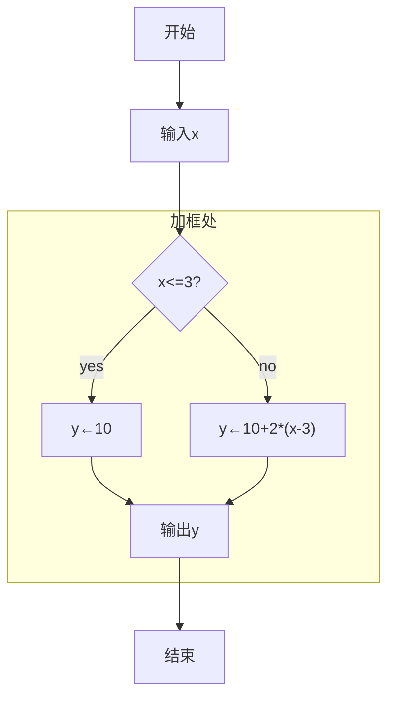
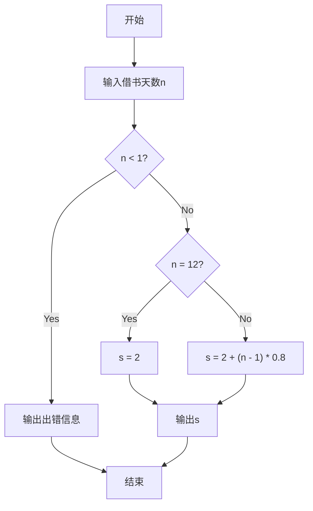

## 1 编码与数制
:::tip 学习要点
1. 二进制数、八进制数、十六进制数的概念及它们与十进制数相互转换的方法。
2. 如何使用Python中的数制转换函数。
:::
:::info 对标内容
1. 能够进行二进制、八进制、十六进制与十进制之间的相互转换；
2. 理解Python 中的数制转换函数。
:::
:::note 情景导入 
二进制起源于中国。二进制的运用，在我国古代就已显现得淋漓尽致。中国古代的二进制运用与现代电子计算机中二进制的运用是一致的。首先从《易经》上可以看到二进制的起源。《易经》阐述的是世间万象变化，通过卦爻来说明天地之间、日月系统以内、人生与事物变化的法则。《易经》中的卦是用阳爻（—）、阴爻（--）表示的，可看作用二进制手段实现的。中国古代将二进制运用于天地、人事、哲学研究，而现代的信息系统领域将二进制运用于电子数字化研究。
:::
### 1.1 十进制与二进制
::::tip 知识点详解
- 人们通常把用来表示信息的符号组合称为信息代码，而编制代码的过程称为信息编码。
- 在计算机中，所有的信息都是采用二进制数存储的，计算机存储的最小单位是位，每一个二进制位可以表示0和1两种信息。
- ==二进制数的特点是==：有0、1两个基本数码，采用逢二进一的进位规则。
- ==将十进制数转化为二进制数的方法==：除以2取余，逆序输出。
- ==例如==：(143)~10~ = (10001111)~2~
除以2取余数，直到商为0，将所得余数倒排序。
:::echarts 
```js
option = {
    title: {
        text: '十进制数143转换为二进制数的过程',
        subtext: '除以2取余，逆序输出',
        left: 'center',
        top: 10,
        textStyle: {
            color: 'gray'
        },
        subtextStyle: {
            color: 'gray'
        }
    },
    tooltip: {
        trigger: 'axis',
        axisPointer: {
            type: 'shadow'
        }
    },
    legend: {
        data: ['除数', '余数'],
        top: 50,
        textStyle: {
            color: 'gray'
        }
    },
    grid: {
        left: '5%',
        right: '5%',
        bottom: '10%',
        top: '25%',
        containLabel: true
    },
    xAxis: {
        type: 'category',
        data: ['第1步', '第2步', '第3步', '第4步', '第5步', '第6步', '第7步', '第8步'],
        axisLabel: {
            interval: 0,
            rotate: 0,
            color: 'gray'
        }
    },
    yAxis: [{
        type: 'value',
        name: '除数',
        position: 'left',
        nameTextStyle: {
            padding: [0, 0, 0, -30],
            color: 'gray'
        },
        axisLabel: {
            color: 'gray'
        }
    }, {
        type: 'value',
        name: '余数',
        position: 'right',
        nameTextStyle: {
            padding: [0, -30, 0, 0],
            color: 'gray'
        },
        axisLabel: {
            color: 'gray'
        }
    }],
    series: [{
        name: '除数',
        type: 'line',
        data: [143, 71, 35, 17, 8, 4, 2, 1],
        label: {
            show: true,
            position: 'top',
            fontSize: 12,
            color: 'gray'
        }
    }, {
        name: '余数',
        type: 'bar',
        yAxisIndex: 1,
        data: [1, 1, 1, 1, 0, 0, 0, 1],
        label: {
            show: true,
            position: 'top',
            fontSize: 12,
            color: 'gray'
        }
    }]
};
```
:::
- 将二进制数转化为十进制数的方法：按权展开，逐项相加。
- ==例如==：(1011)~2~ = 1×2^3^+0×2^2^+1×2^1^+1×2^0^=(11)~10~
- n 个二进制位最多能表示的不同信息个数是2n；
- n位的二进制数能表示的最大十进制数是2n-1。
- Python 中的转换函数：
    + bin()函数将十进制整数转换为二进制数字符串，要求参数必须为整数；
        ```Python
        bin(10)
        ```
        + 运行结果：
        ```console
        '0b1010'
        ```
        其中，0b表示二进制数。
    + int()函数将二进制数字符串转换为十进制数。
        ```Python
        int('1010',2)
        ```
        + 运行结果：
        ```console
        10
        ```
::::
:::caution 易错点
1. bin() 函数将十进制整数转换为二进制数，返回的结果是字符串。
2. 二进制数的前缀“0b”可以省略，同时“0b”与“0B”等价，不区分大小写，八进制数、十六进制数的表示同理。 
:::
#### 1.1.1 模拟考题
:::important 考题1 单选题
将十进制数120转换为二进制数时，该二进制数的位数是（     ）。
- A.5    B.6    C.7[+将十进制数120转换为二进制数时，该二进制数的位数是C]    D.8
:::
[+将十进制数120转换为二进制数时，该二进制数的位数是C]:
    解析：将120除2取余，逆向输出，得到的答案是1111000。
:::important 考题2 判断题
二进制数10101010对应的十进制数为169。（     ）[+二进制数10101010对应的十进制数为169错误]
:::
[+二进制数10101010对应的十进制数为169错误]:
    解析：按权展开，得到的答案是170。
### 1.2 十进制与八进制
::::tip 知识点详解
- 八进制数的特点是：有0、1、2、3、4、5、6、7共8个基本数码，采用==逢八进一==的进位规则。
- ==将十进制数转化为八进制数的方法==：除以8取余，逆序输出。
- ==例如==：(143)~10~ = (217)~8~
- 除以8取余数，直到商为0，将所得余数倒排序。
- 将八进制数转化为十进制数的方法：按权展开，逐项相加。
- ==例如==：(217)~8~ = 2×8^2^+1×8^1^+7×8^0^=(143)~10~
- Python 中的转换函数：
    + oct()函数将十进制整数转换为八进制数字符串，要求参数必须为整数；
        ```Python
        oct(10)
        ```
        + 运行结果：
        ```console
        '0o12'
        ```
        其中，0o表示八进制数。
    + int()函数将八进制数字符串转换为十进制数。
        ```Python
        int('12',8)
        ```
        + 运行结果：
        ```console
        10
        ```
::::
:::caution 易错点
1. oct() 函数将十进制整数转换为八进制数字，返回的结果是字符串。
2. 八进制数的前缀“0o”可以省略，“0o”与“0O”等价，不区分大小写。
:::
#### 1.2.1 模拟考题
:::important 考题1 单选题
表达式int('11', 8) 的值是（     ）。
- A. 10    B. 11    C. 12    D. 13[+表达式int118的值是D]
:::
[+表达式int118的值是D]:
    解析：将11除以8取余，逆向输出，得到的答案是13。
:::important 考题2 判断题
八进制数68对应的十进制数为56。（     ）[+八进制数68对应的十进制数为56错误]
:::
[+八进制数68对应的十进制数为56错误]:
    解析：八进制数没有“8”这个基数，所以答案是错误。
### 1.3 十进制与十六进制
::::tip 知识点详解
- 十六进制数的==特点==是：有0、1、2、3、4、5、6、7、8、9、A、B、C、D、E、F共16个基本数码，采用逢十六进一的进位规则。
1. 将十进制数转化为十六进制数的==方法==：除以16取余，逆序输出。
    - 例如：(143)~10~ = (8F)~16~
    - 除以16取余数，直到商为0，将所得余数倒排序。
2. 将十六进制数转化为十进制数的==方法==：按权展开，逐项相加。
    - 例如：(8F)~16~ = 8×16^1^+15×16^0^=(143)~10~
    - Python 中的转换函数：
        - hex()函数将十进制整数转换为十六进制数字符串，要求参数必须为整数；
            ```Python
            hex(10)
            ```
            + 运行结果：
            ```console
            '0x12'
            ```
            其中，0x表示十六进制数。
        - int()函数将十六进制数字符串转换为十进制数。
            ```Python
            int('12',16)
            ```
            + 运行结果：
            ```console
            10
            ```
::::
:::caution 易错点
1. hex() 函数将十进制整数转换为十六进制数，返回的结果是字符串。
2. 十六进制数的前缀“0x”可以省略，“0x”与“0X”等价。
:::
#### 1.3.1 模拟考题
:::important 考题1 单选题
将十进制数30转换为十六进制数，最低位上的数是（    ）。
A. c    B. d    C. e[+将十进制数30转换为十六进制数，最低位上的数是C]    D. f
:::
[+将十进制数30转换为十六进制数，最低位上的数是C]:
    解析：将30除以16取余，余数为十进制14，转为十六进制是e或E，所以答案是C。
:::important 考题2 判断题
将十进制数转换成十六进制数后，它的位数一定会变短。（    ）[+将十进制数转换成十六进制数后，它的位数一定会变短错误]
:::
[+将十进制数转换成十六进制数后，它的位数一定会变短错误]:
    解析：10以内的十进制数转为十六进制数，位数不变，所以答案是错误。

### 1.4 二进制与十六进制
::::tip 知识点详解
1. 将二进制整数转化为十六进制数的方法：从低位开始4位1组，逐组转换（如果位数不够，左边补0凑足）。
    - 例如：(101110111110111)~2~ = (5DF7)~16~

    | 二进制数 | 0101 | 1101 | 1111 | 0111 |
    |:---:|:---:|:---:|:---:|:---:|
    | 十六进制数 | 5 | D | F | 7 |
    - 合并4组4位十六进制数，得到5DF7。
2. 将十六进制数转化为二进制数的方法：逐位肢解，1位数转为4位二进制数（如果最左边有0，省略不写）。
    - 例如：(5DF7)~16~ = (101110111110111)~2~

    | 十六进制数 | 5 | D | F | 7 |
    |:---:|:---:|:---:|:---:|:---:|
    | 二进制数 | 0101 | 1101 | 1111 | 0111 |
    - 合并4组4位二进制数，把最左边的0省略不写，得到101110111110111。
- Python 中的转换函数：
    - hex()函数将二进制整数转换为十六进制数字符串，要求参数必须为整数；
        ```Python
        hex(10)
        ```
        + 运行结果：
        ```console
        '0x12'
        ```
        其中，0x表示十六进制数。
    - bin()函数将十六进制数转换为二进制数。
        ```Python
        bin(10)
        ```
        + 运行结果：
        ```console
        '0b1010'
        ```
        其中，0b表示二进制数。
::::
:::caution 易错点
1. hex() 函数将二进制整数转换为十六进制数，二进制数不必加引号。
2. bin() 函数将十六进制数转换为二进制数，十六进制数不必加引号。
:::
#### 1.4.1 模拟考题
:::important 考题1 单选题
下列关于表达式的计算结果，不正确的是（     ）。
- A. hex(int('11',2)) 的结果是 '0x3'
- B. hex(0b11110111) 的结果是'0xf7'
- C. hex(int('11',16)) 的结果是 '0x17’[+下列关于表达式的计算结果，不正确的是C]
- D. bin(0xf7) 的结果是'0b11110111'
:::
[+下列关于表达式的计算结果，不正确的是C]:
    解析：C选项正确的结果应该是'0x11'。
:::important 考题2 判断题
二进制数11110011转化为十六进制数为F3。（     ）[+二进制数11110011转化为十六进制数为F3正确]
:::
[+二进制数11110011转化为十六进制数为F3正确]:
    解析：二进制整数转化为十六进制数，从低位开始4位1组，逐组转换。
## 2 数据处理
:::tip 学习要点
一维及二维数据的相关知识：表示、存储、格式化、读入文件、写入文件、提取数据、CSV文件的操作、添加数据。
:::
:::info 对标内容
掌握一维数据的表示和读写方法，能够编写程序处理一维数据。掌握二维数据的表示和读写方法，能够编写程序处理二维数据。掌握CSV格式文件的读写方法。
:::
:::note 情景导入
- 一份班级期中考试成绩表，就是一个二维数据。
- ython是强大的数据处理工具，最基础的数据文件有一维数据、二维数据、CSV格式数据文件。
    1. 一维数据：由对等关系的有序或无序数据组成，采用线性方式组成。
    2. 二维数据：由多个一维数据构成，是一维数据的组合形式。
    3. CSV（Comma-Separated Values）格式数据文件：
        - 国际通用的一二维数据存储格式，扩展名一般为.csv，每行存储一个一维数据，采用逗号分隔，无空行。
        - Excel 和一般文字编辑软件都可以读入或保存CSV文件。
:::
### 2.1 一维数据
:::tip  知识点详解
- 一维数据由对等关系的有序或无序数据构成，采用线性方式组织，对应数学中的数组的概念。
- 一维数据具有线性特点。任何表现为序列或集合的对象都可以看作一维数据。
- 在Python中，一维数据主要采用列表形式表示。
    ```python
    num = [1, 2, 3, 4, 5]
    print(num)
    ```
    + 运行结果：
    ```console
    [1, 2, 3, 4, 5]
    ```
- 一维数据的存储：
    - 采用空格分隔元素；
    - 采用逗号分隔元素（常用，CSV格式）；
    - 采用换行分隔元素；
    - 采用其他特殊符号（比如；）分隔元素。
    - CSV格式就是采用逗号分隔值，它是一种通用的、相对简单的文件格式，广泛应用，Excel、记事本等大部分编辑器支持直接读入或保存CSV格式文件。CSV文件的扩展名为.csv。
    - 1. 将列表对象输出为CSV格式文件，示例如下。
        ```python
        num = ['北京','上海','广州','深圳']
        f = open('num.csv', 'w')
        for i in num:
            f.write(str(i) + ',')
        f.close()
        ```
        - 在上述Python程序的同目录下，如果存在city.csv文件，执行上述程序，将覆盖city.csv 文件（如果想非覆盖，将'w'改为'a'即可）；如果不存在city.csv 文件，执行上述程序后，将产生一个city.csv文件。
        - 打开city.csv文件，内容如下。
            ```console
            北京,上海,广州,深圳,
            ```
        - ==注意==：CSV文件中，每行的最后一个元素后面有一个逗号。
    2. 使用with语句打开文件，处理结束后会自动关闭被打开的文件。上述代码用with语句改写如下。
        ```python
        num = ['北京','上海','广州','深圳']
        with open('num.csv', 'w') as f:
            for i in num:
                f.write(str(i) + ',')
        ```
    3. 从CSV格式文件中读出数据，表示为列表对象，示例如下。
        ```python
        f=open('city.csv','r')
        c=f.read().strip().split(',')
        f.close()
        print(c)
        ```
        - 上述代码用with语句改写如下。
            ```python
            with open('city.csv','r') as f:
                c=f.read().strip().split(',')
            print(c)
            ```
:::
:::info  拓展知识
#### 2.1.1 open()函数
- open()函数用于打开文件，语法格式如下。
    ```python
    open(filename, mode='r', buffering=-1, encoding=None, errors=None, newline=None, closefd=True, opener=None)
    ```
    - filename：文件名，包含路径。
    - mode：打开模式，默认为只读模式。
    - buffering：设置缓冲。
    - encoding：一般使用utf-8。
    - errors：报错级别。
    - newline：区分换行符。
    - closefd：传入的file参数将被关闭，应为False。
    - opener：设置自定义开启器。
- open()函数返回一个文件对象，通过该文件对象可以对文件进行读写操作。
#### 2.1.2 read()方法
- read()方法用于读取文件中的内容，语法格式如下。
    ```python
    file.read([size])
    ```
    - size：表示读取的字节数。
    - 如果没有指定size参数，将读取整个文件。
    - 返回值为读取的字符串。
#### 2.1.3 write()方法
- write()方法用于向文件中写入内容，语法格式如下。
    ```python
    file.write(str)
    ```
    - str：表示要写入的字符串。
    - 返回值为写入的字符数。
#### 2.1.4 close()方法
- close()方法用于关闭文件，语法格式如下。
    ```python
    file.close()
    ```
    - 关闭后文件不能再进行读写操作，否则会出现ValueError异常。
#### 2.1.5. strip()方法
- strip()方法用于移除字符串头尾指定的字符（默认为空格或换行符）或字符序列，语法格式如下。
    ```python
    str.strip([chars])
    ```
    - chars：表示移除字符串头尾指定的字符序列。
    - 返回值为移除字符串头尾指定的字符序列后生成的新字符串。
#### 2.1.6. split()方法
- split()方法通过指定分隔符对字符串进行切片，如果参数num有指定值，则分隔num+1个子字符串，语法格式如下。
    ```python
    str.split(str="", num=string.count(str))
    ```
    - str：表示分隔符，默认为所有的空字符，包括空格、换行(\n)、制表符(\t)等。
    - num：表示分割次数。
    - 返回值为分割后的字符串列表。
#### 2.1.7. join()方法
- join()方法用于将序列中的元素以指定的字符连接生成一个新的字符串，语法格式如下。
    ```python
    str.join(sequence)
    ```
    - sequence：要连接的元素序列。
    - 返回值为通过指定字符连接序列中元素后生成的新字符串。
#### 2.1.8. with语句
- with语句用于简化文件读写操作，语法格式如下。
    ```python
    with open(filename, mode='r', buffering=-1, encoding=None, errors=None, newline=None, closefd=True, opener=None) as file:
        file.read()
    ```
    - filename：文件名，包含路径。
    - mode：打开模式，默认为只读模式。
    - buffering：设置缓冲。
    - encoding：一般使用utf-8。
    - errors：报错级别。
    - newline：区分换行符。
    - closefd：传入的file参数将被关闭，应为False。
    - opener：设置自定义开启器。
    - file：文件对象。
    - file.read()：读取文件中的内容。
    - file.write(str)：向文件中写入内容。
    - file.close()：关闭文件。
:::
:::caution  易错点
1. 一维数据的概念掌握不清晰，导致送分题答题错误率较高。
2. 要理解清楚基础打开文件和with语句打开文件代码每一行的含义。 
:::
#### 2.1.9 模拟考题
:::important 考题1 单选题
有如下程序：
```python
ls=[' 武汉','温州','香港','重庆']
f=open('city.csv','w')
f.write(','.join(ls)+'\n')
f.close()
```
下列说法正确的是（     ）。
- A. 有可能抛出错误
- B. 将输出字符串
- C. 当前程序的功能是将CSV文件表示为列表对象
- D. 当前程序的功能是将列表对象输出到CSV文件[+有如下程序D]
:::
[+有如下程序D]:
    解析：当前程序的功能是将列表对象写到city.csv文件中，所以选D。

:::important 考题2 判断题
在Python中，为了确保列表中每个写入CSV文件中的数据，在电子表格软件中打开时都作为一个单元格存在，可以使用```file.write(','.join(name)+'\n')```语句（file为文件变量名）。（     ）[+答在Python中，为了确保列表中每个写入CSV文件中的数据正确]
:::
[+答在Python中，为了确保列表中每个写入CSV文件中的数据正确]:
    解析：数据以“，”合并成字符串，字符串末尾加换行符。
### 2.2 二维数据
:::tip  知识点详解
- 二维数据由多个一维数据构成，是一维数据的组合形式，可以用二维列表表示。列表的每个元素对应二维数据的一行，这个元素本身也是列表。
- 二维数据一般采用相同的数据类型存储数据。
1. 二维数据的表示：
    ```python
    ls=[['北京','上海','广州','深圳'],
    ['11','22','33','44']]
    print(ls)
    ```
    + 运行结果：
    ```console
    [['北京', '上海', '广州', '深圳'], 
    ['11', '22', '33', '44']]
    ```
    - 二维数据用CSV格式存储。CSV文件的每一行是一维数据，整个CSV文件是一个二维数据
2. 将列表对象输出为CSV格式，示例如下
    ```python
    ls=[['北京','上海','广州','深圳'],
    ['11','22','33','44']]
    f=open('city.csv','w')
    for i in ls:
        f.write(','.join(i)+'\n')
    f.close()
    ```
    - 上述代码用with语句改写如下。
        ```python
        ls=[['北京','上海','广州','深圳'],
        ['11','22','33','44']]
        with open('city.csv','w') as f:
            for i in ls:
                f.write(','.join(i)+'\n')
        ```
    - 在上述Python程序的同目录下，如果存在cj.csv文件，运行上述程序后，将覆盖cj.csv文件；如果不存在cj.csv文件，运行上述程序后，将产生一个cj.csv 文件
3. 从CSV格式文件读出数据，表示为列表对象，示例如下
    ```python
    with open('city.csv','r') as f:
        ls=[]
        for line in f:
            ls.append(line.strip().split(','))
    print(ls)
    ```
    + 运行结果：
    ```console
    [['北京', '上海', '广州', '深圳'],
    ['11', '22', '33', '44']]
    ```
:::
:::info  拓展知识
#### 2.2.1 append()方法
- append()方法用于在列表末尾添加新的对象，语法格式如下。
    ```python
    list.append(obj)
    ```
    - obj：表示要添加到列表末尾的对象。
    - 返回值为None。
#### 2.2.2 其余方法同一维数据
:::
:::caution  易错点
1. 如果对二维数据的概念掌握不清晰，会导致送分题答题错误率较高。
2. 要理解上述两段代码每一行的含义。
:::
#### 2.2.3 模拟考题
:::important 考题1 单选题
要对二维列表所有的数据进行格式化输出，打印成表格形状，程序段如下：画线处的代码应该为（     ）。
```python
ls = [[' 金京',89],[ ' 吴树海',80],[ '王津津',90]]
for row in range(len(ls))：
    for column in range(len(ls[row]))：
        print(_______,end="\t")
print()
```
- A. ```ls[row][column]```[+要对二维列表所有的数据进行格式化输出A]
- B. ```ls[row]```
- C. ```ls[column]```
- D. ```ls[column][row]```
:::
[+要对二维列表所有的数据进行格式化输出A]:
    解析：根据二维数据的切片可得答案。
::::important 考题2 编程题‘
请读取1班和2班语文学科的成绩文件score.csv的数据，数据内容如下图所示。

| 班级 | 语文成绩 |
|:---:|:---:|
| 2 | 56 |
| 1 | 96 |
| 2 | 78 |
| 2 | 99 |
| 1 | 67 |
| 2 | 89 |
| 1 | 90 |
| 1 | 65 |
| 2 | 60 |
- 下列代码实现了读取数据并分别统计1班和2班语文成绩的和，请你补全代码。
:::code-tabs
@tab 待补全
```python :collapsed-lines=5
import csv 
with open("    ①    ") as f:
    rows = list(csv.reader(f))
    sum1 = 0
    sum2 = 0
    for row in rows[1:]:
        if int(    ②    ) == 1:
            sum1 += int(row[1])
        else:
            sum2 += int(row[1])
    print(    ③   )
```
@tab Python
```python :collapsed-lines=5
import csv 
# 打开score.csv文件，使用csv模块读取
with open("score.csv") as f:  # ①处填入"score.csv"
    rows = list(csv.reader(f))  # 将CSV文件内容转换为列表
    sum1 = 0  # 初始化1班总分
    sum2 = 0  # 初始化2班总分
    for row in rows[1:]:  # 从第二行开始遍历(跳过表头)
        if int(row[0]) == 1:  # ②处填入"row[0]" - 判断班级是否为1班
            sum1 += int(row[1])  # 1班成绩累加
        else:
            sum2 += int(row[1])  # 2班成绩累加
    print(f"1班总分：{sum1}，2班总分：{sum2}")  # ③处填入输出语句
```
::::
### 2.3 CSV文件
:::tip  知识点详解
- CSV（Comma-Separated Values）格式是一种通用的、相对简单的文件格式，广泛应用，Excel、记事本等大部分编辑器支持直接读入或保存CSV格式文件。CSV文件的扩展名为.csv。
- CSV文件的每一行是一维数据，整个CSV文件是一个二维数据。
- CSV文件的每一行是一维数据，整个CSV文件是一个二维数据。
    1. 读取CSV文件，示例如下。
        ```python
        import csv
        with open('city.csv','r') as f:
            rows = list(csv.reader(f))
        print(rows)
        ```
        + 运行结果：
        ```console
        [['北京', '上海', '广州', '深圳'], ['11', '22', '33', '44']]
        ```
    2. 将列表对象输出为CSV格式，示例如下。
        ```python
        import csv
        ls=[['北京','上海','广州','深圳'],
        ['11','22','33','44']]
        with open('city.csv','w') as f:
            writer = csv.writer(f)
            for row in ls:
                writer.writerow(row)
        ```
:::
:::info  拓展知识
#### 2.3.1 csv模块
- csv模块用于处理CSV格式文件，语法格式如下。
    ```python
    import csv
    ```
    - csv.reader()：读取CSV格式文件。
    - csv.writer()：写入CSV格式文件。
:::
### 2.4 简单的文件读写
:::tip  知识点详解
#### 2.4.1 将数据存储于本地CSV文件
1. 方法1：单行写入
    ```python
    with open('city.csv','w') as f:
        f.write('北京,上海,广州,深圳')
    ```
    - 在Windows里保存的CSV文件是每空一行存储一条数据，使用newlines='' 可保证存储的数据没有空行。
2. 方法2：多行写入
    ```python
    with open('city.csv','w') as f:
        f.write('北京\n')
        f.write('上海\n')
        f.write('广州\n')
        f.write('深圳\n')
    ```
#### 2.4.2  read()函数的使用
1. 参数详解
    - size：表示读取的字节数。
    - 如果没有指定size参数，将读取整个文件。
    - 返回值为读取的字符串。
2. 示例代码
    ```python
    with open('city.csv','r') as f:
        data = f.read() # 从文件指针所在的位置，读到文件结尾
        data3 = f.read(5) #  # 读取到了0个字节，因为文件指针已经读到文件尾部
    print(data)
    with open('city.csv','r') as f:
        data1 = f.read(5) # 从文件指针所在的位置开始读5个字节
        data2 = f.read() # 从文件指针所在的位置读到文件结尾
    print(data1)
    print(data2)
    ```
    - 运行结果：
    ```console
    北京,上海,广州,深圳

    北京,上海
    ,广州,深圳
    ```
#### 2.4.3  read()与readline()、readlines()的区别
1. read()
    - 一次读取整个文件，将文件指针移动到文件末尾。
    - 返回值为读取的字符串。
2. readline()
    - 一次读取一行，将文件指针移动到下一行。
    - 返回值为读取的字符串。
3. readlines()
    - 一次读取整个文件，将文件指针移动到文件末尾。
    - 返回值为读取的字符串列表。
#### 2.4.4  reader()函数
- reader()函数用于读取CSV格式文件，语法格式如下。
    ```python
    csv.reader(csvfile, dialect='excel', **fmtparams)
    ```
    - csvfile （必需参数）：一个可迭代的文件对象，通常是通过 open() 函数以读取模式('r')打开的文件，建议在打开文件时指定 newline='' ，避免不同操作系统换行符的问题
    - dialect='excel' （可选参数）：指定读取 CSV 文件的格式方言，默认值是 'excel'，这是最常用的格式主要特点：
        - 使用逗号(,)作为字段分隔符
        - 使用双引号(")作为引用字符
    - 自动处理换行符
    - **fmtparams （可选参数）：用于覆盖 dialect 的格式设置，常用的格式参数包括：
        - delimiter ：字段分隔符
        - quotechar ：引用字符
        - skipinitialspace ：是否跳过字段开头的空格
    - 返回值为CSV格式文件的读取器对象。
- 导入模块csv之后，我们将CSV文件打开，并将结果文件对象存储在f中。然后，调用csv.reader()，将前面存储的文件对象作为实参传递给它，从而创建一个与该文件相关联的阅读器（reader）对象，等待进一步处理，如下例所示
    ```python
    import csv
    with open('city.csv','r') as f:
        reader = csv.reader(f)
        for row in reader:
            print(row)
    ```
    - 运行结果：
    ```console
    ['北京', '上海', '广州', '深圳']
    ['11', '22', '33', '44']
    ```
#### 2.4.5  writer()函数
- writer()函数用于写入CSV格式文件，语法格式如下。
    ```python
    csv.writer(csvfile, dialect='excel', **fmtparams)
    ```
    - csvfile （必需参数）：一个支持迭代的文件对象通常是通过 open() 函数打开的文件，建议使用 'w' 模式打开文件用于写入
    - dialect='excel' （可选参数）：用于指定 CSV 文件的格式方言，默认值是 'excel'，这种格式最常用
        - 主要特点：
            - 使用逗号(,)作为分隔符
            - 使用双引号(")作为引用字符
            - Windows 系统使用 '\r\n' 作为行结束符
    - **fmtparams （可选参数）：用于覆盖 dialect 的格式设置，常用的格式参数包括：
        - delimiter ：字段分隔符，默认为逗号
        - quotechar ：引用字符，默认为双引号
        - lineterminator ：行结束符
        - quoting ：引用方式
    - 返回值为CSV格式文件的写入器对象。
    1. 通过write()函数向文件中写入一行数据
        - 基础写法
            ```python
            import csv
            f=open(r"city.csv",'w')
            f.write('新疆，乌鲁木齐，万达广场\n') # 写入一行数据
            f.close()
            ```
        - with语句写法
            ```python
            import csv
            with open(r"city.csv", 'w') as f:
                f.write('新疆，乌鲁木齐，万达广场\n') # 写入一行数据
            ```
    2. 通过writerows()函数向文件中写入多行数据
        - 基础写法
            ```python
            import csv
            f=open(r"city.csv",'w')
            writer=csv.writer(f)
            writer.writerows([['北京','上海','广州','深圳'],['11','22','33','44']]) # 写入多行数据
            f.close()
            ```
        - with语句写法
            ```python
            import csv
            with open(r"city.csv", 'w') as f:
                writer=csv.writer(f)
                writer.writerows([['北京','上海','广州','深圳'],['11','22','33','44']]) # 写入多行数据
            ```
#### 2.4.6   write()和writelines()的区别
1. write()
    - 一次写入一个字符串，将字符串写入文件中。
    - 返回值为写入的字符数。
2. writelines()
    - 一次写入多个字符串，将字符串列表写入文件中。
    - 返回值为写入的字符数。
    - 示例代码
        ```python :collapsed-lines=5
        with open('city.csv','w') as f:
            f.write('北京,上海,广州,深圳\n') # 写入一行数据
            f.writelines(['11,22,33,44\n']) # 写入一行数据
        ```
        - 运行结果：
        ```console
        北京,上海,广州,深圳
        11,22,33,44
        ```
:::
:::caution  易错点
1. 注意对比下列函数或方法的用法与区别：open()、write()、writelines()、writer()、writerow()、writerows()、read()、reader()。
2. 注意对比下列函数或方法的用法与区别：read()、reader()。
:::
#### 2.4.7  模拟考题
:::important 考题1 判断题
在Python中，可以使用下面的代码读取文件中的数据到列表。（     ） [+可以使用下面的代码读取文件中的数据到列表正确]
```python
file = open('score.csv','r')
name = file.read().strip('\n').split(',')
file.close()
```
:::
[+可以使用下面的代码读取文件中的数据到列表正确]:
    解析：这是在考核read()函数的用法。
::::important 考题2 编程题
- 请读取文件plant.csv中的数据，数据内容如下图所示

    | 植物编号 | 生长情况 |
    |:---:|:---:|
    | A32 | 5 |
    | A09 | 5 |
    | A17 | 9 |
    | A43 | 6 |
    | A06 | 3 |
    | B19 | 5 |
    | B22 | 7 |
    | C08 | 8 |
    | C17 | 8 |
    | C36 | 4 |
- 下列代码实现了读取“植物编号”和“生长情况”信息，输出“生长情况”达到6的数量，请你补全代码。
    :::code-tabs
    @tab 待补全
    ```python :collapsed-lines=5
    import csv
    with open("plant.csv") as f:
        rows = list(   ①  (f))
        s=0
        for row in rows[1:]:
            if(   ②    >= 6):
                s=s + 1
    print(s)
    ```
    @tab Python
    ```python :collapsed-lines=5
    import csv  # 导入csv模块用于处理CSV文件

    # 打开plant.csv文件并读取内容
    with open("plant.csv") as f:
        rows = list(csv.reader(f))  # ①处填入csv.reader，将CSV文件内容转换为列表
        s = 0  # 初始化计数器，用于统计生长情况大于等于6的植物数量
        
        # 从第二行开始遍历(跳过表头)
        for row in rows[1:]:
            # ②处填入int(row[1])，将生长情况（第2列）转换为整数后与6比较
            if(int(row[1]) >= 6):  
                s = s + 1  # 如果生长情况大于等于6，计数器加1
                
    print(s)  # 输出统计结果
    ```
    :::
::::
## 3 异常处理
:::tip 学习要点
会使用try…except…进行异常处理。
:::
:::info 对标内容
理解程序的异常处理：try…except…结构语句。
:::

:::note 情景导入
+ 我们在使用Python语言写代码时，难免会弄出一些错误语句，而初学
Python 的青少年朋友往往不知道是哪里出了错，或者不知道自己错在哪里。要
找出是哪行代码出错、错误的类型是什么、错在哪个细节，逐步分析，从而改正
错误，那就要引入“Python的异常处理”。
+ 异常就是程序运行过程中出现的错误或遇到的意外情况。错误的类型有语法
错误、运行错误、逻辑错误。出错的理由通常是输入错误、下标越界、类型错误、
操作不当等。
:::

### 3.1 try…except…格式
:::tip 
Python程序一般对输入有一定的要求，但当实际输入不满足程序要求时，可能会产生运行错误。为了保证程序运行的稳定性，此类运行错误可以被Python 程序捕获并合理控制。
:::
#### 3.1.1 语法规则
```Python
try:
    <语句块 1>
except:
    <语句块 2>
```
当碰到错误语句，try代码块的剩余代码将会被忽略，except代码块的代码
将被执行，如下例所示。
```Python
try:
    a=8/0
    print(a)
except:
    print(' 除数为 0的错误！')
```
运行结果：
```Python
'除数为0的错误！'
```
:::caution 易错点
+ 当碰到错误语句，try代码块的==剩余代码将会被忽略==。
+ “except”容易==拼写错误==。 
:::
#### 3.1.2 模拟考题
:::important 考题1 单选题
关于Python异常处理的作用，描述==不正确==的是（     ）。
+ A. 当程序有输入错误时，可以让程序继续运行
+ B. 异常处理能够弥补程序的漏洞，让程序在任何情况下都不会终止运行[+关于Python异常处理的作用，描述不正确的是B]
+ C. 当try语句中有错误时，不再执行try中剩余的代码
+ D. 当try语句中没有错误时，执行完try中剩余的代码就不再执行except
语句
:::
[+关于Python异常处理的作用，描述不正确的是B]:
    异常处理只能让程序在有些情况下不会终止运行，所以选B。
:::important 考题2 判断题
异常处理结构中，try程序段中的每一个运行错误语句，都要转移到except程序段中，执行异常处理语句。（     ）
+ 答案：错误[+异常处理结构中]
:::
[+异常处理结构中]:
    ==解析==：有的错误情况还是会抛出错误提示。
### 3.2 try…except…except…格式
#### 3.2.1 语法规则
```Python
try:
    < 语句块 1>
 except:
    < 语句块 2>
 except:
    < 语句块 2>
 except:
    < 语句块 2>
```
==当碰到错误语句==，try代码块的剩余代码将会被忽略。根据错误的具体情况，选择except代码块的代码执行，如下例所示。
```Python
try:
    a=int(input(' 输入一个数 '))
    b=int(input(' 输入另一个数 '))
    m=a/b
    print(' 商是 ',m)
 except ValueError:
    print(' 输入的不是数字！')
 except ZeroDivisionError:
    print(' 除数为 0！')
 except :
    print(' 其他错误！')
```
+ 当输入的a、b都是数字，且b非0时，输出正常的数值。
+ 当输入的a、b中有非数字时，==运行结果如下==。
```Python
'输入的不是数字！'
```
::::caution 易错点
+ 要求识记关键字“ValueError”。
+ 要求识记关键字“ZeroDivisionError”。
:::details 常用异常类关键字
+ SyntaxError：在代码存在语法错误时抛出，像遗漏冒号、括号不匹配等情况。
```Py
# 遗漏冒号，会引发 SyntaxError
if True
    print("Hello")
```
+ TypeError：当操作或函数应用于不恰当类型的对象时抛出，例如对字符串和整数进行加法操作。
```py
# 字符串和整数相加，会引发 TypeError
result = "Hello" + 1  
```
+ ValueError：当函数接收到合适类型但不合法的值时抛出，例如将非数字字符串转换为整数。
```py
# 非数字字符串转换为整数，会引发 ValueError
num = int("abc")  
```
+ IndexError：当你尝试访问序列（如列表、元组）中不存在的索引时抛出。
```py
my_list = [1, 2, 3]
# 索引超出范围，会引发 IndexError
print(my_list[3])  
```
+ KeyError：当你尝试访问字典中不存在的键时抛出。
```py
my_dict = {"name": "Alice", "age": 25}
# 键不存在，会引发 KeyError
print(my_dict["city"])  
```
+ NameError: 当你尝试访问一个未定义的变量时，就会触发 NameError。
```py
# 尝试访问未定义的变量
try:
    print(non_existent_variable)
except NameError as e:
    print(f"捕获到 NameError: {e}")
```
+ FileNotFoundError: 当你尝试打开一个不存在的文件时，会引发 FileNotFoundError，它是 OSError 的子类。
```py
# 尝试打开不存在的文件
try:
    with open('non_existent_file.txt', 'r') as file:
        content = file.read()
except FileNotFoundError as e:
    print(f"捕获到 FileNotFoundError: {e}")
```
+ Warning 和 UserWarning: Warning 是所有警告类的基类，UserWarning 是 Warning 的子类，用于发出用户自定义的警告信息。你可以使用 warnings 模块来发出和处理警告。
```py :collapsed-lines=5
import warnings

# 触发 UserWarning
def some_function():
    warnings.warn("这是一个用户自定义警告", UserWarning)

try:
    some_function()
except UserWarning as e:
    print(f"捕获到 UserWarning: {e}")
else:
    print("未捕获到 UserWarning，因为警告默认不会触发异常，除非你设置了警告过滤器。")

# 设置警告过滤器，将 UserWarning 转换为异常
warnings.filterwarnings("error", category=UserWarning)
try:
    some_function()
except UserWarning as e:
    print(f"设置过滤器后，捕获到 UserWarning: {e}")
```
:::
::::
#### 3.2.2 模拟考题
:::important 考题1 单选题
当发生异常时，下列描述==不正确==的是（     ）。
+ A. 可以执行except模块，让程序继续运行
+ B. 异常处理能够弥补程序的漏洞，让程序在有些情况下不会终止运行
+ C. 当try语句中没有错误时，不再执行except中剩余的代码
+ D. 我们需要为每一个try模块设定且只能设定一个except模块[+当发生异常时，下列描述不正确的是D]
:::
[+当发生异常时，下列描述不正确的是D]:
    ==解析==：可以设定多个except模块，所以D不正确。
:::important 考题2 判断题
重复执行同样一段try…except…异常处理结构程序，except程序段中的语句可能会被执行，也可能不会被执行。（     ）
+ 答案：正确[+重复执行同样一段try…except…异常处理结构程序]
:::
[+重复执行同样一段try…except…异常处理结构程序]:
    ==解析==：except程序段中的语句可能会被执行，也可能不会被执行，所以答案正确。

### 3.3 try…except…else…finally…格式
#### 3.3.1 语法规则
```Python
try:
    < 语句块 1>
except:
    < 语句块 2>
else:
    < 语句块 3>
finally:
    < 语句块 4>
```
+ 当碰到错误语句时，try代码块的剩余代码将会被忽略，执行except语句块；
+ 当try语句块正确时，try代码块执行完毕，执行else语句块；
+ 不管try代码块正确与否，finally代码块均要执行，==如下例所示==。
```Python
try:
    a=int(input(' 输入一个数 '))
    b=int(input(' 输入另一个数 '))
    m=a/b
    print(' 商是 '，m)
except :
    print(' 错误！')
else:
    print(' 正确！')
finally:
    print(' 程序结束！')
```
+ 当输入的a、b两个数都是数字，且b非0时，运行结果输出正常的数值，之后再执行else与finally两个代码块。
+ 当a、b中有输入错误时，运行时不执行try剩余的代码，执行except与finally 两个代码块。
+ 总之，不管try语句有无错误，==finally代码块一定会被执行==。
:::caution 易错点
+ 这种异常处理格式容易与前面的两种异常处理格式混淆。
+ finally 代码块一定会被执行。
:::
#### 3.3.2 模拟考题
:::important 考题1 单选题
运行下列程序段时输入“yes”，则输出结果是（     ）。
```Python
try:
    x=eval(input())
    print(x)
except NameError:
    print("ok")
```
A. yes    B. ok[+运行下列程序段时输入“yes”，则输出结果是B]    C. 无法运行    D. 3
:::
[+运行下列程序段时输入“yes”，则输出结果是B]:
    ==解析==：
    + 由于输入的对象类型错误，“yes”无法与eval()函数匹配，故转去执行print("ok")。
    + 在 Python 里，eval() 函数能够把字符串当作 Python 表达式来执行，并且返回表达式的结果。
    ```Python
    result = eval("1 + 2")
    print(result)  # 输出 3
    
    # 也可以使用变量
    x = 5
    result = eval("x * 3")
    print(result)  # 输出 15
    ```
:::important 考题2 判断题
在Python中，执行下面代码，无论输入什么数据，最后一行都会输出“程序结束”。（     ）
```Python
try:
    a=eval(input())
    b=eval(input()) 
    print(a/b)
except NameError:
    print(" 错误 2") 
except ZeroDivisionError:
    print(" 错误 1") 
finally:
    print(" 程序结束 ")
```
答案：正确[+无论输入什么数据，最后一行都会输出“程序结束”。]
:::
[+无论输入什么数据，最后一行都会输出“程序结束”。]:
    ==解析==：finally 语句一定会被执行。

## 4 算法
:::tip 学习要点
解析、枚举、排序、查找等算法。
:::
:::info 对标内容
理解算法的概念，掌握解析、枚举、排序、查找算法的特征。能够用这些算法实现简单的Python程序。
:::
### 4.1 算法与算法的表示
:::note 使用计算机解决问题的一般过程
使用计算机解决问题，一般分为3个阶段:
+ 分析问题，建立模型[+分析问题，建立模型]
+ 设计算法[+设计算法]
+ 实现算法及检验结果[+实现算法及检验结果]
:::
[+分析问题，建立模型]:
    在解决问题前，要对问题有清晰的分析和描述。描述的问题必须具备3个特征：
    + ①指明定义问题范畴的所有假设；
    + ②清晰地说明已知的信息；
    + ③说明何时解决问题，并根据分析情况构建数学模型。
[+设计算法]:
    确定==怎样让计算机做==（用什么应用软件来解决）或==让计算机怎样做==（自己动手设计程序）。
[+实现算法及检验结果]:
    用计算机运行设计好的算法程序解决问题，并对结果进行检测、分析和验证。一个程序由如下两部分组成。
    :::note 指令部分
    ==指令部分==：指令是对计算机操作类型和操作数地址做出规定的一组符号。指令部分由一系列的指令组成，每条指令指定了要求计算机执行的一个操作。由适当的指令构成的序列，描述了解决这个问题的计算过程。
    :::
    :::note 数据部分
    ==数据部分==：计算所需的原始数据、计算的中间结果或最终结果。设计一个程序时，需要考虑以下问题。
        - ==数据的存储==：计算所需要的原始数据，需要存储在不同的变量中。
        - ==计算的过程==：首先必须确定解决问题的方法，接着要把该方法步骤化，并用计算机能执行的指令来实现对应的步骤。
    :::
::::details 思考题&例题
:::note 思考题 1
小杨同学在做研究性学习的课题中收集了很多数据，她想编写一个简单的计算机程序来统计、分析这些数据，则实现这一过程的—般步骤为（    ）
+ A. 分析问题、设计算法、编写程序、调试运行程序
+ B. 编写程序、分析问题、设计算法、调试运行程序
+ C. 编写程序、调试运行程序、分析问题、设计算法
+ D. 设计算法、调试运行程序、编写程序、分析问题
:::
:::note 思考题 2
下列是用计算机解决“计算圆周率”问题的几个步骤正确的顺序是（     ）
```text
①编制计算机程序，用计算机进行处理。
②分析问题，确定计算机解题任务为“计算圆周率”。
③构建数学模型，设计算法。
```
A. ①②③    B. ③①②    C. ②①③    D. ②③①
:::
::::
#### 4.1.1  算法及算法的表示方法
:::info 算法的概念
算法就是对解题方法的精确而完整的描述，即解决问题的方法和步骤。除了有“计算”的问题外，日常生活中解决问题也经常要用到算法。
:::
:::info 算法的特征
```text
（1）有穷性：执行步骤是有限的。
（2）确定性：每个步骤的含义应是确切的。
（3）可行性：每个步骤是可行的，并且能在有限的时间内完成。
（4）有0个或多个输入：初始数据可从外界输入，也可含于算法之中。
（5）有一个或多个输出：算法一定要有结果且以一定方式输出。
```
:::
#### 4.1.2 算法的==3种表示方法==
+ ==自然语言==：指人们在日常生活中使用的语言，用自然语言描述的算法通俗易懂，但缺乏直观性和简洁性，容易产生歧义。[+自然语言]
+ ==流程图==：流程图也称程序框图，它是算法的一种图形化的表示方法，与自然语言相比，它描述的算法形象、直观，更容易理解。[+流程图]
:::details 流程图1-1
```flow:preset
        st=>start: 开始  
        op=>operation: x←8  
        cond=>condition: x>5?  
        op1=>operation: y←3*x+2  
        op2=>operation: y←x*2-3  
        out=>operation: 输出y  
        e=>end: 结束  
        
        st->op->cond  
        cond(yes,left)->op1(bottom)->out->e
        cond(no,right)->op2(bottom)->out->e
```
:::
+ ==程序设计语言==:[+程序设计语言]

[+自然语言]:
    :::note 单选题
    计算圆面积的算法描述如下,描述算法的方法属于（     ）
    ```text
    ①输入圆半径r。
    ②计算圆面积S（计算公式为S＝πr2）。
    ③输出结果。
    ④结束。
    ```
    A. 流程图    B. 伪代码    C. 自然语言    D. 机器语言
    :::
[+流程图]:
    最常用的流程图构件有以下几种，一个完整的流程图1-1如图所示。
    ```text
    处理框（长方形）：框中须指出要处理的内容，该框有一个输入和一个输出。
    输入/输出框（等腰梯形）：用来表示数据的输入或计算结果的输出。
    判断框（菱形）：用来表示分支情况，有一个输入，一个以上输出。
    连接框（圆）：用来连接画不下而中断的流程线。
    流程线（箭头）：用来指出流程控制方向，即动作次序。
    起始框（椭圆）：用来表示程序的开始和结束。
    ```

[+程序设计语言]:
    Python, C++等语言来撰写算法
#### 4.1.3 算法的3种基本结构
+ 顺序结构：在算法执行流程中，执行完一个处理步骤后，依次序执行下一个步骤，如图选择结构1-1所示。
:::details 顺序结构图1-1
```flow:preset
st1=>operation: 步骤1
st2=>operation: 步骤2
st1->st2
```
:::
+ 选择结构：也称分支结构或判断结构。[+选择结构]如图选择结构1-1所示。
:::details 图选择结构1-1
```flow:preset
st=>start: 开始
cond=>condition: 情况e为真?
op1=>operation: 步骤1
op2=>operation: 步骤2
e=>end: 结束
st->cond->e
cond(yes,left)->op1->e
cond(no,right)->op2->e
```
:::

+ 循环结构:[+循环结构]如图循环结构1-1所示。
:::details 图循环结构1-1
```flow:preset
st=>start: 开始
cond=>condition: 情况e为真?
op1=>operation: 步骤1
e=>end: 结束
st->cond(yes,left)->op1(top)->cond
cond(no,bottom)->e
```
:::

[+循环结构]:
    + 在算法执行流程中，对某个情况e进行判断，当结果为真时，执行Y指向流程线下的步骤1；
    + 然后再次判断情况e，如果结果还为真，则再次执行步骤1，并继续判断情况e；
    + 重复上述过程，直到判断的结果为假，执行N指向流程线下的其他语句;
[+选择结构]:
    在算法执行过程中，对某个情况e进行判断:
    + 当结果为真时，执行Y（Yes，是）指向流程线下的步骤1
    + 否则执行N（No，否）指向流程线下的步骤2

:::caution 易错点
+ 在流程图中容易混淆分支结构与循环结构。
+ 经常会考算法的定义与特征，判断题容易做错。
:::

#### 4.1.4 模拟考题
:::important 考题1 单选题
以下关于算法的描述错误的是（     ）。
+ A. 算法必须要在有限的步骤内完成
+ B. 算法每个步骤的含义必须是确切的
+ C. 算法必须有输入，但可以没有输出[+以下关于算法的描述错误的是C]
+ D. 算法可以没有输入，但必须有输出
:::
[+以下关于算法的描述错误的是C]:
    ==解析==：根据算法的定义，算法必须有输出，所以选C。
:::important 考题2 判断题
使用计算机解决问题的一般过程是：设计算法、调试运行程序、编写程序、分析问题。（     ）
+ 答案：错误[+使用计算机解决问题的一般过程是]
:::
[+使用计算机解决问题的一般过程是]:
    ==解析==：要理解使用计算机解决问题的一般过程
    ```text
    首先要分析问题，建立模型；
    然后设计算法；
    接着实现算法（编写程序）及检验结果（调试运行程序）;
    ```
    题目中把顺序弄错了。
### 4.2 解析算法
:::info 基姆拉尔森公式
用基姆拉尔森公式计算某天是星期几。
```Python
W=(D+2*M+3*(M+1）/5+Y+Y/4-Y/100+Y/400) mod 7
```
Y表示年，是4位数，如2022；M表示月，D表示日。[+注意-基姆拉尔森公式]
```Python :collapsed-lines=5
# 提示用户输入日期，要求输入格式为 "year-month-day"，并将输入的内容赋值给变量 RiQi
RiQi = input("输入以下格式日期\"year-month-day\":") 

# 定义平年每个月的天数列表
pingnian = [31,28,31,30,31,30,31,31,30,31,30,31]
# 定义闰年每个月的天数列表
runnian = [31,29,31,30,31,30,31,31,30,31,30,31]
# 定义星期几的中文表示列表
weekday = ['日','一','二','三','四','五','六']

# 从输入的日期字符串中截取前四位并转换为整数，得到年份
year = int(RiQi[0:4]) 

# 查找输入日期字符串中第一个 '-' 的索引位置
temp1 = RiQi.find('-')
# 查找输入日期字符串中最后一个 '-' 的索引位置
temp2 = RiQi.rfind('-')

# 从输入日期字符串中截取月份部分并转换为整数，得到月份
month = int(RiQi[5:temp2]) 
# 从输入日期字符串中截取日期部分并转换为整数，得到日期
day = int(RiQi[temp2+1:])  

# 初始化从年初到指定日期的总天数为 0
Day = 0

# 判断输入的年份是否为闰年
RunNian = ((year%4==0 and year%100!=0) or year%400==0) 

if RunNian:  # 如果是闰年
    # 遍历闰年列表中从 0 到 month - 1 的元素，累加每个月的天数
    for i in runnian[0:month-1]: 
        Day = Day + i
else:   # 如果是平年
    # 遍历平年列表中从 0 到 month - 1 的元素，累加每个月的天数
    for i in pingnian[0:month-1]:
        Day = Day + i

# 将前面累加的天数加上输入的日期，得到从年初到指定日期的总天数
Day = Day + day

# 计算从公元 1 年 1 月 1 日到输入年份前一年的最后一天的总天数对 7 取余的结果
temp = ((year-1)+(year-1)//4-(year-1)//100+(year-1)//400+1)%7

# 结合前面计算的总天数和 temp，计算指定日期是星期几的索引
Weekday = (Day+temp-1)%7

# 输出指定日期是星期几
print(f"{year}年{month}月{day}日是星期{weekday[Weekday]}")
    
```
程序输出：
```Python
2025年3月19日是星期二

```
:::
[+注意-基姆拉尔森公式]:
    + （1）该公式中要把1月和2月分别当成上一年的13月和14月处理。例如：2022年1月4日要换成2021年13月4日代入公式。
    + （2）该式的运算结果与星期几的对应关系为，0代表星期日，1代表星期一……6代表星期六。

:::tip 解析算法的概念
+ ==解析==：用数学公式描述客观事物间的数量关系。
+ ==解析算法==：用解析的方法找出表示问题的前提条件与结果之间关系的数学表达式，并通过表达式的计算来实现问题的求解。
+ 例如：计算以速度v作匀速直线运动的一个物体，在t秒内经过的距离s，则可通过公式s＝vt得到。
:::

::::details 解析算法的程序实现
:::steps
1. 建立模型 
    
    建立正确的数学模型（得出正确的数学计算式）。
2. 表达式转换
    
    将数学表达式转换为Python表达式。
:::
::::
用Python编制解析算法程序时，必须保证计算过程描述的正确性。特别是把数学表达式转换成Python表达式时，必须注意这种转换的正确性，否则容易发生运算结果错误或运行过程出错的情况。

::::details 思考题&例题
:::note 思考题 1
计算长方体体积的算法描述如下,下述算法属于（     ）
```text
② 计算长方形体积v ＝zwh。
③ 输出结果。
④ 结束。
① 输入长方体的长（z）、宽（w）、高（h）。
```
A. 枚举算法    B. 排序算法    C. 解析算法    D. 递归算法
:::

:::note 思考题 2
下列问题适合用解析算法求解的是（     ）
+ A. 将13张纸牌按从小到大进行排列
+ B. 统计100以内各位数字之和恰好为10的偶数的个数
+ C. 计算一辆车行驶100千米的油耗
+ D. 寻找本年级身高最高的同学
:::

:::note 思考题 3
有如下问题：属于解析算法的选项是（     ）。
```text
①已知圆锥体的半径r和高度h，使用公式V＝πr2h求出此圆锥体的体积。
②已知班级中每位同学的期中考试成绩总分为s，按照s的值从大到小的顺
序进行成绩排名。
③已知圆的周长s，利用公式r＝s/(2π)求半径r。     
```
A. ①②    B. ①③    C. ③④    D. ②④
:::

:::note 思考题 3
出租车计价规则：3千米以内，收费10元；超出3千米，每千米多收2元。假定千米数为x，收费金额为y。解决此问题的公式和流程图如下图所示，流程图加框处部分的算法属于（     ）
+ A. 解析算法    B. 排序算法    C. 枚举算法    D. 递归算法
:::

$$y = \begin{cases}10 & (x \leq 3) \\ 10 + 2 \times (x - 3) & (x > 3)\end{cases}$$

:::details 思考题3流程图

:::

:::note 例题1 某书店出租图书的费用标准
某书店出租图书的费用标准如下：借书一天内，收费2元；借书超过一天的，超过部分按每天0.8元收取。最后费用按四舍五入折算成整数。程序算法如下图所示
```Python
# 算法代码
n=eval(input(' 输入借书天数:'))
 if not n<1:
    if n==1:
        s=2
    else:
        s=2+(n-1)*0.8
    print(' 费用（元）：',s)
 else:
    print(' 输入有误！')
```
:::
:::details 例题1流程图

:::
::::


:::caution 易错点
+ 将数学表达式转为Python表达式时，可能会把运算符、运算顺序写错。
+ 要留意分支结构的解析算法。
:::
#### 4.2.1 模拟考题
:::important 考题1 选择题
问题如下图所示，用计算机解决该问题，比较适合使用（  ）


A. 排序算法    B. 枚举算法    C. 解析算法[+求体型的面积]    D. 查找算法
:::
[+求体型的面积]:
    ==解析==：用数学公式解决问题属于解析算法的概念。

:::important 考题2 判断题
质数是指在大于1的自然数中，除了1和它本身以外，不再有其他因数的自然数。小明想编程求出1~2000质数的个数，他应该采用解析算法。（    ）
+ 答案：错误[+小明想编程求出1~2000质数的个数]
:::
[+小明想编程求出1~2000质数的个数]:
    ==解析==：不好用数学公式计算质数的个数，得用枚举算法解决问题，从1到2000，一个一个进行判断。

### 4.3 枚举算法
:::info 模糊单据
模糊单据：一张单据上有一个5位数的编号，其百位数和十位数处已经变得模糊不清,```NO.25**6```。但是知道这个5位数是37或67的倍数。请你编写程序，找出所有满足条件的5位数，并统计这些5位数的个数。
+ 枚举代码
```Python :collapsed-lines=3
count = 0
matching_numbers = []

# 遍历百位数和十位数所有可能的组合
for i in range(100):
    num = 25006 + i * 10
    if num % 37 == 0 or num % 67 == 0:
        matching_numbers.append(num)
        count = count + 1

print("满足条件的 5 位数有：", matching_numbers)
print("满足条件的 5 位数的个数为：", count)
    
```
+ 代码输出
```console
满足条件的 5 位数有： [25086, 25326, 25456, 25826, 25996]
满足条件的 5 位数的个数为： 5
```
:::

:::tip 枚举算法的概念
枚举算法又叫穷举算法，其基本思想是把问题所有的解一一地罗列出来，并对每一个可能解进行判断，以确定这个可能解是否是问题的真正解。若是，就采纳这个解，否则就抛弃它。即使中途找到符合的解也要继续找下去，将所有可能都找完才结束。
:::

::::details 枚举算法的程序实现
:::steps
1. 开始

    列举与检验过程既不重复也不遗漏。

2. 收缩范围

    尽可能地使可能解的罗列范围最小，以提高解决问题的效率。
3. 循环
 
    用循环语句（for语句）在一定范围内列举所有可能的解。
4. 选择

    用选择语句（if语句）判断和选择真正的解。
:::
::::
::::details 思考题&例题
:::note 思考题1
用50元钱兑换面值为1元、2元、5元的纸币共25张。每种纸币不少于1张，问有多少种兑换方案。求解这个问题，最适合的算法是（     ）。

A. 排序算法    B. 递归算法    C. 枚举算法    D. 解析算法
:::
:::note 思考题2
如果一个自然数恰好等于它的因子之和，这个数就称为“完全数”。例如，6就是一个“完全数”，因为6的因子为1、2、3，而6＝1＋2＋3。设计一个算法找出1000以内所有的“完全数”， 那么求解这个问题主要用到的算法是（     ）。

A. 递归算法    B. 排序算法    C. 解析算法    D. 枚举算法
:::
:::note 思考题3
下列问题适合使用枚举算法解决的是（     ）。
+ A. 计算本月的电费
+ B. 计算全班男同学的平均身高
+ C. 查找100以内所有能被2和3整除的整数
+ D. 200米短跑比赛成绩排名
:::
:::note 思考题4
用枚举算法求解“找出所有满足各位数字之和等于7的三位数”时，在下列所列举的数值范围内，算法执行效率最高的是（     ）。

A. 0~999    B. 100~999    C. 100~700    D. 106~700

:::note 例题1
陈丽忘记了支付宝的支付密码，她急需在30分钟内完成货款的支付，请用Python 编程帮她找回密码。她零星记得自己的支付密码信息：
```text
（1）密码是6位数字，前面两位为85；
（2）最后两位数字相同；
（3）能被13和33整除。
```
+ 参考代码
```Python :collapsed-lines=3
for i in range(10000):
    s=850000+i
    if s % 13==0 and s % 33==0:
        a=s%10
        b=s//10%10
        if a==b:
            print(s)
```
:::

:::note 例题2
有一盒乒乓球，9个9个地数，最后余下7个；5个5个地数，最后余下2个；4 个4个地数，最后余下1个。问这盒乒乓球至少有多少个？
+ 参考代码1
```Python :collapsed-lines=3
n=16
while True:
    if n%9==7 and n%5==2 and n%4==1:
        print(n)
        break
    n+=1
```
+ 参考代码2
```Python :collapsed-lines=3
n=16
while True:
    if n%5==2:
        break
    n=n+9
while True:
    if n%4==1:
        break
    n=n+45
print(n)
```
::::

:::caution 易错点
+ 要尽可能地使可能解的罗列范围最小，以提高解决问题的效率。
+ 列举与检验过程不能遗漏。
:::

#### 4.3.1 模拟考题
::::important 考题1 编程题
明明请你帮忙寻找100~999的所有“水仙花数”，并统计个数。“水仙花数”是指各位数字的立方和等于该数本身的3位数，例如153=1×1×1+5×5×5+3×3×3。要求输出结果如下所示：
```text
153
370
371
407
```
+ 请编程实现上述功能，或补全代码。
```Python :collapsed-lines=3
for i in range(__①__): 
    x=i
    a=x % 10
    x=__②__    
    b=x % 10
    c=x // 10
    if (__③__):
        print(i)
```
+ 评分标准：
```text
①100,1000或等效答案（3分）
②x//10或等效答案（3分）
③a*a*a+b*b*b+c*c*c==i 或等效答案（4分）
```
:::code-tabs

@tab Python
```Py :collapsed-lines=3
count = 0
for i in range(100, 1000):
    x = i
    a = x % 10
    x = x // 10
    b = x % 10
    c = x // 10
    if a * a * a + b * b * b + c * c * c == i:
        print(i)
        count = count + 1
print("水仙花数的个数为:", count)
```
:::
::::

::::important 考题2 编程题
把1296分拆成a、b、c、d四个正整数，如果a加上2，b减去2，c乘以2，d 除以2，则4个结果相等。现在请你编写程序求出这4个数。
+ 补全下面的代码：
```Python :collapsed-lines=3
for a in range(1,_-①__):  
    b =__②__    
    for c in range(1,1296-a-b):
        d =__③__    
        if (b-2==c*2) and (a+b+c+d==__④__
            print(a,b,c,d)
```
+ 评分标准：
```text
①1296（2分） 
②a+4（3分） 
③c*4（3分） 
④1296 （2分）
```
+ 完整代码
:::code-tabs
@tab Python
```Python :collapsed-lines=3
for a in range(1, 1296):
    b = a + 4
    for c in range(1, 1296 - a - b):
        d = c * 4
        if (b - 2 == c * 2) and (a + b + c + d == 1296):
            print(a, b, c, d)
```
:::
:::details 可视化运行
<div style="height: 495px; width: 100%;">
    <iframe src="https://pythontutor.com/render.html#code=for%20a%20in%20range%281,%201296%29%3A%0A%20%20%20%20b%20%3D%20a%20%2B%204%0A%20%20%20%20for%20c%20in%20range%281,%201296%20-%20a%20-%20b%29%3A%0A%20%20%20%20%20%20%20%20d%20%3D%20c%20*%204%0A%20%20%20%20%20%20%20%20if%20%28b%20-%202%20%3D%3D%20c%20*%202%29%20and%20%28a%20%2B%20b%20%2B%20c%20%2B%20d%20%3D%3D%201296%29%3A%0A%20%20%20%20%20%20%20%20%20%20%20%20print%28a,%20b,%20c,%20d%29&cumulative=false&curInstr=999&heapPrimitives=nevernest&mode=display&origin=opt-frontend.js&py=311&rawInputLstJSON=%5B%5D&textReferences=false" width="100%" height="100%"
        style="  width: 125%;height: 125%;max-width: 125% !important;max-height: 125% !important;transform: scale(0.8);transform-origin: top left;border: none;"></iframe>

</div>
<a href="https://pythontutor.com/render.html#code=for%20a%20in%20range%281,%201296%29%3A%0A%20%20%20%20b%20%3D%20a%20%2B%204%0A%20%20%20%20for%20c%20in%20range%281,%201296%20-%20a%20-%20b%29%3A%0A%20%20%20%20%20%20%20%20d%20%3D%20c%20*%204%0A%20%20%20%20%20%20%20%20if%20%28b%20-%202%20%3D%3D%20c%20*%202%29%20and%20%28a%20%2B%20b%20%2B%20c%20%2B%20d%20%3D%3D%201296%29%3A%0A%20%20%20%20%20%20%20%20%20%20%20%20print%28a,%20b,%20c,%20d%29&cumulative=false&curInstr=999&heapPrimitives=nevernest&mode=display&origin=opt-frontend.js&py=311&rawInputLstJSON=%5B%5D&textReferences=false" target="_blank">全屏查看</a>

:::
::::

### 4.4 冒泡排序
:::details 冒泡排序可视化
<div style="height: 500px; width: 100%;">
    <iframe src="https://visualgo.net/zh/sorting" width="100%" height="100%"
        style="  width: 125%;height: 125%;max-width: 125% !important;max-height: 125% !important;transform: scale(0.8);transform-origin: top left;border: none;"></iframe>

</div>
<a href="https://visualgo.net/zh/sorting" target="_blank">全屏查看</a>

:::
::::tip 冒泡排序的概念
冒泡排序是在一列数据中把==较大==（或==较小==）的数据逐次向右推移的一种排序技术。

冒泡排序是最简单的排序方法，分为==内外两层==循环。
+ ==外层循序==代表的是总共要跑的遍数，2个数据比较一遍。3个数据比较两遍，以此类推，n个数据就跑n-1遍。
+ ==内层循环==真正比较数据大小，每次比较都会将大的数据放到后面（以升序为例）。

冒泡排序过程容易理解，每一遍加工都是将本遍最大（或最小）的数据移动至本遍的右端位置。每个数如同水中的气泡一样，小的气泡上升，被排到最上面；而大的气泡被依次排在下面，这样的过程我们比喻成“==冒泡==”。
:::important 冒泡排序有多种变式
:::
::::

::::info 冒泡排序的基本思想（以升序为例） 
+ 第一遍排序[+第一遍排序]
+ 第二遍排序[+第二遍排序]
+ ······
+ 第N遍排序[+第N遍排序]
```text
实例模拟
5   8   4   3   7
5   8   4   3   7      将 5 和 8 比较，不交换位置。
5   4   8   3   7      将 8 和 4 比较，交换位置。
5   4   3   8   7      将 8 和 3 比较，交换位置。
5   4   3   7   8      将 8 和 7 比较，交换位置，8被调到了末尾。
```
::::
[+第一遍排序]:
    + ==从第1个元素开始==，让它和第2个元素进行比较，若出现反序（大数在前，小数在后）则交换；
    + 然后让第2个元素和第3个元素进行比较，若出现反序则==交换==；
    + 依次类推，直到比较完最后一对元素为止。
    + 第一遍排序结束时，==最后==一个元素为所有元素中的==最大值==。
[+第二遍排序]:
    + 从第1个元素开始，让它和第2个元素进行比较，若出现反序则==交换==；
    + 然后让第2个元素和第3个元素进行比较，若出现反序则==交换==；
    + ==依次类推==，直到比较完最后一对元素（即倒数第二对数）为止。
    + 这样，==倒数第二个数为第二大的数==。
[+第N遍排序]:
    +  n 个数排序共需进行n-1遍

#### 4.4.1 冒泡排序程序实现
::::note 冒泡排序
:::code-tabs
@tab 伪代码
```Python
for i(0～n-1)      #共进行n-1遍排序
    for j(0 ～n-1-i)   # 第i遍排序
        if 数据对反序，则：交换数据对
```
@tab Python
```Python
# 升序实现
a=[1,3,2,5,8,7,6]
count = len(a)
for i in range(0, count-1):
    for j in range(0, count-1-i):
        if a[j] > a[j+1]:
            a[j], a[j+1] = a[j+1], a[j]
print(a)
```
:::
+ 运行结果：
```console
[1,2,3,5,6,7,8]
```
+ 若要将列表中的元素降序排序，该如何修改程序？
```Python
if a[j] > a[j+1]:
# 更改为
if a[j] < a[j+1]:
```
::::
::::details 思考题&例题
:::note 思考题1
某书店在5所学校的流动售书量（单位为本）分别是80、125、64、68、46。采用冒泡排序对其进行升序排序，完成第二遍时的结果是（     ）
:::
:::note 思考题2
有一组原始数据：23、25、18、63、84、77、65、9、33、17。利用冒泡排序算法进行从小到大排序，最多需要进行（   ）次加工，才可以完成整个数据的排序。

A. 5    B. 6    C. 8    D. 9
:::
::::
:::caution 易错点
+ 理解冒泡排序的算法原理。
+ 交换元素的本质就是变换索引号。
:::

#### 4.4.2 模拟考题
:::important 考题1 选择题
主持人大赛的成绩排名，可以采用的算法是（     ）。

A. 解析算法    B. 枚举算法    C. 排序算法[+主持人大赛的成绩排名C]    D. 查找算法
:::
[+主持人大赛的成绩排名C]:
    ==解析==：成绩排名问题符合用排序算法解决的问题特征。
    
::::important 考题2 编程题
在一列表中产生n（n>=10）个50以内的数据，删除其重复数据并按照升序排序输出，同时输出删除数据个数。
```text
例如输入：n=10
随机产生a=[1,2,3,7,4,7,3,8,5,7]
输出：a=[1,2,3,4,5,7,8]
输出：共删除数据为3个
```
```text
评分标准：
①a=[ ]（3 分）
②a[i]!=a[key]（4 分）
③a[i]（3 分）
④a[j-1],a[j]（3 分）
⑤maxn-n（3分）
```
+ 请编写程序实现上述功能，或补全代码。
:::code-tabs
@tab 待补全
```Python :collapsed-lines=5
import random
maxn = int(input(" 请输入要产生的数据个数："))
___①___    
for i in range (maxn):
    a.append(random.randrange(1,50,1))
print(" 原始数据：")
print(a)
key,n=0,maxn
while key<n:
    i=n-1
    while ___②___:
        i=i-1
    if i==key:
        key=key+1
    else:
        a.remove(___③___)
        n=n-1
for i in range(n):
    for j in range(len(a)-1, i, -1):
        if  a[j]< a[j-1] :
            a[j],a[j-1] = ___④___
print(" 去重后排序数据：")
print(a)
print(" 共删除数据：",___⑤___,"个")
```
@tab Python
```Python :collapsed-lines=5
import random
maxn = int(input(" 请输入要产生的数据个数："))
# ① 初始化一个空列表 a 用于存储随机数
a = []
for i in range (maxn):
    a.append(random.randrange(1,50,1))
print(" 原始数据：")
print(a)
key,n=0,maxn
while key<n:
    i=n-1
    # ② 从后往前查找与 a[key] 相同的元素
    while a[i] == a[key] and i > key:
        i=i-1
    if i==key:
        key=key+1
    else:
        # ③ 移除重复元素
        a.remove(a[i])
        n=n-1
for i in range(n):
    for j in range(len(a)-1, i, -1):
        if  a[j]< a[j-1] :
            # ④ 交换相邻元素的位置
            a[j],a[j-1] = a[j-1], a[j]
print(" 去重后排序数据：")
print(a)
# ⑤ 计算删除的数据个数
print(" 共删除数据：", maxn - n, "个")
```
:::

:::details 可视化运行
<div style="height: 600px; width: 100%;">
    <iframe src="https://pythontutor.com/render.html#code=import%20random%0Amaxn%20%3D%20int%28input%28%22%20%E8%AF%B7%E8%BE%93%E5%85%A5%E8%A6%81%E4%BA%A7%E7%94%9F%E7%9A%84%E6%95%B0%E6%8D%AE%E4%B8%AA%E6%95%B0%EF%BC%9A%22%29%29%0A%23%20%E2%91%A0%20%E5%88%9D%E5%A7%8B%E5%8C%96%E4%B8%80%E4%B8%AA%E7%A9%BA%E5%88%97%E8%A1%A8%20a%20%E7%94%A8%E4%BA%8E%E5%AD%98%E5%82%A8%E9%9A%8F%E6%9C%BA%E6%95%B0%0Aa%20%3D%20%5B%5D%0Afor%20i%20in%20range%20%28maxn%29%3A%0A%20%20%20%20a.append%28random.randrange%281,50,1%29%29%0Aprint%28%22%20%E5%8E%9F%E5%A7%8B%E6%95%B0%E6%8D%AE%EF%BC%9A%22%29%0Aprint%28a%29%0Akey,n%3D0,maxn%0Awhile%20key%3Cn%3A%0A%20%20%20%20i%3Dn-1%0A%20%20%20%20%23%20%E2%91%A1%20%E4%BB%8E%E5%90%8E%E5%BE%80%E5%89%8D%E6%9F%A5%E6%89%BE%E4%B8%8E%20a%5Bkey%5D%20%E7%9B%B8%E5%90%8C%E7%9A%84%E5%85%83%E7%B4%A0%0A%20%20%20%20while%20a%5Bi%5D%20%3D%3D%20a%5Bkey%5D%20and%20i%20%3E%20key%3A%0A%20%20%20%20%20%20%20%20i%3Di-1%0A%20%20%20%20if%20i%3D%3Dkey%3A%0A%20%20%20%20%20%20%20%20key%3Dkey%2B1%0A%20%20%20%20else%3A%0A%20%20%20%20%20%20%20%20%23%20%E2%91%A2%20%E7%A7%BB%E9%99%A4%E9%87%8D%E5%A4%8D%E5%85%83%E7%B4%A0%0A%20%20%20%20%20%20%20%20a.remove%28a%5Bi%5D%29%0A%20%20%20%20%20%20%20%20n%3Dn-1%0Afor%20i%20in%20range%28n%29%3A%0A%20%20%20%20for%20j%20in%20range%28len%28a%29-1,%20i,%20-1%29%3A%0A%20%20%20%20%20%20%20%20if%20%20a%5Bj%5D%3C%20a%5Bj-1%5D%20%3A%0A%20%20%20%20%20%20%20%20%20%20%20%20%23%20%E2%91%A3%20%E4%BA%A4%E6%8D%A2%E7%9B%B8%E9%82%BB%E5%85%83%E7%B4%A0%E7%9A%84%E4%BD%8D%E7%BD%AE%0A%20%20%20%20%20%20%20%20%20%20%20%20a%5Bj%5D,a%5Bj-1%5D%20%3D%20a%5Bj-1%5D,%20a%5Bj%5D%0Aprint%28%22%20%E5%8E%BB%E9%87%8D%E5%90%8E%E6%8E%92%E5%BA%8F%E6%95%B0%E6%8D%AE%EF%BC%9A%22%29%0Aprint%28a%29%0A%23%20%E2%91%A4%20%E8%AE%A1%E7%AE%97%E5%88%A0%E9%99%A4%E7%9A%84%E6%95%B0%E6%8D%AE%E4%B8%AA%E6%95%B0%0Aprint%28%22%20%E5%85%B1%E5%88%A0%E9%99%A4%E6%95%B0%E6%8D%AE%EF%BC%9A%22,%20maxn%20-%20n,%20%22%E4%B8%AA%22%29&cumulative=false&curInstr=8&heapPrimitives=nevernest&mode=display&origin=opt-frontend.js&py=311&rawInputLstJSON=%5B%2250%22%5D&textReferences=false" width="100%" height="100%"
        style="  width: 125%;height: 125%;max-width: 125% !important;max-height: 125% !important;transform: scale(0.8);transform-origin: top left;border: none;"></iframe>

</div>
<a href="https://pythontutor.com/render.html#code=import%20random%0Amaxn%20%3D%20int%28input%28%22%20%E8%AF%B7%E8%BE%93%E5%85%A5%E8%A6%81%E4%BA%A7%E7%94%9F%E7%9A%84%E6%95%B0%E6%8D%AE%E4%B8%AA%E6%95%B0%EF%BC%9A%22%29%29%0A%23%20%E2%91%A0%20%E5%88%9D%E5%A7%8B%E5%8C%96%E4%B8%80%E4%B8%AA%E7%A9%BA%E5%88%97%E8%A1%A8%20a%20%E7%94%A8%E4%BA%8E%E5%AD%98%E5%82%A8%E9%9A%8F%E6%9C%BA%E6%95%B0%0Aa%20%3D%20%5B%5D%0Afor%20i%20in%20range%20%28maxn%29%3A%0A%20%20%20%20a.append%28random.randrange%281,50,1%29%29%0Aprint%28%22%20%E5%8E%9F%E5%A7%8B%E6%95%B0%E6%8D%AE%EF%BC%9A%22%29%0Aprint%28a%29%0Akey,n%3D0,maxn%0Awhile%20key%3Cn%3A%0A%20%20%20%20i%3Dn-1%0A%20%20%20%20%23%20%E2%91%A1%20%E4%BB%8E%E5%90%8E%E5%BE%80%E5%89%8D%E6%9F%A5%E6%89%BE%E4%B8%8E%20a%5Bkey%5D%20%E7%9B%B8%E5%90%8C%E7%9A%84%E5%85%83%E7%B4%A0%0A%20%20%20%20while%20a%5Bi%5D%20%3D%3D%20a%5Bkey%5D%20and%20i%20%3E%20key%3A%0A%20%20%20%20%20%20%20%20i%3Di-1%0A%20%20%20%20if%20i%3D%3Dkey%3A%0A%20%20%20%20%20%20%20%20key%3Dkey%2B1%0A%20%20%20%20else%3A%0A%20%20%20%20%20%20%20%20%23%20%E2%91%A2%20%E7%A7%BB%E9%99%A4%E9%87%8D%E5%A4%8D%E5%85%83%E7%B4%A0%0A%20%20%20%20%20%20%20%20a.remove%28a%5Bi%5D%29%0A%20%20%20%20%20%20%20%20n%3Dn-1%0Afor%20i%20in%20range%28n%29%3A%0A%20%20%20%20for%20j%20in%20range%28len%28a%29-1,%20i,%20-1%29%3A%0A%20%20%20%20%20%20%20%20if%20%20a%5Bj%5D%3C%20a%5Bj-1%5D%20%3A%0A%20%20%20%20%20%20%20%20%20%20%20%20%23%20%E2%91%A3%20%E4%BA%A4%E6%8D%A2%E7%9B%B8%E9%82%BB%E5%85%83%E7%B4%A0%E7%9A%84%E4%BD%8D%E7%BD%AE%0A%20%20%20%20%20%20%20%20%20%20%20%20a%5Bj%5D,a%5Bj-1%5D%20%3D%20a%5Bj-1%5D,%20a%5Bj%5D%0Aprint%28%22%20%E5%8E%BB%E9%87%8D%E5%90%8E%E6%8E%92%E5%BA%8F%E6%95%B0%E6%8D%AE%EF%BC%9A%22%29%0Aprint%28a%29%0A%23%20%E2%91%A4%20%E8%AE%A1%E7%AE%97%E5%88%A0%E9%99%A4%E7%9A%84%E6%95%B0%E6%8D%AE%E4%B8%AA%E6%95%B0%0Aprint%28%22%20%E5%85%B1%E5%88%A0%E9%99%A4%E6%95%B0%E6%8D%AE%EF%BC%9A%22,%20maxn%20-%20n,%20%22%E4%B8%AA%22%29&cumulative=false&curInstr=8&heapPrimitives=nevernest&mode=display&origin=opt-frontend.js&py=311&rawInputLstJSON=%5B%2250%22%5D&textReferences=false" target="_blank">全屏查看</a>

:::
::::
### 4.5 选择排序
:::details 选择可视化
<div style="height: 500px; width: 100%;">
    <iframe src="https://visualgo.net/zh/sorting" width="100%" height="100%"
        style="  width: 125%;height: 125%;max-width: 125% !important;max-height: 125% !important;transform: scale(0.8);transform-origin: top left;border: none;"></iframe>

</div>
<a href="https://visualgo.net/zh/sorting" target="_blank">全屏查看</a>

:::
:::tip 选择排序的概念
选择排序算法是对冒泡排序算法的改进。
+ 这种方法是在参加排序的所有元素中找出数值最小（或最大）的元素，如果它不是左侧第一个元素，就使它与左侧第一个元素中数据相互交换位置；
+ 然后在余下的元素中找出数值最小（或最大）的元素，如果它不是左侧第二个元素，就与左侧第二个元素中的数据交换位置；
+ 以此类推，直到所有元素成为一个有序的序列。

选择排序算法符合人们日常的排序习惯。对于有n个元素的数列，用选择算法进行排序时，比较次数与冒泡排序算法相同，但交换的次数比冒泡排序要少，因此它具有更高的效率。
:::
:::info 选择排序的基本思想（以升序为例）
n 个数排序共需进行n-1遍。
+ 第一遍排序: 从第1个元素到第n个元素中找出一个最小的元素，如果它不是第1个元素，就让它和第1个元素交换位置。第一遍排序结束时，第1个元素为所有元素中的最小值。
+ 第二遍排序: 从第2个元素到第n个元素中找出一个最小的元素，如果它不是第2个元素，就让它和第2个元素交换位置。
+ 第i 遍排序: 开始时，设第i个位置上的数是当前最小数，用k来标记。
    + 让k位置上的数（d[k] ）与 i后面的数(d[j])逐个比较，
    + 当找到一个比k位置上小的数（即d[k]>d[j]），用k 记录j 的值（k=j）。
    + 当j 到达最后一个数时，一遍比较结束，则k 指向最小的数，即k记录的是最小数的位置。
    + 当i不等于k时，交换d[i]与d[k] 的值。
:::
#### 4.5.1 选择排序算法实现（升序）
::::note 采用双重循环嵌套
+ 选择排序的程序同样采用双重循环嵌套来实现，外循环用来控制第几遍加工，内循环用来控制进行排序元素的下标变化范围。
+ 每一遍加工结束，都需要用一个变量来存储这一遍加工中所找出的最小（或最大）的数据的下标。

:::code-tabs
@tab 伪代码实现
```text
for i (0~n-1)   # 共进行n-1遍排序
    K = i
    for j (i+1 ~ n)     # 共i遍
        if 当找到一个比k位置上元素比i位置上小的元素，则：
            用k记录J的位置
        if i != K, 则：
            交换i，k位置上的元素
```
@tab Python
```Py
a=[3,4,1,2,0,9,10]
count = len(a)
for i in range(0, count-1):
    k = i
    for j in range(i + 1, count):
        if a[k] > a[j]:
            k = j
        if k!=i:
        a[k], a[i] = a[i], a[k]
print(a)
```
:::
+ 运行结果：
```console
[0, 1, 2, 3, 4, 9, 10]
```
+ 若要将列表中的元素以降序排序，该如何修改程序？
```Py
# 只需将代码：
if a[K] > a[j]:
# 修改为：
if a[k] < a[j]:
```
::::
::::details 思考题&例题
:::note 思考题1
用选择排序算法对一组学生的身高数据进行升序排序，已知第一遍排序结束后的数据序列为166、169、177、175、172，则下列选项中可能是原始数据序列的是（     ）。
+ A. 175、177、169、166、172        
+ B. 177、169、166、175、172
+ C. 166、177、169、175、172        
+ D. 166、169、172、175、177
:::
:::note 思考题2
某校通过招投标中心采购一套多媒体教学设备，有5家单位参加竞标，竞标价分别为18万元、17万元、23万元、15万元、16万元。若采用选择排序算法对标价从高到低排序，需要进行数据互换的次数是（     ）。

A. 1    B. 3    C. 4    D. 5
:::
:::note 思考题3
下列关于排序的说法，错误的是（     ）。
+ A. 相对而言，选择排序算法的效率比冒泡排序算法的效率高
+ B. 冒泡排序算法和选择排序算法都需要用到双循环结构
+ C. 对于n 个无序数据，不管是冒泡排序还是选择排序，都要经过n－1遍加工
+ D. 冒泡排序算法的程序实现一般要用到数组变量k，而选择排序则不需要
:::
::::
:::caution 易错点
+ 对变量k的理解很重要。

+ 与冒泡排序的优劣对比。
:::
#### 4.5.2 模拟考题
:::important 考题1 单选题
现在一组初始记录无序的数据“7，9，3，2，5”使用选择排序算法，按从小到大的顺序排列，则第一轮排序的结果为（     ）。
+ A. 7，9，2，3，5    B. 2，9，3，7，5[+使用选择排序算法，按从小到大的顺序排列，则第一轮排序的结果B]
+ C. 2，7，9，3，5    D. 2，3，5，7，9
:::
[+使用选择排序算法，按从小到大的顺序排列，则第一轮排序的结果B]:
    ==解析==：
    + 本题考核对选择排序的==概念与算法的理解==，第一轮找出最小值2，与第一个数据7交换，其余数据位置不变。
:::important 考题2 单选题
列表l=[9,2,8,6,3,4]，采用选择排序进行升序排序，第二遍排序之后的结果是（     ）。
+ A. [2,3,8,6,9,4][+采用选择排序进行升序排序，第二遍排序之后的结果是A]    B. [2,8,6,3,4,9]
+ C. [2,6,3,4,8,9]    D. [2,3,4,6,8,9]
:::
[+采用选择排序进行升序排序，第二遍排序之后的结果是A]:
    ==解析==：
    + 第一遍的结果是[2,9,8,6,3,4]
    + 第二遍的结果是[2,3,8,6,9,4]

### 4.6 插入排序
:::details 插入排序可视化
<div style="height: 500px; width: 100%;">
    <iframe src="https://visualgo.net/zh/sorting" width="100%" height="100%"
        style="  width: 125%;height: 125%;max-width: 125% !important;max-height: 125% !important;transform: scale(0.8);transform-origin: top left;border: none;"></iframe>

</div>
<a href="https://visualgo.net/zh/sorting" target="_blank">全屏查看</a>

:::
:::tip 插入排序的概念
插入排序的过程：
+ 先将待排序数列中的第1个数据看成一个有序的子数列，然后从第2个数据起，将数据依次（从大到小或从小到大）逐个地插入这个有序的子数列中，以此类推到最后一个数据。这很像玩扑克牌时一边抓牌一边理牌的过程，抓一张牌就把它插到应有的位置。
:::
::::info 插入排序的基本思想
先将列表中的头两个元素按顺序排列（比如升序）。接着，每次将一个待排序的元素，按其大小插入前面已经排好序的元素序列中，使序列依然有序，直到所有待排序元素全部插入完成。

:::tip 例如
待排数据为：5  3  5  2  8
:::

| 待排序元素 | a[0] | a[1] | a[2] | a[3] | a[4] |
|:----------:|:----:|:----:|:----:|:----:|:----:|
|            | 5    | 3    | 5    | 2    | 8    |


+ 第1次插入（只要将第2个元素与第1个元素比较）：
    + （1）先将要插入的数a[1]放入一个空的变量key；
    + （2）将key与前面已经排好序的元素比较，key<a[0]成立,说明key要插到a[0]前面，==将a[0]后移==一个位置，放到a[1]中；
    + （3）将key放入a[0]中。
    
    | 第一次排序 | a[0] | a[1] | a[2] | a[3] | a[4] |
    | :--------: | :--: | :--: | :--: | :--: | :--: |
    |            |   3  |   5  |   5  |   2  |   8  |

+ 第2次插入（将第3个数插入前面已排好的有2个元素的序列）：
    + （1）先将要插入的数a[2]放入一个空的变量key；
    + （2）将key与前面已经排好序的元素比较，key<a[1]不成立，说明key要==插到a[1]后面==，即a[2]中；
    + （3）将key放入a[2]中。

    | 第二次排序 | a[0] | a[1] | a[2] | a[3] | a[4] |
    | :--------: | :--: | :--: | :--: | :--: | :--: |
    |            |   3  |   5  |   5  |   2  |   8  |
    
+ 第3次插入（将第4个元素插入前面已排好的有3个元素的序列）：
    + （1）先将要插入的数a[3]放入一个空的变量key；
    + （2）将key与前面已经排好序的序列比较，key < a[2]成立,说明key要插到a[2]前面，==将a[2]后移==一个位置，放到a[3]中；

    | 第三次排序 | a[0] | a[1] | a[2] | a[3] | a[4] |
    | :--------: | :--: | :--: | :--: | :--: | :--: |
    |            |   3  |   5  |   5  |   5  |   8  |
 
    + （3）再比较前一个数，key < a[1]成立,说明key要插到a[1]前面，==将a[1]后移==一个位置，放到a[2]中；

    | 第三次排序 | a[0] | a[1] | a[2] | a[3] | a[4] |
    | :--------: | :--: | :--: | :--: | :--: | :--: |
    |            |   3  |   5  |   5  |   5  |   8  |
 
    + （4）再比较前一个数，key < a[0]成立,说明key要插到a[0]前面，==将a[0] 后移==一个位置，放到a[1]中；

    | 第三次排序 | a[0] | a[1] | a[2] | a[3] | a[4] |
    | :--------: | :--: | :--: | :--: | :--: | :--: |
    |            |   3  |   3  |   5  |   5  |   8  |
 
    + （5）将key放入a[0]中。

    |插入排序完成| a[0] | a[1] | a[2] | a[3] | a[4] |
    | :--------: | :--: | :--: | :--: | :--: | :--: |
    |            |   2  |   3  |   5  |   5  |   8  |

::::
#### 4.6.1 插入排序程序实现（升序）
::::note 插入排序
:::code-tabs
@tab 伪代码
```text :collapsed-lines=5
算法: 插入排序
输入: 包含 n 个元素的数组 a
输出: 按升序排序好的数组 a
步骤:
    1. 设置 count 为数组 a 的长度
    2. 外层循环：
        对于 i 从 1 到 count - 1 执行以下操作：
            2.1 设置 key 为 a[i]
            2.2 设置 j 为 i - 1
            2.3 内层循环：
                当 j 大于等于 0 并且 a[j] 大于 key 时执行以下操作：
                    2.3.1 将 a[j] 的值赋给 a[j + 1]
                    2.3.2 将 j 的值减 1
            2.4 将 key 的值赋给 a[j + 1]
    3. 返回排序好的数组 a
```
@tab Python
```Py :collapsed-lines=5
a=[5,3,5,2,8]             
count = len(a)
for i in range(1, count):
    key = a[i]
    j = i - 1
    while j >= 0 and a[j] > key:
        a[j + 1] = a[j]
        j -= 1
        a[j+1] = key
print(a)
```
:::
+ 运行结果：
```console
[2, 3, 5, 5, 8]
```
::::
:::caution 易错点
+ 要理解插入排序的算法原理。
+ 要记忆基础代码。
:::
#### 4.6.2 模拟考题
:::important 考题1 单选题
设一组初始记录关键字序列为[5,2,6,3,7]，利用插入排序算法进行升序排序，则第二次插入排序的结果为（     ）。

A. [5,2,3,6,7]    B. [2,5,3,6,7]

C. [2,5,6,3,7][+利用插入排序算法进行升序排序，则第二次插入排序的结果为C]    D. [2,3,5,6,7] 
:::
[+利用插入排序算法进行升序排序，则第二次插入排序的结果为C]:
    ==解析==：
        + 第一次插入排序的结果为[2,5,6,3,7]
        + 第二次插入排序的结果为[2,5,6,3,7]
::::important 考题2 编程题
对于列表对象a=[5,3,5,2,8]，用插入排序算法进行升序排序，部分代码如下，请补全代码。
:::code-tabs
@tab 待补全
```Py :collapsed-lines=5
a=[5,3,5,2,8]             
___①___      
for i in range(1, count):
    key =___②___
    j = i - 1

    while j >= 0 and a[j] > key:
        a[j + 1] = a[j]
        ___③___
        a[j+1] = key
print(a)
```
@tab Python
```Py :collapsed-lines=5
a = [5, 3, 5, 2, 8]
# 计算列表的长度
count = len(a) # ①
for i in range(1, count):
    # 取出当前要插入的元素
    key = a[i] # ②
    j = i - 1

    # 当 j 大于等于 0 且当前元素大于 key 时，将元素后移
    while j >= 0 and a[j] > key:
        a[j + 1] = a[j]
        # 向前移动指针
        j -= 1   # ③
    # 将 key 插入到合适的位置
    a[j + 1] = key
print(a)
```
:::
+ 评分标准：
```text
①count = len(a)（2 分） 
②a[i]（3 分） 
③j -= 1（3分）
```
::::

### 4.7 顺序查找

:::tip 顺序查找的概念
生活中，顺序查找的例子有很多，比如要从相册中从头开始翻阅查找一张已知的照片。查找算法是程序中经常用到的算法。假定要从n个元素中查找值x是否存在，最原始的方法是从头到尾依次查找，这种查找的方法就叫顺序查找。
+ 查找是一种==查询数据的技术==，其目标是能以比较少的步骤或在较短时间内找到所需的对象。程序将按照查找的结果（找到或未找到）来决定接着应执行的步骤。
+ 我们主要掌握==顺序查找==与对==分查找算法==。
    + 顺序查找的基本思想是从第一个数据开始，按顺序逐个将数据与给定的数据（查找键）进行比较，若某个数据和查找键相等，则查找成功，输出所查数据的位置；
    + 反之，输出未找到。

:::
:::info 顺序查找的处理过程
假定列表a中有n个数据，查找键已经存储在变量key中。其处理过程是：
+ 从列表a的第1个元素==a[0]开始==，==依次判断==各元素的值是否与查找键key相等，若某个元素a[i]的值等于key，则找到了指定的数据，结束处理；
+ 若==找遍了所有的n 个元素==，无任何元素的值等于key，则结束处理，输出未找到信息。
:::
#### 4.7.1 顺序查找的程序实现
::::note 程序实现 
+ 例如：在列表中查找元素==26==
:::code-tabs
@tab 伪代码
```text :collapsed-lines=5
算法: 顺序查找
输入: 列表 lst, 要查找的元素 key
输出: 元素 key 在列表 lst 中的索引，如果未找到则返回 -1

1. 初始化变量 b 为 -1
2. 获取列表 lst 的长度 m
3. 对于 i 从 0 到 m - 1 执行以下操作:
    3.1 如果 lst[i] 等于 key，则
        3.1.1 将 i 赋值给 b
        3.1.2 跳出循环
4. 如果 b 等于 -1，则
    4.1 输出 "要查找的元素 [key] 不在列表 lst 中。"
5. 否则
    5.1 输出 "要查找的元素 [key] 的索引是：b"
```
@tab Python
```Py :collapsed-lines=5
lst = [32, 17, 56, 25, 26, 89, 65, 12] 
key = 26       # 要查找的元素
b = -1         # 要查找元素的索引
m= len(lst)    # 列表长度
for i in range(0, m):
    if lst[i] == key:
        b = i
        break
if b == -1:        #-1 代表元素未查找到
    print(" 要查找的元素 [" + str(key) + "] 不在列表 lst 中。")
else:
    print(" 要查找的元素 [" + str(key) + "] 的索引是：" + str(b))
```
::::
::::details 思考题&例题
:::note 思考题1
为找自己第一次上幼儿园时的照片，小张同学依次翻开自己的多本相册来逐张查找。这种查找方法为（     ）

A. 无序查找    B. 顺序查找    C. 对分查找    D. 随机查找
:::
:::note 思考题1
在23、41、54、26、84、52、65、21中查找数字52，采用从后往前的顺序查找，需要查找的次数是（     ）

A. 2次    B. 3次    C. 7次    D. 1次
:::
::::
:::caution 易错点
+ 顺序查找算法与枚举算法的相似处与不同处
+ 顺序查找程序的实现
:::
#### 4.7.2 模拟考题
:::important 考题1 单选题
对于n 个元素，利用顺序查找算法，最坏的情况是查找（    ）次才结束。

A. n[+对于n个元素利用顺序查找算法最坏的情况是查找A]    B. n/2    C. n2    D. log~2~n+1
:::
[+对于n个元素利用顺序查找算法最坏的情况是查找A]:
    ==解析==：
    + 根据顺序查找的定义，最坏的情况要查找n次，也就是查找到最后一个元素才找到。
### 4.8 对分查找
:::tip 对分查找的概念
对分查找又称==二分查找==，是一种高效的查找方法。
+ 对分查找的==前提==是，被查找的数据序列是有序的（升序或降序）。对分查找的==基本思想==是在有序的数列中，首先将要查找的数据与有序数列内处于中间位置的数据进行比较：
    + ==如果==两者相等，则查找成功。
    + ==否则==就根据数据的有序性，再确定该数据的范围应该在数列的前半部分还是后半部分
+ 在==新确定的缩小范围内==，继续按上述方法进行查找，直到找到要查找的数据，即查找成功；
+ 如果要查找的数据不存在，即查找不成功
:::

:::info 对分查找的处理过程
若key为查找键，列表a存放n个==已按升序排序的元素==。在使用对分查找时，把==查找范围[i，j]==的中间位置上的数据a[m]与查找键key进行比较，结果必然
是如下3种情况之一.
+ 若key< a[m]，查找键小于中点a[m]处的数据。由a中的数据的递增
性可以确定：在(m，j)内不可能存在值为key的数据，必须在新的范围(i，m-1)
中继续查找。
+ 若key＝a[m]，找到了需要的数据。
+ 若key>a[m]，必须在新的范围(m＋1，j)中继续查找。这样，除了出现情况（2），在通过一次比较后，新的查找范围将不超过上次查找范围的一半。中间位置数据a[m]的下标m的计算方法是：==m＝(i＋j)//2==或==m＝int((i＋j)/2)==
:::
#### 4.8.1 对分查找程序实现
::::note 程序实现
+ 由于比较次数难以确定，所以用while语句来实现循环。
+ 在while循环体中用if语句来判断查找是否成功。
+ 若查找成功则输出查找结果，并用break语句结束循环。
+ 若查找不成功，则判断查找键在数组的左半区间还是右半区间，从而缩小范围，继续查找。
```Py
lst = [12, 17, 23, 25, 26, 35, 47, 68, 76, 88, 96]
```
我们假设有一个列表要查找元素key=25，则其对分查找的程序如下。
:::code-tabs
@tab 伪代码
```text :collapsed-lines=5
算法: 对分查找
输入: 有序列表 lst, 要查找的元素 key
输出: 元素 key 在列表 lst 中的索引，如果未找到则返回 -1

1. 初始化变量 i 为 0，j 为列表 lst 的长度减 1
2. 初始化变量 b 为 -1
3. 当 i 小于等于 j 时，执行以下操作:
    3.1 计算中间索引 m 为 (i + j) 整除 2
    3.2 如果 key 等于 lst[m]，则
        3.2.1 将 m 赋值给 b
        3.2.2 跳出循环
    3.3 否则如果 key 大于 lst[m]，则
        3.3.1 将 m + 1 赋值给 i
    3.4 否则
        3.4.1 将 m - 1 赋值给 j
4. 如果 b 等于 -1，则
    4.1 输出 "要查找的元素 [key] 不在列表 lst 中。"
5. 否则
    5.1 输出 "要查找的元素 [key] 的索引是：b"
```
@tab Python
```Py :collapsed-lines=5
lst = [12, 17, 23, 25, 26, 35, 47, 68, 76, 88, 96]
key = 25
n = len(lst)
i, j = 0, n - 1
b = -1
while i <= j:
    m = (i + j) // 2
    if key == lst[m]:
        b = m          # 找到了要找的数，赋值给 b  
        break          # 找到 key，退出循环
    elif key > lst[m]:
        i = m + 1
    else:
        j= m - 1
if b == -1:           #-1 代表元素未查找到
    print(" 要查找的元素 [" + str(key) + "] 不在列表 lst 中。")
else:
    print(" 要查找的元素 [" + str(key) + "] 的索引是：" + str(b))
```
:::
::::
:::important 对分查找的查找次数估算
+ 对元素规模为n的列表进行对分查找时，无论是否找到，至多进行log~2~n次查找就能得到结果；
+ 而使用顺序查找算法，在最坏的情况下（查找键在最后一个或没找到），需要进行n次查找，最好的情况是1次查找（查找键在第一个），平均查找次数是$\frac{n + 1}{2}$
:::
::::details 思考题&例题
:::note 思考题 1
下列有关查找的说法，==正确==的是（     ）。
+ A. 顺序查找时，被查找的数据必须有序  
+ B. 对分查找时，被查找的数据不一定有序
+ C. 顺序查找总能找到要查找的关键字  
+ D. 一般情况下，对分查找的效率较高
:::
:::note 思考题 2
某列表有7个元素，依次为19、28、30、35、39、42、48。若采用对分查找算法在该列表中查找元素48，需要==查找的次数==是（     ）。
+ A. 1    B. 2    C. 3    D. 4
:::
::::
:::caution 易错点
+ 对分查找算法中查找区间的形成
+ 对于分治思想的理解
:::
#### 4.8.2 模拟考题
:::important 考题1 单选题
对于n 个元素，利用对分查找算法，最坏的情况是查找（     ）次才结束。
+ A. n    B. n/2    C. n2    D. log~2~n[+对于n个元素利用对分查找算法最坏的情况是查找D]
:::
[+对于n个元素利用对分查找算法最坏的情况是查找D]:
    ==解析==:
    + 最好：O(n)
    + 最坏：O(log n)/log~2~n
    
::::important 考题2 编程题
科技小组分2个小队搜集到西红柿生长的数据信息。2个小队将数据进行了从小到大排序：
+ a=[1,3,4,6,7,13,17,21]
+ b=[2,5,6,8,10,12,14,16,18]

请将这2个小队的数据进行合并，生成为一个从小到大有序的列表。
+ 输入： 
```console
1,3,4,6,7,13,17,21 
2,5,6,8,10,12,14,16,18 
```
+ 输出:
```console
[1,2,3,4,5,6,6,7,8,10,12,13,14,16,17,18,21] 
```
+ 请编写程序实现上述功能，或补全代码:
:::code-tabs
@tab 待补全
```Py :collapsed-lines=5
x = input()
s = x.split(',')
a=[]
for i in range(___①___):
    a.append(int(s[i]))
y = input()
s = y.___②___
b=[]
for i in range(len(s)):
    b.append(int(s[i]))
ret = []
i=j = 0
while len(a) >= i + 1 and ___③___:
    if a[i] <= b[j]:
        ___④___
        i += 1
    else:
        ret.append(b[j])
        j += 1
if len(a) > i:
    ret += a[i:]
if len(b) > j:
    ___⑤___
print(ret)
```
@tab 伪代码
```text :collapsed-lines=5
// 输入第一行逗号分隔的数字字符串
输入 x

// 将 x 按逗号分割成字符串列表 s
s = x 按逗号分割

// 初始化空列表 a 用于存储整数
a = []

// 遍历 s 中的每个字符串元素
对于 i 从 0 到 s 的长度 - 1
    // 将 s[i] 转换为整数并添加到 a 中
    a 添加整数(s[i])

// 输入第二行逗号分隔的数字字符串
输入 y

// 将 y 按逗号分割成字符串列表 s
s = y 按逗号分割

// 初始化空列表 b 用于存储整数
b = []

// 遍历 s 中的每个字符串元素
对于 i 从 0 到 s 的长度 - 1
    // 将 s[i] 转换为整数并添加到 b 中
    b 添加整数(s[i])

// 初始化空列表 ret 用于存储合并后的有序列表
ret = []

// 初始化指针 i 和 j 分别指向 a 和 b 的起始位置
i = 0
j = 0

// 当 a 和 b 都还有未处理的元素时
当 i 小于 a 的长度 并且 j 小于 b 的长度 时
    如果 a[i] 小于等于 b[j]
        // 将 a[i] 添加到 ret 中
        ret 添加 a[i]
        // i 指针后移一位
        i = i + 1
    否则
        // 将 b[j] 添加到 ret 中
        ret 添加 b[j]
        // j 指针后移一位
        j = j + 1

// 如果 a 还有剩余元素
如果 i 小于 a 的长度
    // 将 a 中从 i 开始的剩余元素添加到 ret 中
    ret 合并 a 从 i 到末尾的元素

// 如果 b 还有剩余元素
如果 j 小于 b 的长度
    // 将 b 中从 j 开始的剩余元素添加到 ret 中
    ret 合并 b 从 j 到末尾的元素

// 输出合并后的有序列表
输出 ret
```
@tab Python
```Py :collapsed-lines=5
# 从用户输入读取第一行数据，这里假设输入是用逗号分隔的数字字符串
x = input()
# 使用 split 方法将输入的字符串按逗号分割成一个字符串列表
s = x.split(',')
# 初始化一个空列表 a，用于存储转换后的整数
a = []
# 遍历分割后的字符串列表 s 的每个元素
for i in range(len(s)):
    # 将每个字符串元素转换为整数，并添加到列表 a 中
    a.append(int(s[i]))

# 从用户输入读取第二行数据，同样假设输入是用逗号分隔的数字字符串
y = input()
# 使用 split 方法将输入的字符串按逗号分割成一个字符串列表
s = y.split(',')
# 初始化一个空列表 b，用于存储转换后的整数
b = []
# 遍历分割后的字符串列表 s 的每个元素
for i in range(len(s)):
    # 将每个字符串元素转换为整数，并添加到列表 b 中
    b.append(int(s[i]))

# 初始化一个空列表 ret，用于存储合并后的有序列表
ret = []
# 初始化两个指针 i 和 j，分别指向列表 a 和列表 b 的起始位置
i = j = 0
# 当列表 a 和列表 b 都还有未处理的元素时
while len(a) >= i + 1 and len(b) >= j + 1:
    # 比较列表 a 和列表 b 当前指针位置的元素
    if a[i] <= b[j]:
        # 如果列表 a 的当前元素小于等于列表 b 的当前元素
        # 将列表 a 的当前元素添加到结果列表 ret 中
        ret.append(a[i])
        # 指针 i 向后移动一位
        i += 1
    else:
        # 如果列表 a 的当前元素大于列表 b 的当前元素
        # 将列表 b 的当前元素添加到结果列表 ret 中
        ret.append(b[j])
        # 指针 j 向后移动一位
        j += 1

# 如果列表 a 还有剩余元素
if len(a) > i:
    # 将列表 a 剩余的元素添加到结果列表 ret 中
    ret += a[i:]
# 如果列表 b 还有剩余元素
if len(b) > j:
    # 将列表 b 剩余的元素添加到结果列表 ret 中
    ret += b[j:]

# 打印合并后的有序列表
print(ret)
```
:::
+ 评分标准:
```text
①len(s) 或等效答案（3分）
② split(',') 或等效答案（3分）
③ len(b) >= j + 1 或等效答案（3 分）
④ ret.append(a[i]) 或等效答案（3 分）
⑤ ret += b[j:] 或等效答案（4分）
```
::::
## 5 核心函数
:::tip 学习要点
至少掌握69个常用函数中的大多数最常用函数，包含:
- [x] 数学运算函数（7个）：abs、divmod、max、min、pow、round、sum；
- [x] 类型转换函数（15个）：bool、int、float、str、ord、chr、bin、hex、tuple、list、dict、set、enumerate、range、object；
- [x] 序列操作函数（6个）：all、any、filter、map、next、sorted；
- [x] 对象操作函数（6个）：help、dir、type、ascii、format、vars；
- [x] 交互操作函数（2个）：print、input；
- [x] 文件操作函数（1个）：open。
:::

:::info 对标内容
记住常用核心内置函数的功能及用法。
:::

### 5.1 数学运算函数
:::tip 知识点详解
#### 5.1.1 ==abs(x)== 
函数返回数字的绝对值,参数x为数值表达式,函数返回x（数字）的绝对值,例如：
```Python
>>>abs(3.9)
3.9
>>>abs(-3.9)
3.9
```
#### 5.1.2 ==divmod(a,b)== 
函数把除数和余数运算结果结合起来，返回一个包含商和余数的元组(a//b, a%b)。
+ 参数a为数字，b为数字,例如:
```Python
>>>divmod(7, 2)
(3, 1)
```
:::

:::caution 易错点
1. ==divmod()== 函数返回的是商和余数组成的元组，不是列表。
2. 余数的符号由第二个参数的符号决定，如下所示。
```Python
>>>divmod(-7,2)
(-4, 1)
>>>divmod(7,-2)
(-4, -1)
>>>divmod(-7,-2)
(3, -1)     
```
:::
#### 5.1.3 模拟考题
:::important 考题1 单选题
关于abs()函数，描述不正确的是（     ）。
+ A. abs() 函数的功能是取整数的绝对值[+关于abs()函数，描述不正确的A]
+ B. abs() 函数的功能是取实数的绝对值
+ C. abs() 函数的功能是取一个数的绝对值
+ D. 负数的绝对值是正数
:::
[+关于abs()函数，描述不正确的A]:
    ==解析==：本题考核对abs()函数的理解。

:::important 考题2 判断题
divmod() 函数的返回值是一个包含商和余数的列表。（    ）[+返回值是一个包含商和余数的列表错误]
:::
[+返回值是一个包含商和余数的列表错误]:
    ==解析==：divmod()函数的返回值是一个包含商和余数的元组。


### 5.2 类型转换函数
::::tip 知识点详解
#### 5.2.1 ==bool()== 
用于将给定参数转换为布尔类型，如果没有参数，则返回False,以下展示了使用bool()函数的实例。 
```Python
>>>bool()
False
>>> bool(0)
False
>>> bool(1)
True
>>> bool(2)
True
```
#### 5.2.2. ==ord("字符串")== 
该函数的返回值类型为int,返回参数所对应的ASCII码值，如下例所示。
```Python
>>>ord("0")
48
```
- [x] ASCII码表如下所示:
:::details ASCII 码表（0-31 及 127：控制字符）
| Dec | Hex | Oct | Char            | 描述                     |
|:-----:|:-----:|:-----:|-----------------:|:--------------------------:|
| 0   | 00  | 000 | `NULL`          | 空字符                   |
| 1   | 01  | 001 | `SOH`           | 标题开始                 |
| 2   | 02  | 002 | `STX`           | 正文开始                 |
| 3   | 03  | 003 | `ETX`           | 正文结束                 |
| 4   | 04  | 004 | `EOT`           | 传输结束                 |
| 5   | 05  | 005 | `ENQ`           | 询问                     |
| 6   | 06  | 006 | `ACK`           | 确认                     |
| 7   | 07  | 007 | `BEL`           | 响铃（BEL）              |
| 8   | 08  | 010 | `BS`            | 退格（Backspace）        |
| 9   | 09  | 011 | `HT`            | 水平制表符（Tab）        |
| 10  | 0A  | 012 | `LF`            | 换行符（Line Feed）      |
| 11  | 0B  | 013 | `VT`            | 垂直制表符               |
| 12  | 0C  | 014 | `FF`            | 换页符（Form Feed）      |
| 13  | 0D  | 015 | `CR`            | 回车（Carriage Return）  |
| 14  | 0E  | 016 | `SO`            | 移出                     |
| 15  | 0F  | 017 | `SI`            | 移入                     |
| 16  | 10  | 020 | `DLE`           | 数据链路转义             |
| 17  | 11  | 021 | `DC1`           | 设备控制 1（XON）        |
| 18  | 12  | 022 | `DC2`           | 设备控制 2                |
| 19  | 13  | 023 | `DC3`           | 设备控制 3（XOFF）       |
| 20  | 14  | 024 | `DC4`           | 设备控制 4                |
| 21  | 15  | 025 | `NAK`           | 否定确认                 |
| 22  | 16  | 026 | `SYN`           | 同步空闲                 |
| 23  | 17  | 027 | `ETB`           | 传输块结束               |
| 24  | 18  | 030 | `CAN`           | 取消                     |
| 25  | 19  | 031 | `EM`            | 介质结束                 |
| 26  | 1A  | 032 | `SUB`           | 替换                     |
| 27  | 1B  | 033 | `ESC`           | 转义符                   |
| 28  | 1C  | 034 | `FS`            | 文件分隔符               |
| 29  | 1D  | 035 | `GS`            | 分组分隔符               |
| 30  | 1E  | 036 | `RS`            | 记录分隔符               |
| 31  | 1F  | 037 | `US`            | 单元分隔符               |
| 127 | 7F  | 177 | `DEL`           | 删除符                   |

:::
:::details ASCII 码表（32-126：可打印字符）
| Dec | Hex | Oct | Char | 描述               |
|:-----:|:-----|-----:|:------:|:--------------------:|
| 32  | 20  | 040 |      | 空格               |
| 33  | 21  | 041 | !    | 感叹号             |
| 34  | 22  | 042 | "    | 双引号             |
| 35  | 23  | 043 | #    | 井号               |
| 36  | 24  | 044 | $    | 美元符号           |
| 37  | 25  | 045 | %    | 百分号             |
| 38  | 26  | 046 | &    | 和号               |
| 39  | 27  | 047 | '    | 单引号             |
| 40  | 28  | 050 | (    | 左括号             |
| 41  | 29  | 051 | )    | 右括号             |
| 42  | 2A  | 052 | *    | 星号               |
| 43  | 2B  | 053 | +    | 加号               |
| 44  | 2C  | 054 | ,    | 逗号               |
| 45  | 2D  | 055 | -    | 减号               |
| 46  | 2E  | 056 | .    | 句点               |
| 47  | 2F  | 057 | /    | 斜杠               |
| 48  | 30  | 060 | 0    | 数字 0             |
| 49  | 31  | 061 | 1    | 数字 1             |
| 50  | 32  | 062 | 2    | 数字 2             |
| 51  | 33  | 063 | 3    | 数字 3             |
| 52  | 34  | 064 | 4    | 数字 4             |
| 53  | 35  | 065 | 5    | 数字 5             |
| 54  | 36  | 066 | 6    | 数字 6             |
| 55  | 37  | 067 | 7    | 数字 7             |
| 56  | 38  | 070 | 8    | 数字 8             |
| 57  | 39  | 071 | 9    | 数字 9             |
| 58  | 3A  | 072 | :    | 冒号               |
| 59  | 3B  | 073 | ;    | 分号               |
| 60  | 3C  | 074 | <    | 小于号             |
| 61  | 3D  | 075 | =    | 等于号             |
| 62  | 3E  | 076 | >    | 大于号             |
| 63  | 3F  | 077 | ?    | 问号               |
| 64  | 40  | 100 | @    | 商业符号           |
| 65  | 41  | 101 | A    | 大写字母 A         |
| 66  | 42  | 102 | B    | 大写字母 B         |
| 67  | 43  | 103 | C    | 大写字母 C         |
| 68  | 44  | 104 | D    | 大写字母 D         |
| 69  | 45  | 105 | E    | 大写字母 E         |
| 70  | 46  | 106 | F    | 大写字母 F         |
| 71  | 47  | 107 | G    | 大写字母 G         |
| 72  | 48  | 110 | H    | 大写字母 H         |
| 73  | 49  | 111 | I    | 大写字母 I         |
| 74  | 4A  | 112 | J    | 大写字母 J         |
| 75  | 4B  | 113 | K    | 大写字母 K         |
| 76  | 4C  | 114 | L    | 大写字母 L         |
| 77  | 4D  | 115 | M    | 大写字母 M         |
| 78  | 4E  | 116 | N    | 大写字母 N         |
| 79  | 4F  | 117 | O    | 大写字母 O         |
| 80  | 50  | 120 | P    | 大写字母 P         |
| 81  | 51  | 121 | Q    | 大写字母 Q         |
| 82  | 52  | 122 | R    | 大写字母 R         |
| 83  | 53  | 123 | S    | 大写字母 S         |
| 84  | 54  | 124 | T    | 大写字母 T         |
| 85  | 55  | 125 | U    | 大写字母 U         |
| 86  | 56  | 126 | V    | 大写字母 V         |
| 87  | 57  | 127 | W    | 大写字母 W         |
| 88  | 58  | 130 | X    | 大写字母 X         |
| 89  | 59  | 131 | Y    | 大写字母 Y         |
| 90  | 5A  | 132 | Z    | 大写字母 Z         |
| 91  | 5B  | 133 | [    | 左方括号           |
| 92  | 5C  | 134 | \    | 反斜杠             |
| 93  | 5D  | 135 | ]    | 右方括号           |
| 94  | 5E  | 136 | ^    | 脱字符             |
| 95  | 5F  | 137 | _    | 下划线             |
| 96  | 60  | 140 | `    | 重音符             |
| 97  | 61  | 141 | a    | 小写字母 a         |
| 98  | 62  | 142 | b    | 小写字母 b         |
| 99  | 63  | 143 | c    | 小写字母 c         |
| 100 | 64  | 144 | d    | 小写字母 d         |
| 101 | 65  | 145 | e    | 小写字母 e         |
| 102 | 66  | 146 | f    | 小写字母 f         |
| 103 | 67  | 147 | g    | 小写字母 g         |
| 104 | 68  | 150 | h    | 小写字母 h         |
| 105 | 69  | 151 | i    | 小写字母 i         |
| 106 | 6A  | 152 | j    | 小写字母 j         |
| 107 | 6B  | 153 | k    | 小写字母 k         |
| 108 | 6C  | 154 | l    | 小写字母 l         |
| 109 | 6D  | 155 | m    | 小写字母 m         |
| 110 | 6E  | 156 | n    | 小写字母 n         |
| 111 | 6F  | 157 | o    | 小写字母 o         |
| 112 | 70  | 160 | p    | 小写字母 p         |
| 113 | 71  | 161 | q    | 小写字母 q         |
| 114 | 72  | 162 | r    | 小写字母 r         |
| 115 | 73  | 163 | s    | 小写字母 s         |
| 116 | 74  | 164 | t    | 小写字母 t         |
| 117 | 75  | 165 | u    | 小写字母 u         |
| 118 | 76  | 166 | v    | 小写字母 v         |
| 119 | 77  | 167 | w    | 小写字母 w         |
| 120 | 78  | 170 | x    | 小写字母 x         |
| 121 | 79  | 171 | y    | 小写字母 y         |
| 122 | 7A  | 172 | z    | 小写字母 z         |
| 123 | 7B  | 173 | {    | 左大括号           |
| 124 | 7C  | 174 | |    | 竖线               |
| 125 | 7D  | 175 | }    | 右大括号           |
| 126 | 7E  | 176 | ~    | 波浪号             |
:::
#### 5.2.3 ==chr(数值表达式)== 
该函数的返回值类型为字符串，其数值表达式取值范围为0~255，返回参数所对应的ASCII码字符串，如下例所示。
```Python
>>>print(chr(78))
N
```
#### 5.2.4 ==set()== 
该函数创建一个无序不重复元素集，可进行关系测试，删除重复数据，还可以计算交集、差集、并集等。
    + 以下实例展示了set()函数的使用方法。
    ```Python :collapsed-lines=5
    >>>x = set('runoob')
    >>>y = set('google')
    >>>x, y
    ({'r', 'b', 'n', 'o', 'u'}, {'l', 'g', 'o', 'e'})   # 重复的元素被删除
    >>>x & y         # 交集
    {'o'}
    >>>x | y         # 并集
    {'r', 'b', 'l', 'n', 'g', 'o', 'u', 'e'}
    >>>x - y         # 差集
    {'n', 'r', 'b', 'u'} 
    ```
#### 5.2.5 ==enumerate()== 
该函数用于将一个可遍历的数据对象(如列表、元组或字符串)组合为一个索引序列，同时列出数据和数据下标，一般用在 for循环中。
    + ==普通的for循环==如下所示。
    ```Python :collapsed-lines=5
    >>>l=[78,98,69,85]
    >>>for i in l:
    >>>print(i)
    78
    98
    69
    85
    ```
    + 使用==enumerate()== 函数的for循环如下所示。
    ```Python :collapsed-lines=5
    >>>l=[78,98,69,85]
    >>>for a,i in enumerate(l):
    >>>print( a, i)
    0 78
    1 98
    2 69
    3 85
    ```
#### 5.2.6 ==object()== 
object类是Python中所有类的基类，如果定义一个类时没有指定继承哪个类，则默认继承object类。object()函数无参数，返回一个新的无特征对象。
```Python
>>>object()
<object object at 0x00000174C47F5D00>
```
::::

:::caution 易错点
1. bool() 函数的参数与返回值的记忆问题。
2. set() 函数的简单运算。
:::

#### 5.2.7 模拟考题
:::important 考题1 判断题
bool()、bool(None)、bool('')、bool(['']) 这 5 个表达式输出的结果都是False（     ）[+这5个表达式输出的结果都是False错误]
:::
[+这5个表达式输出的结果都是False错误]:
    ==解析==：bool(['']) 列表参数中有一个字符串元素。
:::important 考题2 判断题
在Python 中，执行print(ord('a')+12) 语句，能够得到一个数字结果（     ）[+能够得到一个数字结果正确]
:::
[+能够得到一个数字结果正确]:
    ==解析==：ord('a') 的结果是数字，再加12仍旧是数字。

### 5.3 序列操作函数
::::tip 知识点详解
#### 5.3.1 ==all()== 
- 该函数用于判断给定的可迭代参数中的所有元素是否都为True，如果是则返回True，否则返回False。
    + 元素除了值是0、空、None、False外都算True。
    + 以下展示了使用all()函数的实例。
    ```Python :collapsed-lines=5
    >>>all(['a', 'b', 'c', 'd'])  # 列表中的元素都不为空或0
    True
    >>>all(['a', 'b', '', 'd'])   # 列表中存在一个空元素
    False
    >>>all([0, 1，2, 3])          # 列表中存在一个值为0的元素
    False
    >>>all(('a', 'b', 'c', 'd'))  # 元组中的元素都不为空或0
    True
    >>>all(('a', 'b', '', 'd'))   # 元组中存在一个空元素
    False
    >>>all((0, 1, 2, 3))          # 元组中存在一个值为0的元素
    False   
    >>>all([])                    # 空列表
    True
    >>>all(())                    # 空元组
    True
    ```
#### 5.3.2 ==any()== 
- 该函数用于判断给定的可迭代参数iterable是否全部为False，是则返回False，否则返回True。
    + 元素除了值是0、空、False外都算True。
    ```Python :collapsed-lines=5
    >>>any(['a', 'b', 'c', 'd'])   # 列表中的元素都不为空或0
    True
    >>>any(['a', 'b', '', 'd'])   # 列表中存在一个为空的元素
    True
    >>>any([0, '', False])        # 列表中的元素全为0、空、False
    False
    >>>any(('a', 'b', 'c', 'd'))  # 元组中的元素都不为空或0
    True 
    >>>any(('a', 'b', '', 'd'))   # 元组中存在一个空元素
    True 
    >>>any((0, '', False))        # 元组中的元素全为0、空、False
    False  
    >>>any([])                    # 空列表
    False
    >>>any(())                    # 空元组
    False
    ```
#### 5.3.3 ==filter()== 
- 该函数用于过滤序列，过滤掉不符合条件的元素，返回一个迭代器对象。如果要将结果转换为列表，可以使用list()函数来转换。
    + 该函数接收两个参数，第一个为函数，第二个为序列，序列的每个元素作为参数传递给函数进行判断，然后返回True或False，最后将返回True的元素放到新列表中。
    + filter() 函数的实例：过滤出列表中的所有奇数。
    ```Python
    def jishu(n):
        return n % 2 == 1
    newlist = filter(jishu, [1, 2, 3, 4, 5, 6, 7, 8, 9, 10])
    n=list(newlist)
    print(n)
    ```
    + 运行结果：
    ```console
    [1, 3, 5, 7, 9]
    ```
#### 5.3.4 ==map(function,iterable,…)== 
- map() 是Python的内置函数，会根据提供的函数对指定的序列做映射。第一个参数接受一个函数名，后面的参数接受一个或多个可迭代的序列。把函数依次作用在列表中的每一个元素上，得到一个新的列表并返回。
    + 注意，map() 函数不改变原列表，而是返回一个新列表，如下例所示。
    ```Python
    def square(x):
    return x ** 2
    l=list(map(square,[1,2,3,4,5]))
    print(l)
    ```
    + 运行结果:
    ```console
    [1,4,9,16,25]
    ```
    1. 通过使用lambda匿名函数的方法使用map()函数，如下例所示。
    ```Python
    l=list(map(lambda x, y: x+y,[1,3,5,7,9],[2,4,6,8,10]))
    print(l) 
    ```
    + 运算结果：
    ```console
    [3,7,11,15,19]
    ```
    2. 通过lambda函数使返回值是一个元组，如下例所示。
    ```Python
    l=list(map(lambda x, y : (x**y,x+y),[2,4,6],[3,2,1]))
    print(l) 
    ```
    + 运算结果：
    ```console
    [(8, 5), (16, 6), (6, 7)]
    ```
    map() 函数还可以==实现类型转换==
    - [x] 例1 将元组转换为列表
    ```Python
    l=list(map(int,(1,2,3)))
    print(l)
    ```
    + 运算结果：
    ```console
    [1,2,3]
    ```
    - [x] 例2  将字符串转换为列表
    ```Python
    l=list(map(int,'1234'))
    print(l)
    ```
    + 运算结果：
    ```console
    [1,2,3,4]
    ```
    - [x] 提取字典中的键，并将结果放在一个列表中
    ```Python
    l=list(map(int,{1:2,2:3,3:4}))
    print(l)
    ```
    + 运算结果：
    ```console
    [1,2,3,]
    ```
::::

:::caution 易错点
1. all() 与 any() 这两个函数的用法容易混淆。
2. 熟记map()函数的简单用法。 
:::

#### 5.3.5 模拟考题
:::important 考题1 单选题
以下表达式的值为Fasle的是（     ）。
+ A. all(())       B. any ((0,1))
+ C. all ((0,))[+以下表达式的值为Fasle的是C]    D. any(['a', 'b', '', 'd'])
:::
[+以下表达式的值为Fasle的是C]:
    ==解析==：本题考核all()与any()这两个函数的用法。
:::important 考题2 判断题
在Python中，函数all([ ])将返回False（     ）[+将返回False错误]
:::
[+将返回False错误]:
    ==解析==：空列表返回True。

### 5.4 对象操作函数
::::tip 知识点详解
#### 5.4.1 ==help()== 
- 该函数用于查看函数或模块用途的详细说明，返回对象为帮助信息。
    + 以下实例展示了help()函数的使用方法。
    ```Python
    >>>help('sys')             # 查看 sys 模块的帮助信息
    显示帮助信息
    >>>help('str')             # 查看 str 数据类型的帮助信息
    显示帮助信息
    >>>a = [1,2,3]
    >>>help(a)                 # 查看列表的帮助信息
    显示帮助信息
    >>>help(a.append)          # 显示列表的 append 方法的帮助信息
    显示帮助信息
    ```
#### 5.4.2 ==dir([object])== 
- 参数object为对象、变量、类型。该函数不带参数时，返回当前范围内的变量、方法和定义的类型列表；
    + 带参数时，返回参数的属性、方法列表。
    + 如果参数包含方法__dir__()，该方法将被调用。
    + 如果参数不包含__dir__()，该方法将最大限度地收集参数信息。
    ```Python
    >>>dir()   # 获得当前模块的属性列表
    >>>dir([ ])    # 查看列表的方法
    ```
    对dir() 函数了解即可。

#### 5.4.3 ==ascii()== 
- 该函数返回一个表示对象的字符串，如下例所示。
    ```Python :collapsed-lines=5
    >>>ascii((1,2))
    '(1, 2)'
    >>>ascii([1,2])
    '[1, 2]'
    >>>ascii({1:2,'name':5})
    "{1: 2, 'name': 5}"
    >>>ascii('?')
    "'?'"
    >>>ascii(set([1,1,2,3]))
    '{1, 2, 3}'
    ```
#### 5.4.4 ==vars([object])== 
    + 该函数返回对象object的属性和属性值的字典对象；
    + 如果没有参数，就打印当前调用位置的属性和属性值，如下例所示。
    ```Python
    >>>a=2
    >>>b=vars()
    >>>b["a"]
    2
    ```
    对vars() 函数了解即可。
::::

:::caution 易错点
+ 本节大多数内容了解即可。
+ 注意不要混淆ascii()函数与ord()函数的用法。
:::

#### 5.4.5 模拟考题
:::important 考题1 单选题
ascii(chr(65))的值是（     ）。
+ A. 'A'    B. 65    C. "'A'"[+ascii(chr(65))的值是C]    D. '65'
:::
[+ascii(chr(65))的值是C]:
    ==解析==：本题考核ascii()函数与chr()函数的用法。
:::important 考题2 单选题
下列选项中具有查看函数或模块说明功能的函数是（     ）。
+ A. help() 函数[+下列选项中具有查看函数或模块说明功能的函数是A]    B. ascii() 函数    C. dir() 函数    D. vars() 函数
:::
[+下列选项中具有查看函数或模块说明功能的函数是A]:
    ==解析==：本题考核对上述函数用法的了解。