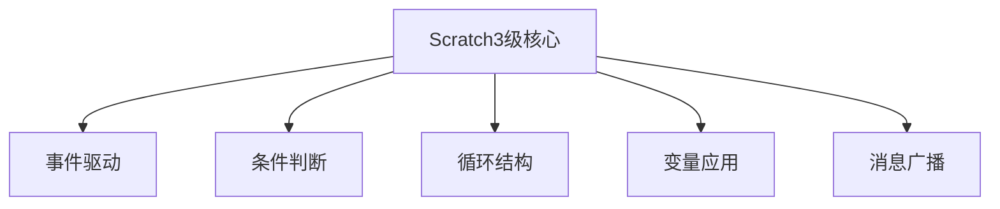

## 用大脑编程：Scratch高分秘诀
:::tip 高分秘诀
在电子协会Scratch考试中取得高分的关键不在于死记硬背代码块，而在于培养"==用大脑编写程序=="的思维方式。以下是：
:::
:::info 高分秘诀核心要点
### 1. 理解而非记忆
- **逻辑先行**：在动手前先在脑中构建程序流程图
- **模块化思维**：将复杂问题分解为多个小功能模块
- **伪代码练习**：用自然语言描述算法逻辑

### 2. 核心知识点脑图

### 3. 高分技巧
1. 逆向思维训练 ：
   - 看到题目先想"不用电脑如何解决"
   - 用纸笔画出角色交互关系
2. 程序调试心法 ：
   - 在脑中模拟角色每一步的状态变化
   - 预判可能出现的边界条件
3. 创意加分项 ：
   - 在满足基本要求后思考"还能如何优化"
   - 用简单逻辑实现复杂效果
### 4. 经典题型脑编程
- [x] 以"小猫追老鼠"为例：
    1. 脑中出现坐标系和运动轨迹
    2. 思考方向控制与距离判断的关系
    3. 预判可能需要的变量和广播消息
+ ==记住==：孩子的优秀与高分不是会写代码，而是会思考代码。考试时先花5分钟构思，能节省15分钟的调试时间！

:::
## 编程思维辩论：枝干 vs 叶子
:::note 编程思维
- 在编程学习中，常出现两种思维方式的辩论：

    **枝干派观点**：
    ```mermaid
    graph LR
        A[程序主干逻辑] --> B[核心算法]
        A --> C[关键流程]
    ```
    - 先构建程序骨架，再补充细节

    **叶子派观点**：
    ```mermaid

    graph TD
        D[具体功能实现] --> E[立即可见效果]
        D --> F[快速成就感]
    ```
    - 从具体功能入手逐步完善
### Scratch考试最佳实践 ：
1. 用"枝干思维"设计整体架构
2. 用"叶子思维"实现具体功能
3. 最终将叶子有机地连接到枝干上
- 正如植物需要枝干支撑和叶子光合作用，优秀高分需要同时掌握这两种思维方式！
:::